# ViPE Instance And Semantic Feature Distillation

This document specifies the 3D instance and semantic-feature distillation pipeline that runs inside ViPE after the existing pose and reconstruction pipeline. ViPE Stages 1-5 are documented in [`fullexplain.md`](fullexplain.md). The distillation path starts only after Stage 5 has successfully written the final pose and TSDF artifacts.

The runtime consumes the native TSDF surface, RGB, sensor depth, shared pinhole intrinsics, and final ViPE camera-to-world poses. It first constructs an overlapping, K-capped set of class-agnostic 3D hypotheses, then distills a vision-language descriptor onto each finalized hypothesis. Runtime never consumes GT labels, GT poses, class names, or a fixed class vocabulary.

```mermaid
flowchart LR
    V[ViPE Stages 1-5<br/>poses and TSDF] --> S6[Stage 6<br/>TSDF surface and frame coreset]
    S6 --> S7[Stage 7<br/>normal-aware atoms]
    S7 --> S8[Stage 8<br/>masks, lift, and track linking]
    S8 --> S9[Stage 9<br/>affinity and hierarchy]
    S9 --> S10[Stage 10<br/>evidence candidates]
    S10 --> S11[Stage 11<br/>K-capped selection and exchange]
    S11 --> S12[Stage 12<br/>semantic feature distillation]
    S12 --> O[Descriptor-bearing NPZ<br/>instance and semantic PLYs]
```



## Representation

Stages 6-11 use four nested geometric representations:

| Level | Symbol | Meaning |
| --- | --- | --- |
| Surface point | `i` | One native TSDF zero-surface sample retained as the instance prediction domain. |
| Atom | `a` | A small connected, normal-aware surface patch containing surface points. Atoms partition the surface. |
| Node | `R` | A union of atoms retained from the agglomeration hierarchy. Nodes are nested or disjoint. |
| Hypothesis | `h` | A selected node or a linked union of nodes representing one possible 3D instance. Hypotheses may overlap. |

For frame `f` and lifted mask `gm`:

```text
V_f       visible TSDF surface points in frame f
q_gm      points claimed by mask gm; q_gm is a subset of V_f
N_a,f     number of points from atom a visible in frame f
I_a,gm    number of points from atom a claimed by mask gm
```

The final geometric output is a hypothesis soup with at most `K=5` hypotheses covering any atom. It is not a hard partition. The instance PLY visualization resolves overlap by assigning each surface point to the smallest selected hypothesis that contains it. Stage 12 preserves the overlap rather than choosing an owner.

## Stage 6: TSDF Surface And Frame Coreset

Stage 5 extracts the fused TSDF zero surface once. The native extension writes the full RGB+normal PLY in bounded chunks while simultaneously retaining the compact surface domain needed by Stage 6. Python receives only those retained point/normal pairs, not the dense output sample tensors. There is no PLY reread and no second all-frame backprojection.

The saved PLY contains a dense deterministic area sample. Running association over all ten million output samples would make point count depend on an output-density knob rather than TSDF resolution. During that same native extraction stream, Stage 5 retains one original TSDF sample per native TSDF-sized cell for Stage 6. For TSDF voxel edge `s`, sample `p_i`, and cell index `c_i`:

```math
c_i = \left\lfloor p_i/s \right\rfloor,
\qquad
i_c = \underset{i:\,c_i=c}{\arg\min}\;
\left\|p_i-(c+\tfrac{1}{2})s\right\|_2^2.
```

Equal-distance ties select the lower original extraction index. The retained point is an actual zero-surface sample, not a cell centroid. Cell keys are sorted deterministically, so every hypothesis index has a stable surface-point meaning. The cell edge comes from `pipeline.output.pcd_tsdf_voxel_edge_m`; it is not duplicated in the instance config.

The frame coreset walks final poses in sequence order. Frame `f` is retained when, relative to the last retained frame, either:

```math
\lVert t_f-t_r\rVert_2 > 0.08\text{ m}
```

or the optical-axis angle exceeds `8 degrees`. The retained frame becomes the next reference. No RGB or depth is loaded during this selection.

Instance images use a separate 1024-pixel-long-side view. RGB is aspect-preserving LANCZOS-resized; depth is nearest-neighbor resized; intrinsics are scaled independently in x and y. This does not alter the canonical ViPE input or TSDF.

## Stage 7: Normal-Aware Atoms

Use the native TSDF-gradient normal carried by each retained surface sample. Build a symmetric 12-neighbor point graph, capped at `2.5` TSDF voxel edges. Edge cost is:

```math
w(i,j)=\lVert p_i-p_j\rVert_2\left(1+4\left(1-|n_i^Tn_j|\right)\right).
```

Seed one surface point in each occupied 3 cm cell. Multi-source Dijkstra assigns every point to its lowest-cost seed, producing an atom partition. Atom adjacency consists of point-graph edges crossing between atoms.

## Stage 8: Masks, Lift, And Global Track Linking

Retained frames are processed in consecutive chunks of four. Mask generation and lifting are interleaved one chunk at a time.

### Stage 8.1: SAM1 AMG Seeds

SAM1 ViT-H automatic mask generation runs on the first frame of each chunk with:

- a `48 x 48` query grid;
- predicted-IoU threshold `0.6`;
- stability threshold `0.9` with offset `1.0`;
- box NMS threshold `0.7`;
- no crop pyramid and no mask-region postprocessing.

Survivors are stably sorted by predicted IoU and capped at 100. Each seed receives a monotonically allocated track ID. IDs are never reused across chunks.

### Stage 8.2: SAM2 Propagation

SAM2.1-small receives every seed in one inference state and propagates them forward through the remaining chunk frames. The mask-logit threshold is `-1.0`; postprocessing and CPU offload are disabled.

The seed frame keeps the original SAM1 masks. Later frames carry the same track IDs and inherited SAM1 scores. A track may disappear and later reappear within its chunk. Track IDs never cross chunk boundaries at this stage.

Once a chunk has been lifted, its decoded masks and SAM state are released.

### Stage 8.3: Visibility And Lift

For surface point `X_w`, final pose `T_{c2w}`, and frame depth map `D_f`, compute camera coordinates and projection:

```math
X_c = R_{c2w}^{T}(X_w-t_{c2w}),
\qquad
(u,v)=\left(f_x X_c^x/X_c^z+c_x,\ f_y X_c^y/X_c^z+c_y\right).
```

A projected point is visible only when it is in front of the camera, inside the image, has valid measured depth, and:

```math
\left|X_c^z-D_f(u,v)\right| \le 0.05\text{ m}.
```

Each 2D mask selects from those visible surface-point indices, producing `q_gm`. Lifted masks with fewer than five points are discarded. The lift immediately counts visible and claimed points per atom and stores the nonzero counts in two atom-major CSR tables:

```text
leafI(atom, mask)  = I_a,gm
leafN(atom, frame) = N_a,f
```

No dense `number_of_atoms x number_of_masks` membership matrix exists. Frame provenance and chunk-local track IDs remain attached to the sparse mask records.

The normalized signature for one retained frame is used immediately to add `num(a,b)` and `W(a,b)` to adjacent atom pairs, then discarded. Thus affinity accumulation keeps fixed-size edge statistics rather than sequence-wide normalized signature, visibility, or masked-frame matrices. The raw `leafI` and `leafN` counts remain available for Stages 10-11.

### Stage 8.4: Global Track Linking

After every retained frame is lifted, each chunk-local track is represented by the union of all point sets claimed by that track. Candidate track pairs must share points and come from different chunks.

For every ordered chunk pair, a track pair is accepted only when:

- 3D set IoU is at least `0.8`;
- each track is the other's best partner in the opposite chunk;
- the accepted IoU exceeds both runner-up IoUs by a factor of at least `1.2`.

Accepted pairs are processed in descending IoU with union-find. A connected component may contain at most one track from each chunk, preventing same-frame part/whole seeds from collapsing. The minimum track ID becomes the deterministic global ID. Only one exact union of claimed point indices is retained per chunk-local track for this linking operation; it is released immediately after global IDs are resolved.

## Stage 9: Affinity And Hierarchy

Stage 9 consumes the adjacency statistics accumulated frame by frame during Stage 8. For atom `a`, mask `gm`, and the mask's frame `f(gm)`, the contributing visible claim fraction was:

```math
x_{a,gm}=I_{a,gm}/N_{a,f(gm)}.
```

Within each atom/frame block, normalize mask claims and weight weakly claimed atoms by the square root of the maximum claim:

```math
\hat{x}_{a,gm}=
\frac{x_{a,gm}}{\lVert x_{a,\cdot}\rVert_2}
\sqrt{\max_{gm}x_{a,gm}}.
```

For adjacent atoms `a,b`:

```math
\operatorname{num}(a,b)=\sum_{gm}\hat{x}_{a,gm}\hat{x}_{b,gm},
```

```math
W(a,b)=\#\{f:\ a,b\text{ co-visible and at least one is masked}\},
\qquad
A(a,b)=\operatorname{num}(a,b)/W(a,b).
```

A co-visible frame masking only one atom contributes an opportunity but no agreement.

Before agglomeration, adjacent atoms with `A >= 0.98` over at least eight observations are contracted into meta-atoms. Agglomeration then repeatedly merges the adjacent region pair with the strongest pooled border evidence under a scene-fitted Beta prior. Every child and merged parent remains a candidate node.

Nested candidates with IoU at least `0.95` are collapsed to the largest representative, creating an epsilon-cover of the hierarchy without turning it into a partition.

## Stage 10: Evidence Candidates

### Stage 10.1: Per-Node Evidence

A post-order pass sums visibility and mask intersections from atoms to every node. A frame can judge node `R` only when:

```math
N_{R,f}\ge\max(8,\ 0.05|R|).
```

For each eligible frame and mask:

```math
\operatorname{IoU}(R,gm)=
\frac{I_{R,gm}}{|q_{gm}|+N_{R,f}-I_{R,gm}},
```

```math
\operatorname{cov}(R,gm)=I_{R,gm}/N_{R,f},
\qquad
\operatorname{pur}(R,gm)=I_{R,gm}/|q_{gm}|.
```

Nodes smaller than ten points are not candidates. Masks with coverage at least `0.5` enter the evidence-edge stage.

### Stage 10.2: Evidence-Edge Clustering

For two co-eligible, non-nested nodes, a frame provides graded join evidence when one mask covers both. The union endorsement is:

```math
\operatorname{cov}_u^2\operatorname{pur}_u^2\operatorname{IoU}_u.
```

A co-eligible frame with no co-covering mask is a miss. For total join weight `k` over `n` opportunities, edge cost is the same-vs-different log-likelihood ratio:

```math
k\ln\frac{p_{same}}{p_{diff}}+(n-k)\ln\frac{1-p_{same}}{1-p_{diff}}.
```

`p_same` and `p_diff` are fit per scene by an unlabeled two-component binomial-mixture EM. Positive pair edges and positive greedy contractions become additional union candidates. A separate track channel proposes cross-viewpoint unions when one global track covers different nodes in different frames. Track proposals add candidates but no negative evidence.

## Stage 11: K-Capped Selection And Exchange

Selection chooses hypotheses by maximizing:

```math
F(S)=\sum_e w_e\max_{h\in S}\phi_h(e)-0.5|S|
\quad\text{subject to at most }K=5\text{ selected hypotheses per atom}.
```

For a mask endorsement:

```math
\phi_h(e)=\operatorname{cov}(h,e)^2\operatorname{pur}(h,e)^2
\operatorname{IoU}(h,e).
```

Weights below `0.05` are omitted as a compute guard. Clients are global tracks with equal weight. A track's value for a hypothesis is the mean over its masks in eligible frames; an eligible frame with no endorsement contributes zero.

Lazy greedy selection uses hypothesis size only as a tie-break and stops when marginal gain falls below the `0.5` hypothesis price. It also enforces at most one variant of a node and the per-atom K cap.

Finally, if two or more selected hypotheses lie inside one tree ancestor, replace the group with that ancestor only when total evidence does not decrease and the K cap remains satisfied:

```math
\operatorname{loss}=\sum_g\left[
\operatorname{best}_g(S)-
\max\left(\operatorname{best}_g(S\setminus G),\phi_{ancestor}(g)\right)
\right].
```

Accept only `loss <= 0`. Process larger ancestors first and repeat to a fixed point for at most three passes.

## Stage 12: Semantic Feature Distillation

Stage 12 runs only after the hypothesis set is final. It reuses the Stage-6 frame coreset, resized RGB and nearest-neighbor depth, scaled intrinsics, retained TSDF points and normals, and final camera poses. It does not rerun mask generation, alter hypothesis membership, or classify hypotheses.

Let `N` be the number of retained TSDF points, `M` the number of selected hypotheses, `G=24` the native square feature grid, and `D=768` the FG-CLIP descriptor dimension. The runtime has three distinct semantic representations:

| Field | Shape and dtype | Meaning | Lifetime |
| --- | --- | --- | --- |
| `A` | `N x D`, float32 | Temporarily fused descriptor at each directly observed TSDF point. | Stage 12 only; represented by float32 weighted sums and materialized only as needed for pooling. |
| `B` | `M x D`, float16 in the NPZ | One row-aligned unit descriptor per finalized hypothesis; an unobserved hypothesis has a zero row. | Persisted runtime output. |
| `C` | requested rows or chunks of `N x D`, float32 | Unit mean of valid descriptors from every hypothesis covering a point. | Reconstructed on demand for visualization or GT-only evaluation; never persisted as a dense field. |

### Stage 12.1: Dense Image Features

For each selected frame `f`, FG-CLIP emits a row-wise L2-normalized map

```math
F_f \in \mathbb{R}^{G\times G\times D},
\qquad \lVert F_f[r,c]\rVert_2=1.
```

The already aspect-preserving instance RGB is resized to FG-CLIP's native `336 x 336` square input and CLIP-normalized. Projection below maps the original resized-image coordinates to its fixed `24 x 24` grid, so the feature lookup follows the same deterministic stretch.

For point `X_i`, pose `T_{c2w,f}=[R_f,t_f]`, and scaled intrinsics `(f_x,f_y,c_x,c_y)`:

```math
x_{if}=R_f^T(X_i-t_f),
\qquad z_{if}=x_{if}^z,
```

```math
u_{if}=f_x x_{if}^x/z_{if}+c_x,
\qquad
v_{if}=f_y x_{if}^y/z_{if}+c_y.
```

The point is projectable when `z_if > 10^-3`, `u_if` and `v_if` are finite, and `0 <= u_if < W`, `0 <= v_if < H`. Depth is sampled at

```math
(\bar u_{if},\bar v_{if})=(\lfloor u_{if}\rfloor,\lfloor v_{if}\rfloor),
```

and the point is visible exactly when the sampled sensor depth is greater than `10^-3` m and

```math
\left|z_{if}-D_f[\bar v_{if},\bar u_{if}]\right|\le\tau,
```

where `tau = features.occlusion_tolerance_m`. The dense feature cell is selected by integer binning:

```math
c_{if}=\operatorname{clip}\left(\left\lfloor G u_{if}/W\right\rfloor,0,G-1\right),
\qquad
r_{if}=\operatorname{clip}\left(\left\lfloor G v_{if}/H\right\rfloor,0,G-1\right).
```

### Stage 12.2: Visibility Weight And Point Field `A`

Transform the retained world normal into camera coordinates as `n_if = R_f^T n_i`. The implementation's projective incidence score is

```math
s_{if}=\operatorname{clip}\left(
\left|n_{if}^{T}\frac{x_{if}}{z_{if}}\right|,0,1
\right).
```

The ray `x_if/z_if = (x/z,y/z,1)` is deliberately not unit-normalized. For configured exponents `a = features.weight_a` and `b = features.weight_b`, the exact visible-view weight is

```math
w_{if}=\max\left(z_{if}^{-b}s_{if}^{a},10^{-6}\right).
```

Invisible views contribute nothing. Stage 12 accumulates float32 arrays `sum_wf` of shape `N x D` and `sum_w` of shape `N`:

```math
S_i=\sum_{f:\,i\text{ visible}}w_{if}F_f[r_{if},c_{if}],
\qquad
q_i=\sum_{f:\,i\text{ visible}}w_{if}.
```

The temporary per-point field is

```math
A_i=\begin{cases}
S_i/q_i,&q_i>0,\\
0,&q_i=0.
\end{cases}
```

`A_i` is a weighted mean and is not assumed to have unit norm. Only one frame feature map is needed at a time. The feature maps, `S`, `q`, and any materialized `A` rows are released after hypothesis pooling.

### Stage 12.3: Stored Hypothesis Descriptors `B`

For hypothesis `h`, let `H_h` be its TSDF point-index set and

```math
O_h=\{i\in H_h:q_i>0\}.
```

Normalize each observed point descriptor before pooling:

```math
\hat A_i=A_i/\max(\lVert A_i\rVert_2,10^{-8}).
```

Then compute

```math
B_h=\begin{cases}
\operatorname{norm}\left(\dfrac{1}{|O_h|}\displaystyle\sum_{i\in O_h}\hat A_i\right),&|O_h|>0,\\
0,&|O_h|=0,
\end{cases}
```

where `norm(x)=x/max(||x||_2,10^-8)`. Pooling visits hypothesis indices in bounded chunks. `B` is converted from float32 to float16 and stored as `instance_features`; row `h` corresponds exactly to packed hypothesis `h`. The number of nonzero rows is reported as `valid_descriptor_count`.

### Stage 12.4: On-Demand Overlap Field `C`

No dense semantic point field is stored. When a consumer requests point `i`, let

```math
\mathcal H_i^+=\{h:i\in H_h\ \land\ \lVert B_h\rVert_2>0\}.
```

The overlap field is reconstructed as

```math
C_i=\begin{cases}
\operatorname{norm}\left(\dfrac{1}{|\mathcal H_i^+|}
\displaystyle\sum_{h\in\mathcal H_i^+}B_h\right),&|\mathcal H_i^+|>0,\\
0,&|\mathcal H_i^+|=0.
\end{cases}
```

Thus every valid overlapping hypothesis contributes equally; there is no smallest-owner rule and no size or confidence weight. A compact point-to-valid-hypothesis membership index has `N+1` int64 offsets and one int32 member ID per valid membership. Consumers reconstruct only requested rows or bounded chunks. `instance_field_coverage` is the fraction of the `N` points for which `H_i^+` is nonempty; it differs from `direct_point_hit_fraction`, because a valid hypothesis descriptor propagates to all points in that hypothesis.

### Stage 12.5: FG-CLIP Configuration

`model_path` and the pinned revision are loaded through Transformers with remote model code; Transformers major version 5 or newer is rejected. FP32 dense features use FG-CLIP-Large's native `336 x 336` input and `24 x 24` patch grid. Dense and text features are 768-dimensional. Text prompts use a 77-token maximum and the model's short-position walk.

For open-vocabulary confidence queries, `text_scores()` compares each unit descriptor against the query prompts and the canonical negatives `object`, `things`, `stuff`, and `texture`. It uses FG-CLIP's learned contrastive temperature. If `s_q` is one query similarity, `N` is the four-negative set, and `tau` is that temperature, the returned confidence is

```math
p(q)=\frac{\exp(s_q/\tau)}{\exp(s_q/\tau)+\sum_{n\in N}\exp(s_n/\tau)}.
```

Queries do not compete with one another in this denominator. This scorer is available to consumers but is not used by the temperature-free semantic top-1 benchmark.

The default frontier is:

```yaml
features:
  grid: 64
  weight_a: 1.0
  weight_b: 1.0
  occlusion_tolerance_m: 0.05
  model_path: qihoo360/fg-clip-large
  revision: 5a8f0f23b5a06dc92310e907599b2a0c2d58fe6f
```

## Runtime Artifacts

Runtime writes descriptors but no GT labels, class names, or semantic predictions:

```text
pose/<scene>.npz                 final ViPE camera-to-world trajectory
pcd/<scene>_tsdf.ply            native ViPE RGB+normal TSDF surface
instances/<scene>.npz           TSDF points, packed hypotheses, and row-aligned descriptors
instances/<scene>_summary.json  resolved config, timings, and structural counts
pcd/<scene>_instances.ply       smallest-hypothesis-wins visualization
pcd/<scene>_semantic_pca.ply    PCA-colored on-demand overlap field
```

The NPZ is authoritative. For `L` total packed memberships it stores `points` (`N x 3`, float32), `hypothesis_indices` (`L`, int32), `hypothesis_offsets` (`M+1`, int64), scalar `K` (int32), scalar `domain="tsdf_surface"`, scalar `voxel_edge_m` (float32), `instance_features=B` (`M x 768`, float16), and scalar `feature_grid` (int32).

The summary uses schema version 3. Its `features` block records grid, descriptor dimension, selected-frame count, nonzero descriptor count, direct point-hit fraction, and overlap-field coverage. `timings.semantic_features_s` measures FG-CLIP loading, fusion, and descriptor pooling; `timings.semantic_visualization_s` measures bounded overlap reconstruction and PCA PLY writing. The instance PLY is not used by the algorithm or metrics.

The semantic PLY evaluates `C` in bounded chunks. It centers covered rows, fits three PCA axes by SVD on at most 100,000 covered points sampled with RNG seed 0, and maps the sampled 2nd and 98th projection percentiles to RGB. Uncovered points are gray. This is a deterministic descriptor visualization, not a class prediction, and is not an evaluator input.

## Instance Evaluation Boundary

Instance evaluation is separate from runtime. It builds a GT 2 cm cloud from canonical depth and GT poses, aligns the predicted ViPE trajectory to GT by solving one global SE3 transform, and transfers GT instance IDs to the predicted TSDF surface by nearest neighbor. Replica labels the GT cloud from `mesh_semantic.ply`; ScanNet maps its aggregation groups through the oversegmentation IDs onto `_vh_clean_2.ply`, then labels the GT cloud from that annotated mesh.

Known annotation-debris IDs are relabeled to background before scoring:

```text
office0: 1, 13, 18, 26, 56, 65, 67
office2: 5, 6, 7, 78, 83
room0:   17, 26, 28, 29, 37, 38, 42, 52, 53, 62, 66, 82, 91
```

Excluded labels remain represented on the prediction surface as background, so they still penalize a predicted hypothesis that includes them.

For each GT instance `g`, evaluation computes the best point-set IoU over all hypotheses. Average Recall is the mean recall over IoU thresholds `0.50, 0.55, ..., 0.95`. R50, R75, R90, hypothesis count, and mean/max point membership are reported alongside AR.

Semantic top-1 is a GT-only evaluator operation. Runtime does not select classes. After GT object IDs have been transferred to the predicted TSDF points, the evaluator maps them to dataset-provided class names. Replica uses valid class IDs and normalized names from `info_semantic.json`; ScanNet uses normalized aggregation labels. Only points that both have a mapped class and are covered by `C` are scored.

For the set of mapped classes present on those valid points, the evaluator uses FG-CLIP to encode prompts `"a photo of a {class_name}"`. If `T_c` is the unit text descriptor for class `c`, the point prediction is

```math
\hat y_i=\underset{c}{\arg\max}\;C_i^T T_c.
```

`semantic_top1` is point accuracy over the valid set, `semantic_evaluated_points` is that set's size, and `semantic_field_coverage` is the fraction of all predicted TSDF points covered by `C` before class filtering. A scene with no valid points reports no top-1 value. The aggregate top-1 is weighted by evaluated point count; aggregate field coverage is the unweighted mean over scenes. Evaluation also verifies that the artifact grid matches the active feature configuration.

Evaluation writes `pcd/<scene>_instances_gt.ply`, which colors the predicted TSDF domain by transferred GT instance ID, and `pcd/<scene>_instances_gtmatch.ply`, which keeps the unique best predicted hypothesis for every GT instance whose best IoU is at least `0.30`. Both use spatially contrasting colors. These are benchmark visualizations only: GT labels never enter instance distillation.

## Determinism And Lifetime

Ordering is part of the algorithm: frames and chunks are ascending, SAM top-k sorting is stable, track IDs are monotonic, union-find keeps the minimum representative, Stage-12 frames are sorted, and projection uses explicit elementwise arithmetic. Semantic PCA uses a fixed RNG seed. TF32 remains disabled and deterministic ViPE settings remain active.

Stage 5 releases SLAM GPU state before SAM models are built. Native TSDF extraction streams the dense PLY in bounded chunks and returns only the compact Stage-6 surface domain. Stage 8 retains one mask chunk at a time and converts each lifted mask directly into sparse atom counts. Mask tensors, SAM2 state, temporary JPEGs, exact track unions, sparse evidence, and hierarchy tables are released after their last consumer. Stage 12 loads FG-CLIP after association state is released, processes one selected frame at a time, pools `A` into `B`, and then releases the accumulator and GPU cache. Artifact writing retains only the TSDF surface, packed hypotheses, and `B`; each `C` consumer builds and releases its own compact overlap index.
