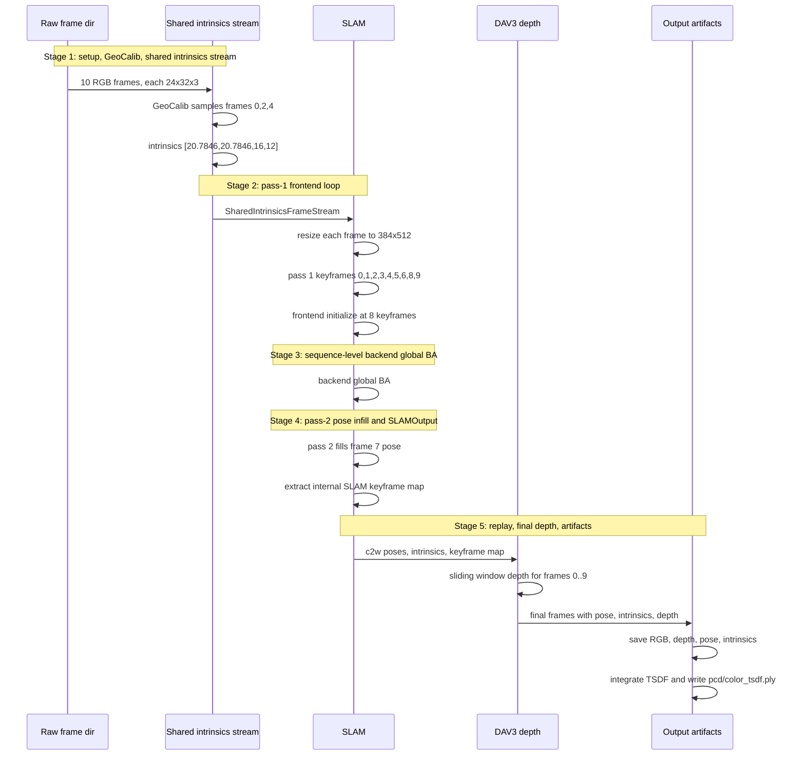

# Numeric Toy Trace For The Current Standalone ViPE Run

Open this beside [fullexplain.md](./fullexplain.md). The chunk numbers match one-to-one with the main explanation, and those chunks sit under the same five-stage handoff model.

Each toy chunk follows the same flow as the matching chunk in `fullexplain.md`: it states what object arrives from the previous chunk, computes the concrete toy values, and ends by stating what object is handed to the next chunk. If you keep both files open side by side, read one chunk in `fullexplain.md` first, then read the same-numbered toy chunk here to see the exact values carried by that code path.

The five-stage toy handoff is:

| Stage | Toy chunks | Toy handoff |
| --- | --- | --- |
| Stage 1: initialization and stream setup | chunks 1.1-1.3 | `FrameDir`, one shared GeoCalib intrinsics vector, and `SharedIntrinsicsFrameStream` |
| Stage 2: SLAM pass 1 frontend loop | chunks 2.1-2.2 | keyframe buffer with toy keyframes `0,1,2,3,4,5,6,8,9` |
| Stage 3: backend global BA | chunk 3.1 | globally refined keyframe poses/disparities in `GraphBuffer` |
| Stage 4: SLAM pass 2 pose infill loop | chunk 4.1 | full 10-frame trajectory, recovered intrinsics, and internal `SLAMMap` |
| Stage 5: final DAV3 depth and outputs | chunks 5.1-5.3 | final frames with depth plus saved artifacts and `pcd/color_tsdf.ply` |

## Toy Sequence Used Throughout

Every chunk below uses the same toy sequence. The numeric values are intentionally small, but the data flow and tensor transformations match the current code.

Assume:

| Object | Toy value |
| --- | --- |
| Input directory | `/toy/scene0000_00/color` |
| File names | `0.png` through `9.png` |
| Number of frames | `N = 10` |
| Raw RGB size | `H0 = 24`, `W0 = 32` |
| Input FPS | `2.0` |
| `frame_start`, `frame_end`, `frame_skip` | `0`, `-1`, `1` |
| Effective stream FPS | `2.0 / 1 = 2.0` |
| `camera_type` | `pinhole` |
| GeoCalib toy vertical FOV output | `60 deg = 1.0472 rad` |
| Raw intrinsics from that FOV | `[fx, fy, cx, cy] = [20.7846, 20.7846, 16.0, 12.0]` |
| SLAM resize target result | `384 x 512`, no crop for this toy |
| SLAM low-res grid | `48 x 64` |
| SLAM warmup | `8` keyframes |
| Motion-filter toy decisions | frames `0,1,2,3,4,5,6,8,9` are keyframes, frame `7` is non-keyframe |
| PCD mode in the command | `tsdf` |
| Max PCD points | `8,000,000` |

Toy image values used in examples:

| Pixel | Toy RGB float |
| --- | --- |
| frame 0 pixel `(u=0, v=0)` | `[0.10, 0.20, 0.30]` |
| frame 0 pixel `(u=16, v=12)` | `[0.50, 0.40, 0.30]` |
| frame 0 pixel `(u=31, v=23)` | `[0.90, 0.80, 0.70]` |

Toy final pose and depth values used later:

| Frame | Toy final camera-to-world pose translation |
| --- | --- |
| frame 0 | `[0.0, 0.0, 0.0]` |
| frame 1 | `[0.1, 0.0, 0.0]` |
| frame 7 | `[0.7, 0.0, 0.0]` |
| frame 9 | `[0.9, 0.0, 0.0]` |

| Pixel | Toy final metric depth |
| --- | --- |
| frame 0 pixel `(16,12)` | `2.0 m` |
| frame 0 pixel `(0,0)` | `3.0 m` |

The toy network outputs are illustrative. They show exact shapes, exact formulas, and exact branch behavior. They are not claiming that the learned networks will output those exact values on a real image.

<a id="chunk-1-1-toy"></a>
## Chunk 1.1 Toy: Shell, Hydra Config, And Runtime Construction

This corresponds to [fullexplain.md Chunk 1.1](./fullexplain.md#chunk-1-1). This is Stage 1 sequence-once object construction. The input is only a shell command plus config overrides. The output of this chunk is two live Python objects: one `FrameDir` source and one `VipePipeline`.

Toy CLI:

```bash
python run.py streams.base_path=/toy/scene0000_00/color streams.fps=2 pipeline.output.path=/toy/out pipeline.output.save_artifacts=true pipeline.output.pcd_fusion_mode=tsdf
```

Hydra produces:

```python
args.streams.base_path == "/toy/scene0000_00/color"
args.streams.fps == 2
args.streams.frame_start == 0
args.streams.frame_end == -1
args.streams.frame_skip == 1
args.pipeline.output.pcd_fusion_mode == "tsdf"
```

Runtime objects:

```python
frame_stream = FrameDir("/toy/scene0000_00/color", fps=2, frame_start=0, frame_end=-1, frame_skip=1)
frame_stream.name() == "color"
pipeline = VipePipeline(slam=args.pipeline.slam, output=args.pipeline.output)
pipeline.out_path == Path("/toy/out")
```

So after chunk 1.1, nothing has read image pixels yet. The only concrete state is: `frame_stream` knows where `/toy/scene0000_00/color` is, and `pipeline` knows it should write to `/toy/out` with TSDF PCD output. Chunk 1.2 now asks `FrameDir` to enumerate the actual image files and yield `FrameData` objects.

<a id="chunk-1-2-toy"></a>
## Chunk 1.2 Toy: Frame Directory Stream And Frame Ordering

This corresponds to [fullexplain.md Chunk 1.2](./fullexplain.md#chunk-1-2). This remains Stage 1: ordering and frame-size metadata are computed once, while RGB tensors are produced lazily each time the stream is iterated. The input is the `FrameDir` object from chunk 1.1. The output is a re-iterable stream of bare `FrameData` objects containing only `raw_frame_idx` and CUDA RGB tensors.

Input files:

```text
/toy/scene0000_00/color/0.png
/toy/scene0000_00/color/1.png
...
/toy/scene0000_00/color/9.png
```

All stems are numeric, so sorted order is:

```python
[0.png, 1.png, 2.png, 3.png, 4.png, 5.png, 6.png, 7.png, 8.png, 9.png]
```

`frame_start=0`, `frame_end=-1`, `frame_skip=1` gives:

```python
self.start = 0
self.end = 10
self.step = 1
len(frame_stream) == len(range(0, 10, 1)) == 10
frame_stream.fps() == 2.0 / 1 == 2.0
frame_stream.frame_size() == (24, 32)
frame_stream.name() == "color"
```

For `0.png`, suppose OpenCV reads BGR pixel `(v=0,u=0)` as `[76, 51, 26]`. After BGR-to-RGB and normalization:

```python
rgb[0,0] = [26, 51, 76] / 255.0 = [0.1020, 0.2000, 0.2980]
```

The first yielded frame is:

```python
FrameData(
    raw_frame_idx=0,
    rgb=torch.tensor(shape=(24,32,3), device="cuda", dtype=float32),
)
```

At the end of chunk 1.2, every yielded frame is just RGB plus its sorted-file index. There is still no camera model, pose, depth, or point cloud. Chunk 1.3 attaches the first required geometric attribute: shared pinhole intrinsics from GeoCalib.

<a id="chunk-1-3-toy"></a>
## Chunk 1.3 Toy: GeoCalib Intrinsics And Shared Intrinsics Stream

This corresponds to [fullexplain.md Chunk 1.3](./fullexplain.md#chunk-1-3). This completes Stage 1. GeoCalib samples three frames once, converts the shared vertical FOV into one raw-resolution intrinsics tensor, and wraps the original `FrameDir` with `SharedIntrinsicsFrameStream`. The input is the RGB-only `FrameData` stream from chunk 1.2. The output is a lazy calibrated stream where each yielded frame has `intrinsics` and `camera_type`.

GeoCalib samples toy frames:

```python
sample_frame_inds = [0, 2, 4]
sample_frames.shape == (3, 3, 24, 32)
```

Assume GeoCalib returns:

```python
self.fov_y = 1.0472  # 60 deg
```

For every raw frame:

```python
frame_height = 24
frame_width = 32
fx = fy = 24 / (2 * tan(1.0472 / 2))
   = 24 / (2 * 0.57735)
   = 20.7846
cx = 32 / 2 = 16.0
cy = 24 / 2 = 12.0
shared_intrinsics = tensor([20.7846, 20.7846, 16.0, 12.0], device="cuda")
```

`SharedIntrinsicsFrameStream` holds:

```python
init_stream.stream is frame_stream
init_stream.intrinsics is shared_intrinsics
```

When SLAM starts iterating `init_stream`, frame 0 is loaded from disk and augmented:

```python
raw_frame = FrameData(raw_frame_idx=0, rgb.shape=(24,32,3))
raw_frame.intrinsics = shared_intrinsics
raw_frame.camera_type = CameraType.PINHOLE
```

Frame 9 gets the same intrinsics object:

```python
frame_9.intrinsics = shared_intrinsics
frame_9.camera_type = CameraType.PINHOLE
```

Final calibrated toy frame 0 yielded to SLAM:

```python
FrameData(
    raw_frame_idx=0,
    rgb.shape=(24,32,3),
    intrinsics=[20.7846,20.7846,16.0,12.0],
    camera_type=PINHOLE,
)
```

So chunk 1.3 turns image-only frames into camera-calibrated frames for SLAM. The stream is still lazy and re-iterable through the original `FrameDir`; there is no full-frame cache. Chunk 2.1 now takes these calibrated frames into SLAM, where they are resized and placed into the graph buffer.

<a id="chunk-2-1-toy"></a>
## Chunk 2.1 Toy: SLAM Standard Resize, Graph Buffer, And Model Setup

This corresponds to [fullexplain.md Chunk 2.1](./fullexplain.md#chunk-2-1). This is Stage 2 setup before the pass-1 frame loop. The input is calibrated original-resolution frames from chunk 1.3. The output is the resized/cropped representation and a `GraphBuffer` layout ready to store keyframes, features, poses, disparities, and DAV3 keyframe depth anchors.

Toy raw frame size is `(24,32)`.

Resize scale:

```text
scale_factor = sqrt((384*512)/(24*32))
             = sqrt(196608 / 768)
             = sqrt(256)
             = 16
h1 = int(24 * 16) = 384
w1 = int(32 * 16) = 512
crop_h = 384 % 8 = 0
crop_w = 512 % 8 = 0
```

No crop. Intrinsics after resize:

```text
raw intrinsics = [20.7846, 20.7846, 16.0, 12.0]
w scale = 512 / 32 = 16
h scale = 384 / 24 = 16
resized intrinsics = [332.5536, 332.5536, 256.0, 192.0]
```

One resized frame entering SLAM:

```python
frame.rgb.shape == (384,512,3)
frame.intrinsics == [332.5536, 332.5536, 256.0, 192.0]
```

SLAM `_rgb_bchw` converts it to:

```python
images.shape == (1,3,384,512)  # batch,C,H,W
```

The toy `GraphBuffer` dimensions are:

```python
buffer.images.shape == (buffer_size,3,384,512)
buffer.poses.shape == (buffer_size,7)
buffer.intrinsics.shape == (4,)
buffer.disps.shape == (buffer_size,48,64)
buffer.disps_sens.shape == (buffer_size,48,64)
buffer.fmaps.shape == (buffer_size,128,48,64)
buffer.nets.shape == (buffer_size,128,48,64)
buffer.inps.shape == (buffer_size,128,48,64)
```

At the end of chunk 2.1, the important concrete conversion is: raw `24 x 32` frames become SLAM `384 x 512` frames, and the dense optimization grid becomes `48 x 64`. Chunk 2.2 now iterates the sequence, decides which resized frames enter the keyframe buffer, and runs frontend BA over those keyframes.

<a id="chunk-2-2-toy"></a>
## Chunk 2.2 Toy: SLAM Pass 1, Motion Filtering, Keyframe Addition, And Frontend BA

This corresponds to [fullexplain.md Chunk 2.2](./fullexplain.md#chunk-2-2). This is the Stage 2 per-frame pass-1 loop. The input is the resized stream and empty graph buffer from chunk 2.1. The output is an initialized frontend keyframe graph: toy keyframes `0,1,2,3,4,5,6,8,9`, optimized keyframe poses, optimized keyframe disparities, and DAV3 sensor disparity anchors for those keyframes.

Toy pass-1 motion decisions:

| Raw frame | MotionFilter result | Forced last? | Added to keyframe buffer? | Buffer keyframe index |
| --- | --- | --- | --- | --- |
| 0 | true first frame | no | yes | 0 |
| 1 | true | no | yes | 1 |
| 2 | true | no | yes | 2 |
| 3 | true | no | yes | 3 |
| 4 | true | no | yes | 4 |
| 5 | true | no | yes | 5 |
| 6 | true | no | yes | 6 |
| 7 | false | no | no | none |
| 8 | true | no | yes | 7 |
| 9 | false | yes | yes | 8 |

For frame 0:

```python
images.shape = (1,3,384,512)
gmap.shape = (1,128,48,64)
net.shape = (1,128,48,64)
inp.shape = (1,128,48,64)
buffer.tstamp[0] = 0
buffer.intrinsics = [332.5536, 332.5536, 256.0, 192.0]
```

Assume DAV3 keyframe metric depth at resized pixel `(v=3,u=3)` is `2.0 m`. Then:

```python
disp_sens[0,0] = 1 / 2.0 = 0.5
buffer.disps_sens[0,0,0,0] = 0.5
```

For a toy motion-filter frame, assume the learned `delta` norms over four low-res pixels are:

```text
[1.0, 2.0, 4.0, 5.0]
```

Mean score:

```text
dense_motion_score = (1+2+4+5)/4 = 3.0
```

Since `3.0 > filter_thresh 2.4`, the frame becomes a keyframe.

For a non-keyframe, assume low-res norms:

```text
[0.5, 1.2, 2.0, 1.1]
dense_motion_score = 1.2
```

Since `1.2 <= 2.4`, frame 7 is not added in pass 1.

When buffer reaches 8 keyframes at raw frame 8:

```python
buffer.n_frames == 8
frontend.is_initialized == False
```

`frontend.__initialize()` adds directed adjacent edges:

```text
(0,1), (1,0), (1,2), (2,1), ..., (6,7), (7,6)
```

There are `2 * (8 - 1) = 14` directed edges.

For one low-res point on edge `(0,1)`, suppose:

```text
coords0 = [10.0, 5.0]
current projected coords1 = [11.2, 5.4]
previous target = [11.0, 5.0]
```

Motion feature is:

```text
coords1 - coords0 = [1.2, 0.4]
target - coords1 = [-0.2, -0.4]
motn = [1.2, 0.4, -0.2, -0.4]
```

Suppose the learned update returns:

```text
delta = [-0.1, 0.2]
weight = [0.8, 0.7]
```

Then:

$$
\hat{\mathbf{p}}_{01}
=
\mathbf{p}^{\text{proj}}_{01} + \Delta
=
\begin{bmatrix}11.2 \\ 5.4\end{bmatrix}
+
\begin{bmatrix}-0.1 \\ 0.2\end{bmatrix}
=
\begin{bmatrix}11.1 \\ 5.6\end{bmatrix}.
$$

BA residual is:

$$
\mathbf{r}^{\text{flow}}
=
\mathbf{p}^{\text{proj}} - \hat{\mathbf{p}}.
$$

If current BA projection is `[11.2,5.4]`, residual is:

$$
\mathbf{r}^{\text{flow}}
=
\begin{bmatrix}11.2 \\ 5.4\end{bmatrix}
-
\begin{bmatrix}11.1 \\ 5.6\end{bmatrix}
=
\begin{bmatrix}0.1 \\ -0.2\end{bmatrix}.
$$

The code also multiplies learned weights by `weight_dense_disp = 0.001`, so the dense-flow cost contribution is:

$$
E_{\text{flow}}
=
0.001\left(0.8\cdot 0.1^2 + 0.7\cdot (-0.2)^2\right)
=
0.001(0.008 + 0.028)
=
0.000036.
$$

For sensor-depth regularization at the same low-res pixel, suppose:

```text
optimized disparity = 0.45
DAV3 sensor disparity = 0.50
dense_disp_alpha = 0.001
residual = 0.45 - 0.50 = -0.05
```

In LaTeX form:

$$
r^{\text{sens}} = d - d^{\text{DAV3}} = 0.45 - 0.50 = -0.05.
$$

$$
E_{\text{sens}}
=
\alpha \left(r^{\text{sens}}\right)^2
=
0.001(-0.05)^2
=
0.0000025.
$$

This is the concrete meaning of the frontend BA loop in the main explanation: for every graph edge and every low-res pixel, ViPE compares the current geometric projection to the learned DROID target, weights that residual, and also keeps optimized disparity close to DAV3 inverse depth where available. Repeating this over all active edges updates the keyframe poses and dense disparities stored in `GraphBuffer`.

The final state after chunk 2.2 is:

```python
buffer.tstamp[:9] == [0,1,2,3,4,5,6,8,9]
buffer.n_frames == 9
buffer.poses[:9]       # optimized world-to-camera keyframe poses
buffer.disps[:9]       # optimized 48x64 keyframe disparities
buffer.disps_sens[:9]  # DAV3 inverse-depth anchors for keyframes
```

Frame 7 is still missing from the keyframe graph because it failed the motion threshold in pass 1. Chunk 3.1 now runs backend global BA over the keyframes as a sequence-level solve.

<a id="chunk-3-1-toy"></a>
## Chunk 3.1 Toy: Backend Global BA Over Keyframes

This corresponds to [fullexplain.md Chunk 3.1](./fullexplain.md#chunk-3-1). This is Stage 3: a sequence-level solve over keyframes, not a raw-frame loop. The input is the pass-1 keyframe buffer from chunk 2.2. The output is the same keyframe set with globally refined keyframe poses/disparities stored back into `GraphBuffer`.

Pass 1 toy keyframes:

```python
keyframe_tstamps = [0,1,2,3,4,5,6,8,9]
K = 9
```

The backend call:

```python
backend.run(backend_iters)  # backend_iters = 31
```

builds a fresh non-incremental graph. A toy subset of accepted bidirectional edges could be:

```python
graph_edges = [
    (0,1), (1,0),
    (1,2), (2,1),
    (6,7), (7,6),  # keyframe-index 7 is raw frame 8
    (7,8), (8,7),
]
```

`update_batch(..., steps=31)` updates all keyframe poses/disparities. Toy value for raw frame 8:

```text
before backend: world-to-camera translation = [-0.82, 0.01, 0.00]
after backend: world-to-camera translation = [-0.800, 0.000, 0.00]
```

At the end of chunk 3.1:

```python
buffer.n_frames == 9
buffer.tstamp[:9] == [0,1,2,3,4,5,6,8,9]
```

The keyframe trajectory is globally refined, but the sequence still needs poses for non-keyframe raw frames. Chunk 4.1 uses these refined keyframes to fill frame 7 and then extracts the internal low-resolution `SLAMMap`.

<a id="chunk-4-1-toy"></a>
## Chunk 4.1 Toy: SLAM Pass 2 And Non-Keyframe Pose Infill

This corresponds to [fullexplain.md Chunk 4.1](./fullexplain.md#chunk-4-1). This is Stage 4: a second raw-frame loop for pose infill plus final SLAM output construction. The input is the optimized keyframe trajectory from chunk 3.1. The output is a full length-`N` `SLAMOutput.trajectory`, where every raw frame has a camera-to-world pose.

Toy keyframes after pass 1:

```python
n_tstamp = [0,1,2,3,4,5,6,8,9]
start_idx = 9
```

Pass 2 appends all raw frames:

```python
m_tstamp = [0,1,2,3,4,5,6,7,8,9]
```

For frame 7:

```python
searchsorted([0,1,2,3,4,5,6,8,9], 7, right=True) = 7
t0 = 7 - 1 = 6        # keyframe raw timestamp 6
t1 = t0 + 1 = 7       # keyframe raw timestamp 8
```

Assume keyframe world-to-camera translations are:

```text
pose at raw frame 6 translation = [-0.6, 0, 0]
pose at raw frame 8 translation = [-0.8, 0, 0]
```

The initial interpolated world-to-camera translation for raw frame 7 is halfway:

```text
d_time = 8 - 6 + 0.001 = 2.001
fraction = (7 - 6) / 2.001 = 0.49975
translation approx = [-0.6,0,0] + 0.49975 * ([-0.8,0,0] - [-0.6,0,0])
                   = [-0.69995, 0, 0]
```

The graph update then refines this pose using DROID reprojection constraints to nearby keyframes.

After `filled_return.poses.inv()`, camera-to-world translation is approximately:

```text
[0.7, 0, 0]
```

After pass 2, `SLAMSystem.run` extracts the internal keyframe map from the refined keyframes. The keyframe ids are still:

```python
slam_map.dense_disp_frame_inds = [0,1,2,3,4,5,6,8,9]
K = 9
```

Low-res colors per keyframe:

```python
images.shape = (9,48,64,3)
```

For keyframe 0, low-res coordinate `(u=32, v=24)` with resized intrinsics:

```text
scaled intrinsics for low-res = [332.5536/8, 332.5536/8, 256/8, 192/8]
                             = [41.5692, 41.5692, 32.0, 24.0]
disparity = 0.5
depth = 1 / 0.5 = 2.0
```

Pinhole inverse projection at the principal point:

```text
X = (u - cx) * depth / fx = (32 - 32) * 2.0 / 41.5692 = 0
Y = (v - cy) * depth / fy = (24 - 24) * 2.0 / 41.5692 = 0
Camera point = [0.0, 0.0, 2.0]
World point with identity c2w = [0.0, 0.0, 2.0]
```

If depth consistency count for this pixel is `3`, and `min(2,K-1)=2`:

```text
count >= 2 -> true
disparity > 0.5 * mean_disparity -> true if mean < 1.0
```

The point is retained in `dense_disp_xyz`. If another pixel has `count = 1`, it is filtered out because `1 < 2`.

Final `SLAMOutput` toy:

```python
slam_output.trajectory.shape == (10,)  # SE3 batch
slam_output.intrinsics.shape == (4,)
slam_output.intrinsics == [20.7846,20.7846,16.0,12.0]
slam_output.slam_map.dense_disp_frame_inds == [0,1,2,3,4,5,6,8,9]
```

At the end of chunk 4.1, SLAM has produced the geometric backbone needed by the rest of the pipeline: one pose per original frame, one recovered raw-resolution intrinsic vector, and the internal keyframe map. Chunk 5.1 now replays the original RGB frames and attaches those SLAM outputs to each original-resolution `FrameData`.

<a id="chunk-5-1-toy"></a>
## Chunk 5.1 Toy: Re-Reading Original Frames And Assigning SLAM Results

This corresponds to [fullexplain.md Chunk 5.1](./fullexplain.md#chunk-5-1). This starts Stage 5. The input is `SLAMOutput` from chunk 4.1 plus the original `FrameDir`. The output is an original-resolution stream where every frame has RGB, camera type, recovered intrinsics, and its final SLAM pose.

The pipeline builds:

```python
output_base_stream = SLAMOutputFrameStream(frame_stream, slam_output)
output_stream = DAV3DepthStream(output_base_stream, slam_output)
```

When `output_base_stream` is iterated, toy raw frame 7 is loaded again from `/toy/scene0000_00/color/7.png`:

```python
frame.rgb.shape == (24,32,3)
```

`SLAMOutputFrameStream` assigns final SLAM geometry:

```python
frame.pose = slam_output.trajectory[7]  # c2w
frame.intrinsics = slam_output.intrinsics
frame.camera_type = PINHOLE
```

For the toy:

```python
frame.pose.translation()[:3] approx [0.7,0,0]
frame.intrinsics == [20.7846,20.7846,16.0,12.0]
```

Then `DAV3DepthStream` attaches:

```python
frame.metric_depth.shape == (24,32)
frame.depth_confidence.shape == (24,32) or None
```

Chunk 5.1 is the handoff from SLAM-space back to artifact-space. The RGB is original `24 x 32`, the pose is the full-frame camera-to-world pose, and the intrinsics are raw-resolution intrinsics. Chunk 5.2 uses exactly these per-frame values to run final DAV3 depth over posed windows.

<a id="chunk-5-2-toy"></a>
## Chunk 5.2 Toy: Final DAV3 Depth For Every Frame

This corresponds to [fullexplain.md Chunk 5.2](./fullexplain.md#chunk-5-2). This is the final-depth part of Stage 5. The input is the re-read original-resolution stream from chunk 5.1. The output is the same stream with `metric_depth` and optional `depth_confidence` attached to every yielded frame.

Toy has exactly 10 frames and `window_size=10`, so pass 1 creates one window:

```python
current_sliding_window_idx = [0,1,2,3,4,5,6,7,8,9]
is_last_frame = True
```

Neighbor keyframe probe for frame 7:

```python
keyframes_inds = [0,1,2,3,4,5,6,8,9]
searchsorted(keyframes_inds, 7, side="right") = 7
left_idx = 7 - 1 = 6      # raw frame 6
frame_idx < keyframes_inds[-1] -> 7 < 9 true
also append left_idx + 1 = 7  # raw frame 8
```

But raw frame 6 and raw frame 8 are already in the current sliding window, so the extra keyframe context list is empty.

DAV3 input list length:

```python
len(sw_images) = 10
len(kf_images) = 0
total DAV3 images = 10
extrinsics.shape = (10,4,4)
intrinsics.shape = (10,3,3)
```

For toy frame 0:

```python
pose c2w =
[[1,0,0,0],
 [0,1,0,0],
 [0,0,1,0],
 [0,0,0,1]]

extrinsic w2c = inverse(pose) = identity

intrinsic K =
[[20.7846, 0,       16.0],
 [0,       20.7846, 12.0],
 [0,       0,       1.0]]
```

Assume DAV3 returns depth for frame 0 at a lower internal size, then ViPE interpolates it to:

```python
frame.metric_depth.shape = (24,32)
frame.metric_depth[12,16] = 2.0
frame.depth_confidence[12,16] = 0.92
```

Because this toy has one last window, all 10 frames are yielded and `trailing_depth` is empty at the end.

After chunk 5.2, each frame has all data needed for persistence: RGB, pose, intrinsics, camera type, final metric depth, and confidence. Chunk 5.3 consumes this final stream once to write artifacts and build the selected point cloud.

<a id="chunk-5-3-toy"></a>
## Chunk 5.3 Toy: Artifact Saving And PCD Fusion

This corresponds to [fullexplain.md Chunk 5.3](./fullexplain.md#chunk-5-3). This is the persistence part of Stage 5. The input is the final stream from chunk 5.2. The output is saved files under the output directory: RGB video, pose npz, intrinsics npz, depth zip, and one PCD file.

### Backprojection Formula


Even though your command uses TSDF, the backproject branch is useful for understanding the coordinate convention.

Toy frame 0:

```text
pixel (u=16, v=12)
depth z = 2.0
intrinsics = [20.7846,20.7846,16.0,12.0]
pose c2w = identity
```

Camera point:

```text
x = (16 - 16.0) * 2.0 / 20.7846 = 0.0
y = (12 - 12.0) * 2.0 / 20.7846 = 0.0
z = 2.0
points_cam = [0.0, 0.0, 2.0, 1.0]
```

World point:

```text
points_world = identity @ points_cam = [0.0, 0.0, 2.0]
```

Color:

```text
frame.rgb[12,16] = [0.50, 0.40, 0.30]
PLY color = [127, 102, 76]
```

For frame 1 with camera-to-world translation `[0.1,0,0]`, same camera point becomes:

```text
points_world = [0.1,0,0] + [0,0,2] = [0.1,0,2.0]
```

### TSDF Integration


Toy TSDF settings:

```text
voxel_length = 0.02
sdf_trunc = 0.15
depth_trunc = 5.0
```

For frame 0 pixel `(16,12)` with depth `2.0`, the observed surface is at world point `[0,0,2]`.

Open3D integrates voxels near this point along the camera ray. For a voxel centered exactly at `[0,0,2]`, signed distance is near:

```text
surface_depth - voxel_depth = 2.0 - 2.0 = 0.0
truncated_signed_distance = 0.0 / 0.15 = 0.0
```

For a voxel centered at `[0,0,1.94]`, signed distance is:

```text
2.0 - 1.94 = 0.06
normalized TSDF = 0.06 / 0.15 = 0.4
```

For a voxel at `[0,0,1.70]`, distance is:

```text
2.0 - 1.70 = 0.30
```

Since `0.30 > sdf_trunc`, it is outside the truncated band and is not updated as a near-surface voxel by this surface observation.

After all toy frames integrate, the volume extracts a mesh at the zero-crossing of the TSDF. Then it samples up to `8,000,000` points on that mesh and writes `pcd/color_tsdf.ply`.

For a 10-frame toy scene, the mesh likely has far fewer meaningful triangles than 8M points, but Open3D's sampler still attempts to return the requested number by sampling triangle areas with replacement-like distribution over the mesh surface.

So chunk 5.3 turns per-frame predictions into files you can inspect. In the command’s `tsdf` mode, the saved PCD is built from final DAV3 depth plus SLAM pose/intrinsics via TSDF fusion.

<a id="end-to-end-toy-trace-summary"></a>
## End-To-End Toy Trace Summary



Final toy outputs:

| Output | Toy content |
| --- | --- |
| `rgb/color.mp4` | 10 frames, 24x32 RGB encoded as video |
| `pose/color.npz` | `inds=[0..9]`, `data.shape=(10,4,4)` |
| `intrinsics/color.npz` | `inds=[0..9]`, `data.shape=(10,4)` |
| `depth/color.zip` | 10 EXR depth maps, each 24x32 |
| `pcd/color_tsdf.ply` | sampled point cloud from TSDF mesh |
