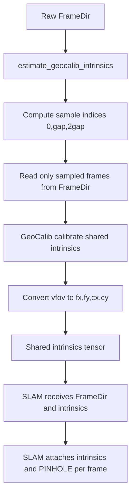
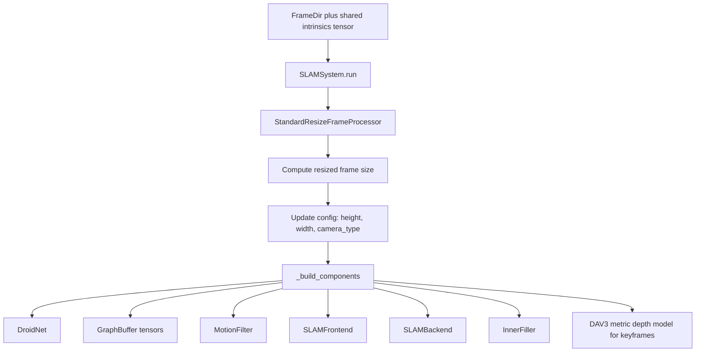
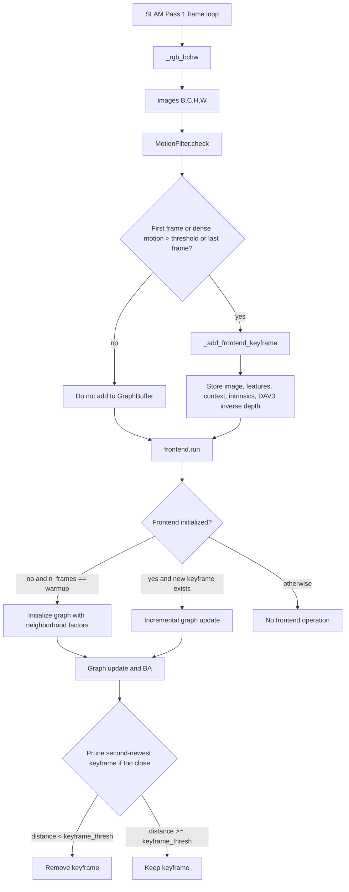
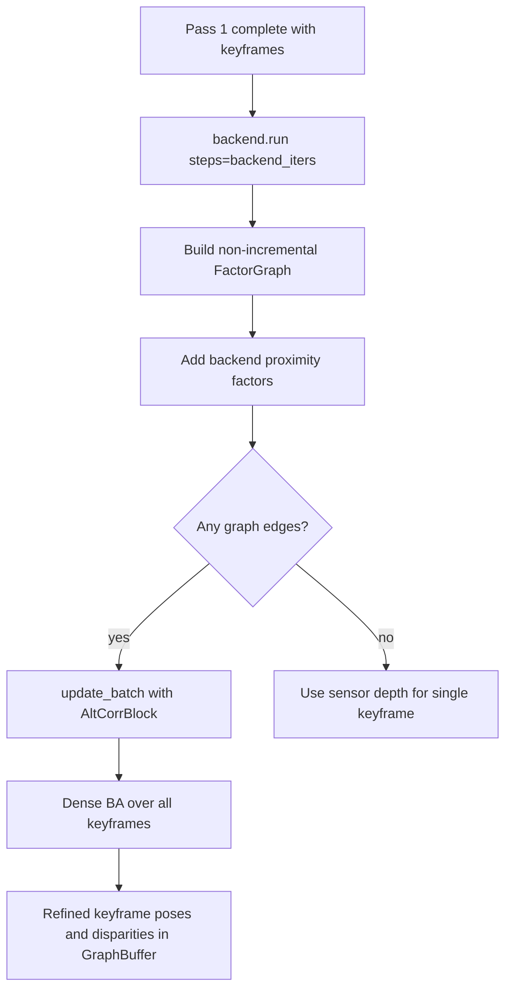
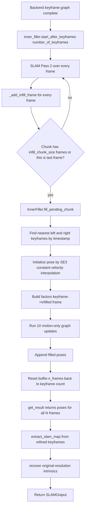
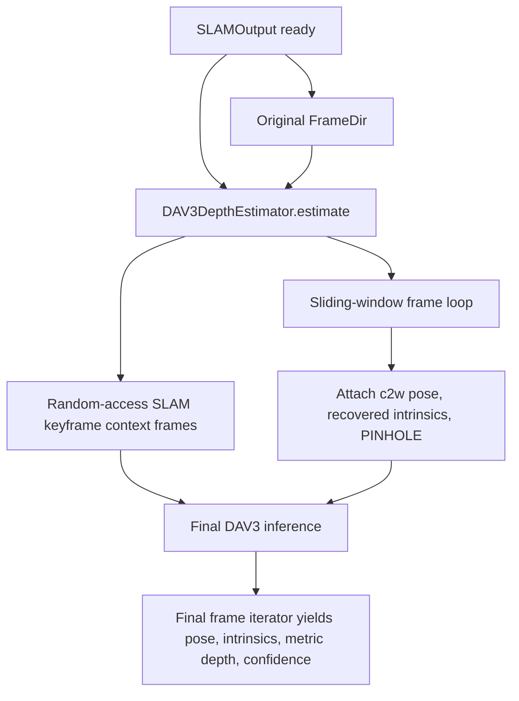
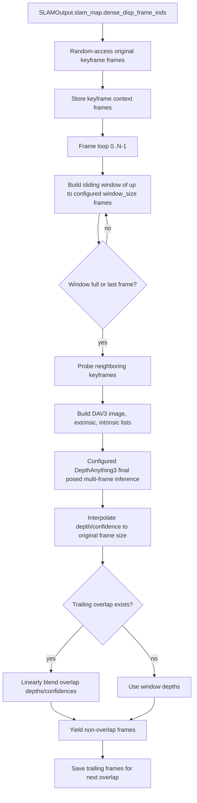
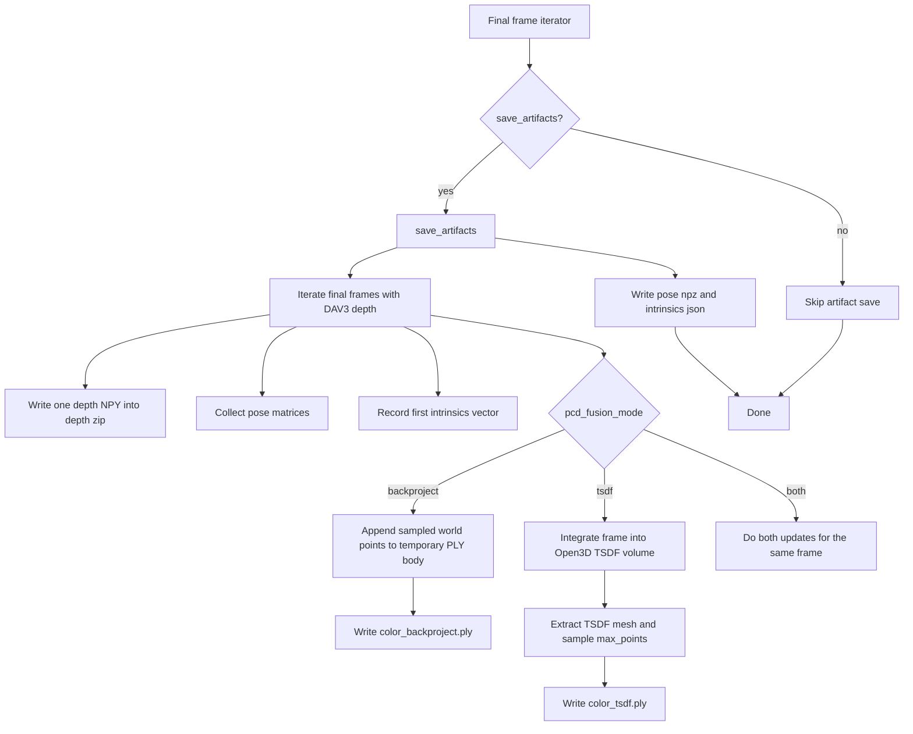
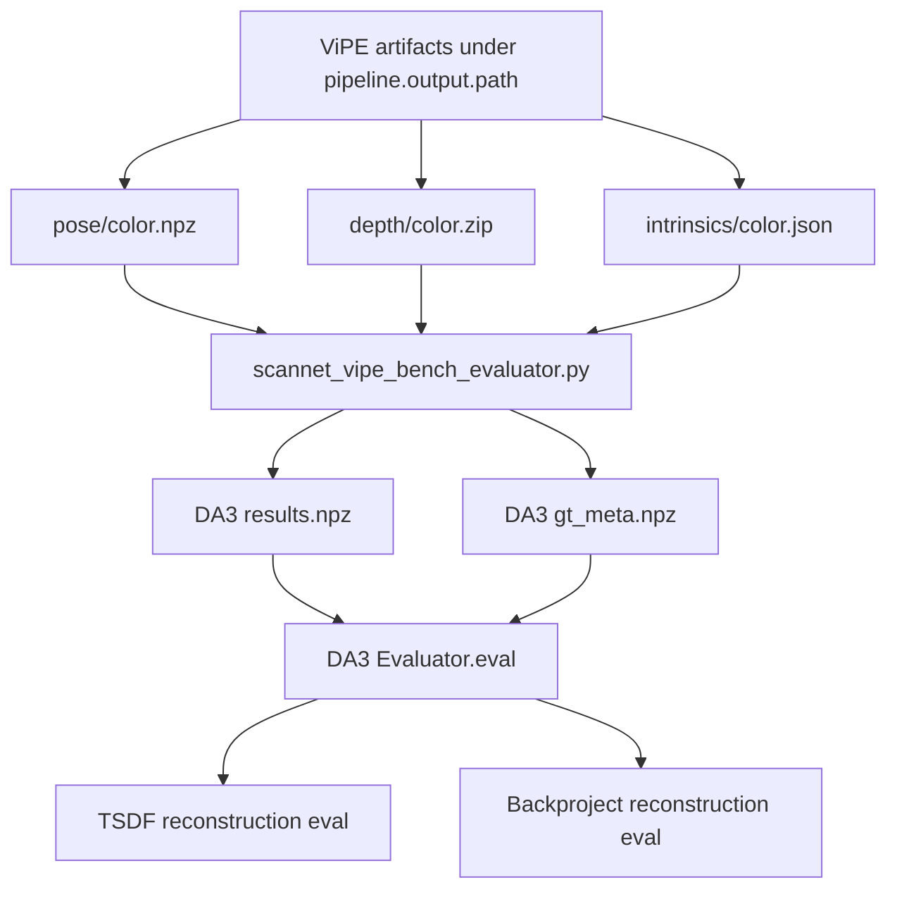

# Full Computation Walkthrough For The Current Standalone ViPE Run

This document explains the current standalone ViPE path started by `run.py`.

The standalone run is:

```bash
export NUMEXPR_MAX_THREADS=16
export OMP_NUM_THREADS=16
export MKL_NUM_THREADS=16
export CUDA_VISIBLE_DEVICES='2'

python run.py \
  streams.base_path=/robodata/smodak/repos/ovo/data/input/ScanNet/scene0000_00/color \
  streams.fps=30 \
  pipeline.output.path=/robodata/smodak/repos/vipe/outputs/scene00_dav3tsdf \
  pipeline.output.save_artifacts=true \
  pipeline.output.pcd_fusion_mode=both
```

## High-Level Runtime Flow

The current standalone run is easiest to read as five computation stages. Each stage hands one explicit object/state bundle to the next stage. There is no iterative feedback from a later stage back into an earlier stage.

The implementation details below are still split into smaller chunks because the code has separate classes for stream construction, initialization, SLAM frontend, backend BA, infill, DAV3 depth, and artifact writing. Those chunks should be read under this five-stage lens.


The execution grain is:

| Stage | What it computes |
| --- | --- |
| Stage 1: initialization and stream setup | Creates one `FrameDir` and estimates one shared pinhole intrinsics vector from three sampled frames with GeoCalib. No full-sequence cache or stream wrapper is created. |
| Stage 2: SLAM pass 1 frontend loop | Loops over frames once, attaches the shared intrinsics, resizes each frame for SLAM, runs DROID motion-filter features on every frame, stores accepted keyframes with DROID feature/context tensors and DAV3 metric depth anchors, and runs incremental frontend BA as keyframes arrive. |
| Stage 3: backend global BA | Runs once over the complete pass-1 keyframe set with `steps=backend_iters`. It builds one fresh non-incremental factor graph and optimizes all keyframes as a sequence-level solve. |
| Stage 4: SLAM pass 2 pose infill loop | Loops over every frame again, appends frames in chunks, initializes non-keyframe poses from neighboring keyframes, optimizes those appended poses motion-only, returns one pose per original frame, and extracts the internal low-resolution keyframe map. |
| Stage 5: final DAV3 depth and outputs | Re-reads original-resolution frames, assigns final SLAM pose/intrinsics, runs final DAV3 depth in sliding windows, writes artifacts, and writes the configured PCD export or exports. |

The detailed chunks map to the five stages like this:

| Detailed chunks | Stage | Loop or sequence-once? | Handoff produced |
| --- | --- | --- | --- |
| Chunks 1.1-1.3 | Stage 1 | `FrameDir` construction once; GeoCalib samples three frames once; shared intrinsics are returned as one CUDA tensor. | Original `FrameDir` plus shared intrinsics tensor. |
| Chunks 2.1-2.2 | Stage 2 | Per-frame SLAM pass-1 loop with incremental updates as keyframes arrive. | Optimized frontend keyframe buffer. |
| Chunk 3.1 | Stage 3 | Sequence-level backend BA over all keyframes, not a per-frame loop. | Refined keyframe poses/disparities in `GraphBuffer`. |
| Chunk 4.1 | Stage 4 | Per-frame pass-2 loop plus chunked infill solves. | `SLAMOutput` containing full-frame trajectory, recovered intrinsics, and `SLAMMap`. |
| Chunks 5.1-5.3 | Stage 5 | Re-reads original frames; DAV3 directly gathers SLAM keyframes by index and then runs one sliding-window pass; artifact writing loops once over final yielded frames. | Saved artifacts and configured PCD export or exports. |

## Stage 1: Initialization And Stream Setup

<a id="chunk-1-1"></a>
### Chunk 1.1: Shell, Hydra Config, And Runtime Construction

Source files:

| File | Role |
| --- | --- |
| `run.py` | Hydra entrypoint, direct frame-dir source construction, and pipeline launch |
| `configs/default.yaml` | Single config file |
| `vipe/pipeline.py` | `VipePipeline` |
| `vipe/streams/base.py` | `FrameDir`, `FrameData`, `FrameStream` |

Stage context: this is the sequence-once setup part of Stage 1. It constructs config-backed Python objects only. It does not read the whole image sequence, does not run GeoCalib yet, and does not run SLAM. The handoff is one `FrameDir` source plus one `VipePipeline`.

#### Diagram

```mermaid
flowchart TD
    A[Shell command] --> B[Environment variables]
    A --> C[Hydra CLI overrides]
    C --> D[configs/default.yaml]
    D --> E[DictConfig args]
    E --> F[FrameDir args.streams.base_path/fps/start/end/skip]
    E --> G[VipePipeline args.pipeline]
    F --> H[frame_stream]
    G --> I[pipeline]
    H --> J[pipeline.run(frame_stream)]
    I --> J
```

#### Computation

`run.py` is decorated with:

```python
@hydra.main(version_base=None, config_path="configs", config_name="default")
```

Hydra loads `configs/default.yaml`, then applies CLI overrides such as:

```text
streams.base_path=/robodata/smodak/repos/ovo/data/input/ScanNet/scene0000_00/color
streams.fps=30
pipeline.output.path=/robodata/smodak/repos/vipe/outputs/scene00_dav3tsdf
pipeline.output.save_artifacts=true
pipeline.output.pcd_fusion_mode=both
```

The shell variables do not change Python control flow directly:

| Variable | Effect |
| --- | --- |
| `CUDA_VISIBLE_DEVICES='2'` | Makes physical GPU 2 appear as CUDA device 0 inside PyTorch/Open3D/DA3 calls. |
| `NUMEXPR_MAX_THREADS=16` | Controls NumExpr thread count if NumExpr is imported. |
| `OMP_NUM_THREADS=16` | Controls OpenMP thread count for libraries that obey it. |
| `MKL_NUM_THREADS=16` | Controls MKL thread count for libraries that obey it. |

`run.py` then constructs one frame source directly:

```python
logger = configure_logging()
frame_stream = FrameDir(
    path=args.streams.base_path,
    fps=args.streams.fps,
    frame_start=args.streams.frame_start,
    frame_end=args.streams.frame_end,
    frame_skip=args.streams.frame_skip,
)
```

Then it constructs one pipeline directly:

```python
pipeline = VipePipeline(
    slam=args.pipeline.slam,
    depth=args.pipeline.depth,
    output=args.pipeline.output,
)
```

The pipeline constructor creates the output root:

```python
self.slam_cfg = slam
self.out_cfg = output
self.out_path = Path(self.out_cfg.path)
self.out_path.mkdir(exist_ok=True, parents=True)
```

With the command above:

```text
self.out_path = /robodata/smodak/repos/vipe/outputs/scene00_dav3tsdf
```

Finally:

```python
logger.info(f"Processing {frame_stream.name()}")
pipeline.run(frame_stream)
logger.info(f"Finished processing {frame_stream.name()}")
```

#### Branches

| Branch | Current command outcome |
| --- | --- |
| `save_artifacts` | `true`, so artifacts are written. |
| `pcd_fusion_mode` | `both` for the command shown. This is also the default, so both PCD exports are written. |

<a id="chunk-1-2"></a>
### Chunk 1.2: Frame Directory Source And Frame Ordering

Source files:

| File | Role |
| --- | --- |
| `vipe/streams/base.py` | `FrameDir`, `FrameData`, `FrameStream` |
| `vipe/utils/misc.py` | Numeric-vs-lexicographic image sorting |

Stage context: this is the frame-source part of Stage 1. The file list and image size are computed once in `FrameDir.__init__`. Actual pixel tensors are produced lazily each time the stream is iterated, so later stages can re-read the same directory without caching a full frame list in memory.

#### Diagram

```mermaid
flowchart TD
    A[base_path] --> B[Path exists check]
    B --> C[glob jpg jpeg png bmp tiff tif both cases]
    C --> D{Are all stems pure digits?}
    D -->|yes| E[sort by int(stem), then str(path)]
    D -->|no| F[sort lexicographically by str(path)]
    E --> G[frame_files]
    F --> G
    G --> H[read first frame with cv2.imread]
    H --> I[record H, W, fps, start, end, step]
    I --> J[__getitem__ or __iter__ reads selected frames]
    J --> K[BGR to RGB]
    K --> L[float32 0..1 tensor on CUDA]
    L --> M[FrameData(raw_frame_idx, rgb)]
```

#### Computation

`run.py` calls:

```python
FrameDir(
    path=args.streams.base_path,
    fps=args.streams.fps,
    frame_start=args.streams.frame_start,
    frame_end=args.streams.frame_end,
    frame_skip=args.streams.frame_skip,
)
```

`FrameDir.__init__`:

1. Checks `path.is_dir()`.
2. Collects image files with extensions:
   ```python
   [".jpg", ".jpeg", ".png", ".bmp", ".tiff", ".tif"]
   ```
   and uppercase variants.
3. Calls:
   ```python
   self.frame_files = sort_image_sequence(set(self.frame_files))
   ```
4. Reads the first frame with `cv2.imread` to set `_height` and `_width`.
5. Sets:
   ```python
   self.start = frame_start
   self.end = len(self.frame_files) if frame_end == -1 else min(frame_end, len(self.frame_files))
   self.step = frame_skip
   self._fps = fps / self.step
   ```

The current image sorting rule is:

```python
def sort_image_sequence(paths):
    paths = list(paths)
    if paths and all(Path(path).stem.isdigit() for path in paths):
        return sorted(paths, key=lambda path: (int(Path(path).stem), str(path)))
    return sorted(paths, key=str)
```

That means:

| File names | Sort order |
| --- | --- |
| `0.png`, `1.png`, `2.png`, `10.png` | `0`, `1`, `2`, `10` because every stem is numeric |
| `frame1.png`, `frame10.png`, `frame2.png` | lexicographic: `frame1`, `frame10`, `frame2` |
| mixed `0.png`, `frame1.png` | lexicographic because not every stem is numeric |

`FrameDir` supports both iteration and random access. Random access uses selected-frame indices, not raw sorted-file indices:

```python
frame_idx = self.start + index * self.step
frame_path = self.frame_files[frame_idx]
```

So `frame_stream[0]` means "the first selected frame", and `FrameData.raw_frame_idx` stores the actual index in the sorted file list after applying `frame_start` and `frame_skip`.

Iteration is re-iterable and simply yields `self[0]`, `self[1]`, ...:

```python
for frame_idx in range(len(self)):
    yield self[frame_idx]
```

For each selected frame:

```python
frame = cv2.imread(str(frame_path))              # H,W,3 BGR uint8 CPU
frame = cv2.cvtColor(frame, cv2.COLOR_BGR2RGB)   # H,W,3 RGB uint8 CPU
frame_rgb = torch.as_tensor(frame).float().cuda() / 255.0
return FrameData(raw_frame_idx=frame_idx, rgb=frame_rgb)
```

The resulting `FrameData` initially has:

```python
FrameData(
    raw_frame_idx=<integer index in sorted file list>,
    rgb=<CUDA tensor, shape H x W x 3, float32, range 0..1>,
    pose=None,
    camera_type=None,
    intrinsics=None,
    metric_depth=None,
    depth_confidence=None,
)
```

#### Branches

| Branch | Behavior |
| --- | --- |
| `frame_end == -1` | Uses all files through the end. |
| `frame_skip > 1` | Reads every `frame_skip`-th image and divides FPS by `frame_skip`. |
| Image read fails | Raises `ValueError`. |

<a id="chunk-1-3"></a>
### Chunk 1.3: GeoCalib Intrinsics

Source files:

| File | Role |
| --- | --- |
| `vipe/pipeline.py` | `estimate_geocalib_intrinsics`, `VipePipeline.run` |
| `vipe/priors/geocalib/*` | GeoCalib model and LM optimizer |

Stage context: this completes Stage 1. GeoCalib samples three frames once, estimates one shared vertical FOV, and converts that FOV into one raw-resolution pinhole intrinsics tensor. The one-time handoff to Stage 2 is the original `FrameDir` plus this shared CUDA tensor.

#### Diagram



#### Pipeline Construction

`VipePipeline.run(frame_stream)` starts by creating the artifact path and computing intrinsics:

```python
artifact_path = io.ArtifactPath(self.out_path, frame_stream.name())
intrinsics = estimate_geocalib_intrinsics(frame_stream)
slam_output = self._run_slam(frame_stream, intrinsics)
```

`artifact_path` only records where outputs for this frame stream will be written. `estimate_geocalib_intrinsics` is the only computation in Stage 1 that runs a learned model. It returns a tensor; it does not wrap the stream or store every frame.

When SLAM later iterates `frame_stream`, `SLAMSystem.run` attaches the same tensor and `CameraType.PINHOLE` to each yielded `FrameData` before resizing it for SLAM.

#### GeoCalib Intrinsics Computation

`estimate_geocalib_intrinsics(frame_stream, gap_sec=1.0)` computes sample indices:

```python
gap_frame = int(gap_sec * frame_stream.fps())
gap_frame = min(gap_frame, (len(frame_stream) - 1) // 2)
sample_frame_inds = [0, gap_frame, gap_frame * 2]
```

Default `gap_sec` is `1.0`.

For a real ScanNet run at `fps=30` with 5578 frames:

```text
gap_frame = min(30, (5578 - 1) // 2) = 30
sample_frame_inds = [0, 30, 60]
```

For a concrete 10-frame, 2-FPS example:

```text
gap_frame = min(int(1.0 * 2), (10 - 1)//2) = min(2, 4) = 2
sample_frame_inds = [0, 2, 4]
```

`estimate_geocalib_intrinsics` then:

1. Constructs `GeoCalib(weights="pinhole").cuda()`.
2. Iterates the `FrameDir` until the last sample index and stores the needed samples:
   ```python
   sample_frame_set = set(sample_frame_inds)
   sample_by_idx = {}
   for frame_idx, frame in enumerate(frame_stream):
       if frame_idx in sample_frame_set:
           sample_by_idx[frame_idx] = frame.rgb.moveaxis(-1, 0)
       if frame_idx >= sample_frame_inds[-1]:
           break
   sample_frames = torch.stack([sample_by_idx[i] for i in sample_frame_inds])
   ```
   Shape is `(3, 3, H0, W0)`.
3. Calls:
   ```python
   res = model.calibrate(sample_frames, shared_intrinsics=True)
   ```
4. Reads the shared vertical FOV:
   ```python
   fov_y = res["camera"].vfov[0].item()
   ```

GeoCalib internal sequence:

```mermaid
flowchart TD
    A[3 RGB sample frames C,H,W in range 0..1] --> B[ImagePreprocessor resize short side to 320, edge divisible by 32]
    B --> C[MSCAN high-level features]
    B --> D[LowLevelEncoder features]
    C --> E[PerspectiveDecoder]
    D --> E
    E --> F[up_field, up_confidence]
    E --> G[latitude_field, latitude_confidence]
    F --> H[LMOptimizer]
    G --> H
    H --> I[Initialize camera from 0.7 * max(h,w) focal]
    I --> J[Iteratively optimize gravity and focal]
    J --> K[Return camera vfov]
```

The calibration model predicts dense perspective fields:

| Field | Shape after postprocess | Meaning |
| --- | --- | --- |
| `up_field` | `(B, 2, H, W)` | 2D image-space up direction |
| `up_confidence` | `(B, H, W)` | Confidence for up field |
| `latitude_field` | `(B, 1, H, W)` | Predicted latitude angle |
| `latitude_confidence` | `(B, H, W)` | Confidence for latitude |

`LMOptimizer` creates an initial pinhole camera and gravity, computes analytic perspective fields for that camera, and minimizes residuals between predicted fields and analytic fields. It uses Huber-weighted residuals and Levenberg-Marquardt updates. With `shared_intrinsics=True`, all 3 sample frames share the same optimized focal length, but each frame can have its own gravity estimate.

After GeoCalib returns, ViPE converts vertical FOV to one pinhole intrinsics vector at the original input image size:

```python
frame_height, frame_width = frame_stream.frame_size()
fx = fy = frame_height / (2 * np.tan(fov_y / 2))
intrinsics = torch.as_tensor([fx, fy, frame_width / 2, frame_height / 2]).float().cuda()
```

Important: this code uses image height to compute both `fx` and `fy` from vertical FOV. `cx` and `cy` are image center coordinates.

#### Handoff To SLAM

The original `FrameDir` preserves the stream metadata:

| Method | Returned value |
| --- | --- |
| `frame_size()` | original `FrameDir.frame_size()` |
| `fps()` | original effective FPS |
| `name()` | original stream name, such as `color` |
| `__len__()` | original selected frame count |

Every yielded `FrameData` still has original-resolution RGB. Stage 2 adds:

```python
frame_data.intrinsics = shared_intrinsics  # CUDA tensor [fx, fy, cx, cy]
frame_data.camera_type = CameraType.PINHOLE
```

SLAM then performs its own resizing in Stage 2. That separation matters: GeoCalib intrinsics are computed at the raw frame size; SLAM scales and crops both RGB and intrinsics afterward.

## Stage 2: SLAM Pass 1 Frontend Loop

### High-Level Pseudocode

```python
def stage_2_slam_pass_1_frontend(frame_stream, intrinsics):
    resizer = StandardResizeFrameProcessor()
    total_n_frames = len(frame_stream)

    frame_size = resizer.update_frame_size(frame_stream.frame_size())
    config.height = frame_size[0]
    config.width = frame_size[1]
    config.camera_type = PINHOLE

    droid_net = DroidNet().cuda().eval()
    buffer = GraphBuffer(height=config.height, width=config.width, ...)
    motion_filter = MotionFilter(droid_net, thresh=config.filter_thresh)
    frontend = SLAMFrontend(droid_net, buffer, config)
    metric_depth_model = DepthAnything3Model(configured_keyframe_model)

    for frame_idx, frame_data in enumerate(frame_stream):
        frame_data.intrinsics = intrinsics
        frame_data.camera_type = PINHOLE
        frame_data = resizer(frame_data)
        images = frame_data.rgb.permute(2, 0, 1)[None]  # BCHW

        motion_result = motion_filter.check(images)
        is_last_frame = frame_idx == total_n_frames - 1

        if motion_result.is_keyframe or is_last_frame:
            kf_idx = buffer.n_frames
            buffer.tstamp[kf_idx] = frame_idx
            buffer.images[kf_idx] = images[0]
            buffer.fmaps[kf_idx] = motion_result.fmap[0]
            net, inp = motion_result.net, motion_result.inp
            if net is None or inp is None:
                net, inp = droid_net.encode_context(images)
            buffer.nets[kf_idx], buffer.inps[kf_idx] = net[0], inp[0]

            if kf_idx == 0:
                buffer.intrinsics = frame_data.intrinsics

            buffer.n_frames += 1
            buffer.update_disps_sens(metric_depth_model, frame_idx=kf_idx)

        if not frontend.is_initialized and buffer.n_frames == config.warmup:
            frontend.t1 = buffer.n_frames
            frontend.graph.add_neighborhood_factors(0, frontend.t1, r=1 if config.seq_init else 3)
            for _ in range(8):
                frontend.graph.update(t0=1, use_inactive=True)

            if not config.seq_init:
                frontend.graph.add_proximity_factors(...)
                for _ in range(8):
                    frontend.graph.update(t0=1, use_inactive=True)

            frontend.initialize_next_pose_and_disparity()
            frontend.is_initialized = True

        elif frontend.is_initialized and frontend.t1 < buffer.n_frames:
            frontend.graph.rm_factors(frontend.graph.age > frontend.max_age, store=True)
            frontend.graph.add_proximity_factors(...)

            for _ in range(frontend.iters1):
                frontend.graph.update(use_inactive=True)

            if second_newest_keyframe_is_too_close():
                frontend.graph.rm_second_newest_keyframe(...)
            else:
                for _ in range(frontend.iters2):
                    frontend.graph.update(use_inactive=True)

            frontend.initialize_next_pose_and_disparity()

    return buffer  # keyframe poses/disparities/features/DAV3 depth anchors for Stage 3
```

<a id="chunk-2-1"></a>
### Chunk 2.1: SLAM Standard Resize, Graph Buffer, And Model Setup

Source files:

| File | Role |
| --- | --- |
| `vipe/slam/system.py` | `SLAMSystem`, resize processor, two SLAM passes |
| `vipe/slam/components/buffer.py` | Persistent keyframe graph state |
| `vipe/slam/networks/droid_net.py` | DROID feature/context/update networks |
| `vipe/priors/depth/dav3.py` | DAV3 metric depth used on SLAM keyframes |

Stage context: this is the sequence-once setup for Stage 2. It computes the resized SLAM frame size from the raw `FrameDir`, builds the DROID network, allocates the keyframe `GraphBuffer`, and loads the configured DAV3 metric-depth model used only for keyframe scale anchors. The handoff is an empty but fully allocated SLAM state ready for the pass-1 frame loop.

#### Diagram



#### Standard Resize And Crop

SLAM never works at the original frame size directly. It creates one resize processor:

```python
resizer = StandardResizeFrameProcessor()
frame_size = resizer.update_frame_size(frame_stream.frame_size())
```

During each SLAM pass, every raw `FrameData` is assigned the shared intrinsics and then resized/cropped inline:

```python
frame_data.intrinsics = intrinsics
frame_data.camera_type = CameraType.PINHOLE
frame_data = resizer(frame_data)
```

For each frame, `StandardResizeFrameProcessor._compute_frame_size_crop` computes:

```python
h0, w0 = previous_frame_size
scale_factor = sqrt((384 * 512) / (h0 * w0))
h1 = int(h0 * scale_factor)
w1 = int(w0 * scale_factor)

crop_h = h1 % 8
crop_w = w1 % 8
crop_top = crop_h // 2
crop_bottom = crop_h - crop_top
crop_left = crop_w // 2
crop_right = crop_w - crop_left

self.fac_x = w0 / w1
self.fac_y = h0 / h1
self.scx = crop_left
self.scy = crop_top
```

Then `__call__` does:

```python
frame_data = frame_data.resize((h1, w1))
frame_data = frame_data.crop(top=crop_top, bottom=crop_bottom, left=crop_left, right=crop_right)
```

`FrameData.resize` changes:

| Field | Resize rule |
| --- | --- |
| `rgb` | bilinear interpolation |
| `metric_depth` | bilinear interpolation if present |
| `depth_confidence` | bilinear interpolation if present |
| `intrinsics` | `fx,cx` scaled by `w1/w0`, `fy,cy` scaled by `h1/h0` |

`FrameData.crop` changes:

| Field | Crop rule |
| --- | --- |
| `rgb`, `metric_depth`, `depth_confidence` | slice `[top:bottom, left:right]` |
| `intrinsics` | `cx -= left`, `cy -= top` |

The resized dimensions must be divisible by 8 because DROID features and disparities live at `1/8` resolution.

#### GraphBuffer State

After resize, `SLAMSystem.run` sets config values:

```python
self.config.update({
    "height": frame_size[0],
    "width": frame_size[1],
    "camera_type": camera_type,
})
```

For the current standalone path:

```text
camera_type = PINHOLE
```

`GraphBuffer` allocates fixed-size CUDA tensors:

| Buffer | Example shape | Meaning |
| --- | --- | --- |
| `tstamp` | `(1024,)` | raw frame index for each keyframe/buffer frame |
| `images` | `(1024,3,384,512)` float16 | resized RGB images |
| `poses` | `(1024,7)` | SE3 world-to-camera pose as translation + quaternion |
| `intrinsics` | `(4,)` | resized pinhole intrinsics |
| `disps` | `(1024,48,64)` | optimized inverse depth/disparity |
| `disps_sens` | `(1024,48,64)` | DAV3 metric inverse-depth anchor |
| `fmaps` | `(1024,128,48,64)` half | DROID feature maps |
| `nets` | `(1024,128,48,64)` half | DROID GRU hidden state |
| `inps` | `(1024,128,48,64)` half | DROID context input |

`poses` are initialized to identity:

```text
[tx, ty, tz, qx, qy, qz, qw] = [0, 0, 0, 0, 0, 0, 1]
```

`disps` is initialized to `init_disp`, default `1.0`. That corresponds to initial depth `1 / 1.0 = 1.0 m`.

#### DROID Network Setup

`DroidNet()` contains:

| Module | Purpose |
| --- | --- |
| `fnet = BasicEncoder(output_dim=128, norm_fn="instance")` | Feature maps for correlation |
| `cnet = BasicEncoder(output_dim=256, norm_fn="none")` | Context split into hidden state and input |
| `update = UpdateModule()` | RAFT/DROID-style recurrent update that predicts coordinate deltas, weights, and damping |

`load_weights` checks:

```python
ckpt_path = Path(torch.hub.get_dir()) / "droid_slam" / "droid.pth"
```

If missing, it downloads the DROID checkpoint, strips `module.` prefixes, adapts the 4-channel original output heads down to 2 channels, loads weights, and sets eval mode.

#### Keyframe DAV3 Metric Depth Model

`SLAMSystem._build_components` always creates:

```python
self.metric_depth = DepthAnything3Model(self.keyframe_depth_model)
```

This is `DepthAnything3Model`, using:

```python
DepthAnything3.from_pretrained(pipeline.depth.keyframe_model)
```

This keyframe model is separate from the final post-processing multiview DAV3 model. It is used to anchor SLAM keyframe inverse depths during bundle adjustment.

<a id="chunk-2-2"></a>
### Chunk 2.2: SLAM Pass 1, Motion Filtering, Keyframe Addition, And Frontend BA

Source files:

| File | Role |
| --- | --- |
| `vipe/slam/system.py` | Pass 1 loop, `_rgb_bchw`, `_add_frontend_keyframe` |
| `vipe/slam/components/motion_filter.py` | Keyframe decision |
| `vipe/slam/components/frontend.py` | Warmup, incremental graph updates, keyframe pruning |
| `vipe/slam/components/factor_graph.py` | Correlation, update operator, graph edges |
| `vipe/slam/components/buffer.py` | Dense BA call and frame-distance metric |
| `vipe/slam/ba/*` | Sparse solver and residual terms |
| `vipe/slam/maths/geom.py` | Inverse projection, projection, SE3 transforms |

Stage context: this is the per-frame loop of Stage 2. It consumes the original `FrameDir` once, attaches the shared intrinsics, and resizes each frame to SLAM resolution. Every frame is converted to BCHW and runs the motion filter. The motion filter computes DROID features for every frame for keyframe selection, while accepted keyframes are stored in `GraphBuffer` with their DROID feature/context tensors plus DAV3 keyframe depth anchors. Frontend BA runs incrementally as keyframes arrive. The handoff to Stage 3 is the keyframe buffer with frontend-optimized poses and disparities.

#### Diagram



#### Per-Frame BCHW Conversion

Each pass-1 iteration receives one `FrameData` from:

```python
for frame_idx, frame_data in enumerate(frame_stream):
```

`_rgb_bchw(frame_data)`:

```python
images = frame_data.rgb.permute(2, 0, 1)[None]
return images
```

Example output shapes:

```python
images.shape == (1, 3, 384, 512)
```

The batch dimension is `1` because this runtime path has one camera and one frame directory.

This helper only changes tensor layout and adds a batch dimension. DROID feature computation happens inside `MotionFilter.check(images)`. Accepted keyframes reuse the motion-filter feature map instead of recomputing it during buffer storage.

#### MotionFilter Keyframe Decision

`MotionFilter.check(images)` runs on every frame.

First frame branch:

```python
gmap = self.net.encode_features(images)
if not self.initialized:
    net, inp = self.net.encode_context(images)
    self.f_net, self.f_inp, self.f_fmap = net, inp, gmap
    self.current_frame_idx = 0
    self.last_kf_frame_idx = 0
    self.initialized = True
    return MotionFilterResult(True, gmap, net, inp)
```

So the first frame is always a keyframe.

Later-frame branch:

1. Encode current feature map:
   ```python
   gmap = self.net.encode_features(images)
   ```
   Example shape: `(1,128,48,64)`.
2. Create low-res coordinate grid:
   ```python
   coords0.shape == (1,1,48,64,2)
   ```
   Pixel `(x=10,y=5)` has coordinate `[10,5]`.
3. Build correlation between last keyframe feature map and current feature map:
   ```python
   corr = CorrBlock(self.f_fmap[None], gmap[None])(coords0)
   ```
4. Run one learned DROID update:
   ```python
   _, delta, weight = self.net.update.forward(self.f_net[None], self.f_inp[None], corr)
   ```
   `delta.shape == (1,1,48,64,2)`.
5. Compute per-pixel flow magnitude:
   ```python
   dense_flow = delta.norm(dim=-1)[0]  # shape (1,48,64)
   ```
6. Average flow magnitude over all low-res pixels:
   ```python
   dense_motion_score = dense_flow.mean([1, 2]).item()
   ```
7. Return a `MotionFilterResult` with `is_keyframe=True` if:
   ```python
   dense_motion_score > self.thresh
   ```
   Default threshold is `2.4`.

`SLAMSystem.run` also forces the last frame to be a keyframe:

```python
motion_result = self.motion_filter.check(images)
if motion_result.is_keyframe or frame_idx == total_n_frames - 1:
    self._add_frontend_keyframe(...)
```

#### Keyframe Addition

When a frame is accepted as a keyframe, `_add_frontend_keyframe(...)` runs.

Let:

```python
kf_idx = self.buffer.n_frames
```

The function stores:

```python
self.buffer.tstamp[kf_idx] = frame_idx
self.buffer.images[kf_idx] = images[0]
self.buffer.fmaps[kf_idx] = motion_result.fmap[0]
net, inp = motion_result.net, motion_result.inp
if net is None or inp is None:
    net, inp = self.droid_net.encode_context(images)
self.buffer.nets[kf_idx], self.buffer.inps[kf_idx] = net[0], inp[0]
```

For normal accepted keyframes, `MotionFilter.check` has already computed both `fmap` and context tensors, so `_store_buffer_frame` reuses them. For the last frame forced into the keyframe set even when its motion score is below threshold, the feature map is still reused and only the missing context tensors are computed.

```python
if kf_idx == 0:
    self.buffer.intrinsics = frame_data.intrinsics
```

If the frame already has metric depth, it samples it into `disps_sens`. In current initialized frames, metric depth is not present yet, so this part is normally skipped before DAV3 keyframe depth.

If an input pose exists, it stores that pose as world-to-camera. In current standalone frame-dir runs, input poses are not present, so this is skipped:

```python
if frame_data.pose is not None:
    self.buffer.poses[kf_idx] = frame_data.pose.inv().data
```

Then phase 1 runs keyframe DAV3:

```python
self.buffer.update_disps_sens(self.metric_depth, frame_idx=kf_idx)
```

`GraphBuffer.update_disps_sens` creates:

```python
DepthEstimationInput(
    rgb=self.images[frame_idx].moveaxis(0, -1).float(),  # H,W,3
    intrinsics=self.intrinsics,
    camera_type=self.camera_type,
)
```

`DepthAnything3Model.estimate`:

1. Converts RGB to uint8 numpy list.
2. Runs the configured single-image metric depth model, default `depth-anything/DA3METRIC-LARGE`:
   ```python
   self.model.inference(rgb_images, process_res_method="upper_bound_resize", process_res=504)
   ```
3. Computes focal scaling:
   ```python
   dav3_camera_focal = focal_length / max(width, height) * 504
   dav3_metric_depth = dav3_result.depth * dav3_camera_focal / 300.0
   ```
4. Zeroes sky depth from DA3 sky mask.
5. Interpolates to the SLAM image size.

Back in `GraphBuffer.update_disps_sens`, ViPE converts metric depth to inverse depth at the DROID grid sample positions:

```python
disp_sens = metric_depth[3::8, 3::8]
disp_sens = torch.where(disp_sens > 0, disp_sens.reciprocal(), disp_sens)
self.disps_sens[frame_idx] = disp_sens
```

For a `384 x 512` SLAM image, `3::8` gives `48` rows and `64` columns. It samples pixel centers offset by 3 at each 8-pixel block.

Finally:

```python
self.buffer.n_frames += 1
```

#### Frontend Initialization

`self.frontend.run()` is called every frame, but it only acts when enough keyframes are present or a new keyframe arrives after initialization.

Initialization branch:

```python
if not self.is_initialized and self.video.n_frames == self.warmup:
    self.__initialize()
```

Default `warmup=8`.

`__initialize`:

1. Sets:
   ```python
   self.t1 = self.video.n_frames
   ```
2. Adds neighborhood factors:
   ```python
   self.graph.add_neighborhood_factors(0, self.t1, r=1 if self.args.seq_init else 3)
   ```
   Current config has `seq_init=true`, so `r=1`.
3. Runs 8 graph updates:
   ```python
   for _ in range(8):
       self.graph.update(t0=1, use_inactive=True)
   ```
4. If `seq_init=false`, it would also add proximity factors and run 8 more updates. Current config does not use that branch.
5. If no initial poses exist, initialize the next pose by constant velocity:
   ```python
   self.__init_pose()
   ```
6. Set next disparity initial value to mean of recent disparities:
   ```python
   self.video.disps[self.t1] = self.video.disps[self.t1 - 4:self.t1].mean()
   ```
7. Set `self.is_initialized=True`.
8. Remove factors older than `warmup - 4`, storing them as inactive:
   ```python
   self.graph.rm_factors(self.graph.ii < self.warmup - 4, store=True)
   ```

#### Frontend Incremental Update

After initialization, when a new keyframe exists:

```python
elif self.is_initialized and self.t1 < self.video.n_frames:
    self.__update()
```

`__update`:

1. Increments optimized keyframe count:
   ```python
   self.t1 += 1
   ```
2. Drops old active factors whose age is too high:
   ```python
   self.graph.rm_factors(self.graph.age > self.max_age, store=True)
   ```
3. Adds proximity factors:
   ```python
   self.graph.add_proximity_factors(
       self.t1 - 5,
       max(self.t1 - self.frontend_window, 0),
       rad=self.frontend_radius,
       nms=self.frontend_nms,
       thresh=self.frontend_thresh,
       beta=self.beta,
       remove=True,
   )
   ```
4. Runs 4 graph updates:
   ```python
   for _ in range(self.iters1):  # iters1 = 4
       self.graph.update(use_inactive=True)
   ```
5. Computes dense-disparity frame distance between the second-newest and third-newest keyframes:
   ```python
   d = self.video.frame_distance_dense_disp(t1-3, t1-2, beta=self.beta, bidirectional=True)
   ```
6. If `d.max() < keyframe_thresh`, remove the second-newest keyframe:
   ```python
   self.graph.rm_second_newest_keyframe(self.t1 - 2)
   self.t1 -= 1
   ```
7. Else run 2 more graph updates:
   ```python
   for _ in range(self.iters2):  # iters2 = 2
       self.graph.update(use_inactive=True)
   ```
8. Predict initial pose and disparity for the next possible keyframe.

#### Factor Graph Update

`FactorGraph.update` is the central DROID-style learned optimization step.

For all active graph edges `(i,j)`:

1. Reproject current dense disparity from source frame `i` into target frame `j`:
   ```python
   coords1, _ = self.buffer.reproject_dense_disp(self.ii, self.jj)
   coords1.shape == (num_edges, 48, 64, 2)
   ```
2. Build motion features:
   ```python
   motn = torch.cat([coords1 - coords0, self.target - coords1], dim=-1)
   ```
   Per low-res pixel, this is:
   ```text
   [current_rigid_flow_x, current_rigid_flow_y, previous_residual_x, previous_residual_y]
   ```
3. Sample correlation features at `coords1`:
   ```python
   corr = self.corr(coords1)
   ```
4. Run learned update:
   ```python
   self.f_net, delta, weight, damping, _ = self.net.update.forward(...)
   ```
   Outputs:
   | Output | Shape | Meaning |
   | --- | --- | --- |
   | `delta` | `(1,E,48,64,2)` | learned correction to projected coordinates |
   | `weight` | `(1,E,48,64,2)` | per-residual confidence in x and y |
   | `damping` | `(1,unique_dense_disps,48,64)` | dense disparity damping |
5. Set new target coordinates:
   ```python
   self.target = coords1 + delta
   self.weight = weight
   self.damping[di] = damping
   ```
6. Run dense bundle adjustment:
   ```python
   self.buffer.bundle_adjustment(...)
   ```

#### Dense Bundle Adjustment Terms

`GraphBuffer.bundle_adjustment` builds a `Solver` with two term families in the current reduced path:

| Term | Active when | Residual |
| --- | --- | --- |
| `DenseDepthFlowTerm` | Always for graph edges | projected coordinate minus learned target coordinate |
| `DispSensRegularizationTerm` | When `disps_sens` exists for a keyframe | optimized disparity minus DAV3 inverse depth |

Let:

$$
\begin{aligned}
P_i &\in SE(3) && \text{world-to-camera pose for frame } i, \\
K &= (f_x, f_y, c_x, c_y) && \text{low-resolution pinhole intrinsics}, \\
d_i(\mathbf{p}) &> 0 && \text{optimized inverse depth / disparity at low-res pixel } \mathbf{p}, \\
\hat{\mathbf{p}}_{ij}(\mathbf{p}) &\in \mathbb{R}^2 && \text{learned DROID target coordinate in frame } j, \\
\mathbf{w}_{ij}(\mathbf{p}) &\in \mathbb{R}^2 && \text{learned x/y residual weights.}
\end{aligned}
$$

For low-resolution pixel $\mathbf{p}=(u,v)$ in source frame $i$, inverse projection is:

$$
z_i(\mathbf{p}) = \frac{1}{d_i(\mathbf{p})}
$$

$$
\Pi_K^{-1}(\mathbf{p}, d_i) =
\begin{bmatrix}
(u-c_x)z_i/f_x \\
(v-c_y)z_i/f_y \\
z_i \\
1
\end{bmatrix}.
$$

The source camera point is moved from camera $i$ to camera $j$ with the current poses:

$$
\mathbf{X}_{j}(\mathbf{p}) =
P_j P_i^{-1}\Pi_K^{-1}(\mathbf{p}, d_i).
$$

The pinhole projection is:

$$
\Pi_K(\mathbf{X}) =
\begin{bmatrix}
f_x X/Z + c_x \\
f_y Y/Z + c_y
\end{bmatrix}.
$$

So the dense flow residual for edge $(i,j)$ and pixel $\mathbf{p}$ is:

$$
\mathbf{r}^{\text{flow}}_{ij,\mathbf{p}} =
\Pi_K\!\left(P_j P_i^{-1}\Pi_K^{-1}(\mathbf{p}, d_i)\right)
- \hat{\mathbf{p}}_{ij}(\mathbf{p}).
$$

The solver uses componentwise weights. In code, the learned weights are additionally scaled by `weight_dense_disp = 0.001`, and invalid projections get zero weight:

$$
\tilde{\mathbf{w}}_{ij,\mathbf{p}}
= 10^{-3}\,\mathbf{w}_{ij,\mathbf{p}}\odot \mathbf{m}_{ij,\mathbf{p}},
$$

where $\mathbf{m}_{ij,\mathbf{p}}\in\{0,1\}^2$ is the valid-projection mask broadcast over x/y components.

The DAV3 sensor disparity regularizer uses:

$$
r^{\text{sens}}_{i,\mathbf{p}} =
d_i(\mathbf{p}) - d^{\text{DAV3}}_i(\mathbf{p}).
$$

With `dense_disp_alpha = 0.001`, the BA objective for one solve is:

$$
\min_{\{P_i\},\{d_i\}}
\sum_{(i,j)\in\mathcal{E}}
\sum_{\mathbf{p}\in\Omega}
\left[
\tilde{w}^{x}_{ij,\mathbf{p}}\left(r^{\text{flow},x}_{ij,\mathbf{p}}\right)^2
+
\tilde{w}^{y}_{ij,\mathbf{p}}\left(r^{\text{flow},y}_{ij,\mathbf{p}}\right)^2
\right]
+
\alpha
\sum_{i\in\mathcal{S}}
\sum_{\mathbf{p}\in\Omega}
\left(d_i(\mathbf{p}) - d^{\text{DAV3}}_i(\mathbf{p})\right)^2.
$$

$K$ is fixed during this minimization. When `motion_only=True`, dense disparity is also fixed, so the solve only updates poses.

Each nonlinear iteration linearizes residuals around the current state:

$$
\mathbf{r}(\mathbf{x}+\Delta\mathbf{x})
\approx
\mathbf{r}(\mathbf{x}) + J\Delta\mathbf{x}.
$$

The normal equations assembled by the solver are:

$$
\left(J^\top W J + \Lambda\right)\Delta\mathbf{x}
=
-J^\top W\mathbf{r}.
$$

Here $W$ is the diagonal matrix represented by the per-residual weights, and $\Lambda$ is the damping added by `set_damping`.

Dense disparities are marked as marginalized. Splitting the state update into regular variables $\Delta\mathbf{x}_r$ and marginalized dense-disparity variables $\Delta\mathbf{x}_m$ gives:

$$
\begin{bmatrix}
H_{rr} & H_{rm} \\
H_{mr} & H_{mm}
\end{bmatrix}
\begin{bmatrix}
\Delta\mathbf{x}_r \\
\Delta\mathbf{x}_m
\end{bmatrix}
=
\begin{bmatrix}
\mathbf{b}_r \\
\mathbf{b}_m
\end{bmatrix}.
$$

The Schur-complement reduced system solved first is:

$$
\left(H_{rr} - H_{rm}H_{mm}^{-1}H_{mr}\right)\Delta\mathbf{x}_r
=
\mathbf{b}_r - H_{rm}H_{mm}^{-1}\mathbf{b}_m.
$$

Then dense-disparity updates are recovered by:

$$
\Delta\mathbf{x}_m =
H_{mm}^{-1}\left(\mathbf{b}_m - H_{mr}\Delta\mathbf{x}_r\right).
$$

The solver:

1. Evaluates residuals and Jacobians.
2. Builds sparse damped normal equations.
3. Applies damping.
4. Marginalizes dense disparity with Schur complement.
5. Solves the reduced sparse system with SciPy sparse `spsolve`.
6. Applies updates using retractions:
   | Variable | Retraction |
   | --- | --- |
   | `pose` | SE3 pose retraction |
   | `dense_disp` | dense disparity additive/retracted update |

Intrinsics remain the GeoCalib estimate at resized scale during SLAM.

## Stage 3: Backend Global BA Over Keyframes

### High-Level Pseudocode

```python
def stage_3_backend_global_ba(buffer):
    t = buffer.n_frames  # number of pass-1 keyframes

    graph = FactorGraph(
        net=droid_net,
        buffer=buffer,
        max_factors=16 * t,
        incremental=False,
    )

    graph.add_proximity_factors(
        rad=config.backend_radius,
        nms=config.backend_nms,
        thresh=config.backend_thresh,
        beta=config.beta,
    )

    if len(graph.ii) == 0:
        buffer.disps[0] = where(buffer.disps_sens[0] > 0, buffer.disps_sens[0], buffer.disps[0])
        return buffer

    corr_op = AltCorrBlock(buffer.fmaps[None])

    for step in range(config.backend_iters):
        coords1, _ = buffer.reproject_dense_disp(graph.ii, graph.jj)
        motn = build_motion_features(coords1, graph.coords0, graph.target)

        for source_chunk in chunks_by_source_keyframe(graph.ii, chunk_size=8):
            iis = graph.ii[source_chunk]
            jjs = graph.jj[source_chunk]

            corr = corr_op(coords1[:, source_chunk], iis, jjs)
            net, delta, weight, damping, _ = droid_net.update(
                graph.f_net[:, source_chunk],
                buffer.inps[iis][None],
                corr,
                motn[:, source_chunk],
                ix=unique_source_inverse_indices(iis),
            )

            graph.f_net[:, source_chunk] = net
            graph.target[:, source_chunk] = coords1[:, source_chunk] + delta.float()
            graph.weight[:, source_chunk] = weight.float()
            graph.damping[unique(iis)] = damping

        buffer.bundle_adjustment(
            target=flatten_hw(graph.target),
            weight=flatten_hw(graph.weight),
            disp_damping=graph.damping,
            ii=graph.ii,
            jj=graph.jj,
            t0=1,
            t1=t,
            n_iters=8,
            pose_damping=1e-5,
            pose_ep=1e-2,
            motion_only=False,
            verbose=True,
        )

    return buffer  # same GraphBuffer, globally refined in-place
```

<a id="chunk-3-1"></a>
### Chunk 3.1: Backend Global BA Over Keyframes

Source files:

| File | Role |
| --- | --- |
| `vipe/slam/components/backend.py` | Global BA over keyframes |
| `vipe/slam/components/factor_graph.py` | Batch graph update with low-memory correlation |
| `vipe/slam/components/buffer.py` | Global frame-distance graph state |

Stage context: this is Stage 3. It is a sequence-level solve over the pass-1 keyframes. It does not loop over raw frames. The handoff into this chunk is the complete keyframe buffer from Stage 2. The handoff out is the same keyframe buffer with globally refined keyframe poses/disparities.

#### Diagram



#### Backend Graph Creation

After pass 1:

```python
self.backend.run(self.config.backend_iters)
```

Default:

```text
backend_iters = 31
```

`SLAMBackend.run` creates a fresh non-incremental `FactorGraph`:

```python
graph = FactorGraph(
    self.net,
    self.video,
    self.device,
    max_factors=16 * t,
    incremental=False,
)
```

The backend adds denser proximity factors:

```python
graph.add_proximity_factors(
    rad=self.args.backend_radius,
    nms=self.args.backend_nms,
    thresh=self.args.backend_thresh,
    beta=self.args.beta,
)
```

Defaults:

```text
backend_radius = 2
backend_nms = 3
backend_thresh = 22.0
beta = 0.3
```

`add_proximity_factors` adds:

1. Local neighborhood edges around each keyframe.
2. Additional edges whose frame-distance score is below threshold.
3. Bidirectional pairs for accepted edges.

#### Backend Batch Update

If the graph has edges, the backend calls `_iterate`.

`_iterate(graph, steps)`:

```python
graph.update_batch(
    itrs=8,
    steps=steps,
    solver_verbose=True,
)
```

The backend does not recompute DAV3 keyframe depth. DAV3 sensor disparities are already stored in `buffer.disps_sens` when each pass-1 keyframe is added, and `GraphBuffer.bundle_adjustment` uses those stored values through `DispSensRegularizationTerm`.

`FactorGraph.update_batch` uses `AltCorrBlock` instead of materializing all correlation volumes:

```python
corr_op = AltCorrBlock(self.buffer.fmaps[None])
```

For each batch step:

1. Reproject current dense disparities to get `coords1`.
2. Build motion features.
3. Process graph edges in source-index chunks of size `s=8`.
4. Sample alt correlation only for the chunk.
5. Run the DROID update module.
6. Update target coordinates, weights, and damping.
7. Run dense BA over all keyframes.

## Stage 4: SLAM Pass 2 Pose Infill

### High-Level Pseudocode

```python
def stage_4_slam_pass_2_pose_infill(refined_keyframe_buffer, frame_stream, intrinsics, resizer):
    inner_filler.start_after_keyframes(refined_keyframe_buffer.n_frames)
    keyframe_count = refined_keyframe_buffer.n_frames
    total_n_frames = len(frame_stream)

    for frame_idx, frame_data in enumerate(frame_stream):
        frame_data.intrinsics = intrinsics
        frame_data.camera_type = PINHOLE
        frame_data = resizer(frame_data)
        images = frame_data.rgb.permute(2, 0, 1)[None]  # BCHW

        append_idx = refined_keyframe_buffer.n_frames
        refined_keyframe_buffer.tstamp[append_idx] = frame_idx
        refined_keyframe_buffer.images[append_idx] = images[0]
        refined_keyframe_buffer.fmaps[append_idx] = droid_net.encode_features(images)[0]
        net, inp = droid_net.encode_context(images)
        refined_keyframe_buffer.nets[append_idx], refined_keyframe_buffer.inps[append_idx] = net[0], inp[0]
        refined_keyframe_buffer.n_frames += 1

        is_chunk_ready = refined_keyframe_buffer.n_frames - keyframe_count >= config.infill_chunk_size
        is_last_frame = frame_idx == total_n_frames - 1

        if is_chunk_ready or is_last_frame:
            fill_start = keyframe_count
            fill_end = refined_keyframe_buffer.n_frames
            fill_inds = arange(fill_start, fill_end)

            for fill_idx in fill_inds:
                left_kf, right_kf = nearest_keyframes_by_timestamp(fill_idx)
                refined_keyframe_buffer.poses[fill_idx] = se3_constant_velocity_interpolate(
                    refined_keyframe_buffer.poses[left_kf],
                    refined_keyframe_buffer.poses[right_kf],
                    refined_keyframe_buffer.tstamp[left_kf],
                    refined_keyframe_buffer.tstamp[right_kf],
                    refined_keyframe_buffer.tstamp[fill_idx],
                )

            graph = FactorGraph(droid_net, refined_keyframe_buffer, max_factors=-1, incremental=True)
            graph.add_factors(left_keyframe_indices(fill_inds), fill_inds)
            graph.add_factors(right_keyframe_indices(fill_inds), fill_inds)

            for _ in range(10):
                graph.update(
                    t0=fill_start,
                    t1=fill_end,
                    motion_only=True,  # optimize appended poses, keep dense disparities fixed
                )

            inner_filler.filled_poses.append(SE3(refined_keyframe_buffer.poses[fill_start:fill_end].clone()))
            refined_keyframe_buffer.n_frames = keyframe_count  # discard appended frames from keyframe graph

    filled_w2c_poses = inner_filler.get_result().poses
    slam_map = refined_keyframe_buffer.extract_slam_map(filter_thresh=config.map_filter_thresh)
    original_intrinsics = resizer.recover_intrinsics(refined_keyframe_buffer.intrinsics)

    return SLAMOutput(
        trajectory=filled_w2c_poses.inv(),  # camera-to-world pose for every raw frame
        intrinsics=original_intrinsics,
        slam_map=slam_map,
    )
```

<a id="chunk-4-1"></a>
### Chunk 4.1: SLAM Pass 2 And Non-Keyframe Pose Infill

Source files:

| File | Role |
| --- | --- |
| `vipe/slam/system.py` | Pass 2 loop |
| `vipe/slam/components/inner_filler.py` | Pose interpolation and optimization for every original frame |
| `vipe/slam/components/factor_graph.py` | Infill graph updates |
| `vipe/slam/components/buffer.py` | SLAM keyframe map extraction after pass 2 |
| `vipe/slam/interface.py` | `SLAMMap`, `SLAMOutput` |

Stage context: this is Stage 4. It loops over the original sequence again; its primary purpose is to produce poses for frames that were not retained as pass-1 keyframes. After that loop, it extracts the internal keyframe map and returns `SLAMOutput`. The handoff into this chunk is the globally refined keyframe buffer from Stage 3. The handoff out is `SLAMOutput`: camera-to-world pose for every original frame, recovered original-resolution intrinsics, and the internal low-resolution `SLAMMap`.

#### Diagram



#### Computation

After backend, SLAM has optimized only keyframes. Non-keyframe poses are filled in pass 2.

The code sets:

```python
self.inner_filler.start_after_keyframes(self.buffer.n_frames)
```

At this moment, `self.buffer.n_frames` is the number of optimized keyframes.

Then pass 2 loops over every original frame again:

```python
for frame_idx, frame_data in enumerate(frame_stream):
    images = self._rgb_bchw(frame_data)
    self._add_infill_frame(frame_idx, images, frame_data)
    if self.inner_filler.chunk_ready() or frame_idx == total_n_frames - 1:
        self.inner_filler.fill_pending_chunk()
```

`_add_infill_frame(...)` stores every frame after the keyframes in the same `GraphBuffer`, but it does not run `update_disps_sens`; DAV3 keyframe depth anchors were only inserted during `_add_frontend_keyframe(...)` in pass 1.

`InnerFiller.chunk_ready()` returns:

```python
self.video.n_frames - self.start_idx >= self.args.infill_chunk_size
```

Default:

```text
infill_chunk_size = 16
```

So for long scenes, it fills in chunks of 16 appended frames. For a concrete 10-frame sequence, it fills once at the last frame.

#### Pose Initialization Inside `fill_pending_chunk`

Let:

```python
m_tstamp = self.video.tstamp[self.start_idx:total_frames]  # timestamps for frames to fill
n_tstamp = self.video.tstamp[:self.start_idx]              # keyframe timestamps
```

For every infill timestamp, it finds left and right keyframes:

```python
t0 = torch.searchsorted(n_tstamp, m_tstamp, right=True) - 1
t1 = torch.where(t0 < self.start_idx - 1, t0 + 1, t0)
```

So:

| Case | `t0` | `t1` |
| --- | --- | --- |
| timestamp before the last keyframe | nearest left keyframe | next keyframe |
| timestamp at or after last keyframe | last keyframe | same last keyframe |

Then it does SE3 constant-velocity interpolation:

```python
d_time = n_tstamp[t1] - n_tstamp[t0] + 1e-3
n_pose = SE3(self.video.poses[:self.start_idx])
d_pose = n_pose[t1] * n_pose[t0].inv()
vel = d_pose.log() / d_time.unsqueeze(-1)
w = vel * (m_tstamp - n_tstamp[t0]).unsqueeze(-1)
m_pose = SE3.exp(w) * n_pose[t0]
self.video.poses[self.start_idx:total_frames] = m_pose.data
```

These poses are world-to-camera because `GraphBuffer.poses` stores inverse/camera poses.

#### Motion-Only Infill

Current `InnerFiller.fill_pending_chunk` only optimizes poses for appended non-keyframe frames. It does not update their dense disparities.

#### Infill Graph Optimization

`InnerFiller.fill_pending_chunk` builds a temporary incremental `FactorGraph`:

```python
graph = FactorGraph(..., max_factors=-1, incremental=True)
```

For each infill frame, it adds:

```python
graph.add_factors(t0, infill_inds)
graph.add_factors(t1, infill_inds)
```

That means each infilled frame is constrained by reprojection factors from its left and right neighboring keyframes.

Then:

```python
for _ in range(10):
    graph.update(
        self.start_idx,
        total_frames,
        motion_only=True,
    )
```

Because `motion_only=True`, BA fixes dense disparity and optimizes poses only.

After optimization:

```python
current_poses = SE3(self.video.poses[self.start_idx:total_frames].clone())
self.filled_poses.append(current_poses)
self.video.n_frames = self.start_idx
```

Resetting `video.n_frames` discards appended infill frames from the keyframe graph buffer, while preserving the filled poses in `self.filled_poses`.

#### Return From SLAM

After pass 2:

```python
filled_return = self.inner_filler.get_result()
```

`filled_return.poses` has one world-to-camera pose for every original frame.

After `filled_return` is available, `SLAMSystem.run` extracts the internal keyframe map:

```python
slam_map = self.buffer.extract_slam_map(filter_thresh=self.config.map_filter_thresh)
```

Default:

```text
map_filter_thresh = 0.05
```

`GraphBuffer.extract_slam_map`:

1. Chooses all keyframe buffer indices if `t_range is None`.
2. Converts stored world-to-camera poses to camera-to-world:
   ```python
   c2w_se3 = SE3(self.poses[t_range]).inv()
   ```
3. Takes low-res colors:
   ```python
   images = self.images[t_range, :, 3::8, 3::8].moveaxis(1, -1)
   ```
   Example shape: `(K,48,64,3)`.
4. Build a camera model from resized intrinsics.
5. Scale intrinsics by `1/8`.
6. Inverse project every low-res disparity pixel into camera coordinates.
7. Transform points into world coordinates.
8. Compute consistency count with `slam_ext.depth_filter`.
9. Build the valid point mask:
   ```python
   masks = (
       (count >= min(2, n_frames - 1))
       & (disps > 0.5 * disps.mean(dim=[1,2], keepdim=True))
   )
   ```
10. Pack only valid points into `SLAMMap.from_masked_dense_disp`.

`SLAMMap` stores:

| Field | Shape | Meaning |
| --- | --- | --- |
| `dense_disp_xyz` | `(M,3)` | world-space keyframe map points |
| `dense_disp_rgb` | `(M,3)` | RGB colors in `0..1` |
| `dense_disp_packinfo` | `(K,2)` | for each keyframe: start offset and count in packed point arrays |
| `dense_disp_frame_inds` | list length `K` | raw frame ids of keyframes |

This SLAM map is not the final saved TSDF/backproject point cloud. It is an internal low-resolution keyframe map; in the current output path, Stage 5 uses its `dense_disp_frame_inds` keyframe list to choose DAV3 context frames.

Then `SLAMSystem.run` returns:

```python
SLAMOutput(
    trajectory=filled_return.poses.inv(),  # camera-to-world
    intrinsics=original_intrinsics,
    slam_map=slam_map,
)
```

`original_intrinsics` are recovered from resized/cropped SLAM intrinsics:

```python
new_intrinsics = after_intrinsics.clone()
new_intrinsics[2] += crop_left
new_intrinsics[3] += crop_top
new_intrinsics[0:4:2] *= fac_x
new_intrinsics[1:4:2] *= fac_y
```

For a concrete no-crop example:

```text
after_intrinsics = [332.5536, 332.5536, 256.0, 192.0]
fac_x = 32 / 512 = 0.0625
fac_y = 24 / 384 = 0.0625
original_intrinsics = [20.7846, 20.7846, 16.0, 12.0]
```

## Stage 5: Final DAV3 Depth And Outputs

<a id="chunk-5-1"></a>
### Chunk 5.1: Re-Reading Original Frames And Assigning SLAM Results

Source files:

| File | Role |
| --- | --- |
| `vipe/pipeline.py` | `DAV3DepthEstimator`, final Stage 5 call site |
| `vipe/streams/base.py` | `FrameData.dav3_conditions` |

Stage context: this starts Stage 5. `run.py` has already received `SLAMOutput` from Stage 4. The pipeline now prepares final DAV3 depth by re-reading original frames, assigning final camera-to-world poses, assigning recovered raw-resolution SLAM intrinsics, setting the camera type to pinhole, and yielding frames with final dense depth.

#### Diagram



#### Re-Reading Original Frames

After SLAM returns, `VipePipeline._save_outputs` builds the final output iterator:

```python
final_frames = self._run_final_depth(frame_stream, slam_output)
```

`frame_stream` here is the original `FrameDir`, not the resized SLAM frame stream. Iterating or indexing it reads original-resolution RGB frames from disk again.

`DAV3DepthEstimator._attach_slam_output` attaches final SLAM geometry by selected frame index:

```python
frame = frame_stream[frame_idx]
frame.pose = slam_output.trajectory[frame_idx]
frame.intrinsics = slam_output.intrinsics
frame.camera_type = CameraType.PINHOLE
return frame
```

So after attachment, frame `i` has:

```python
FrameData(
    raw_frame_idx=i,
    rgb=original_resolution_rgb,
    pose=slam_output.trajectory[i],       # camera-to-world
    intrinsics=slam_output.intrinsics,    # recovered raw-resolution [fx, fy, cx, cy]
    camera_type=CameraType.PINHOLE,
)
```

`slam_output.trajectory` is a length-`N` batch of camera-to-world poses. `slam_output.intrinsics` is one recovered original-resolution pinhole intrinsic vector with shape `(4,)`, so the same tensor is assigned to every frame.

#### Keyframe Context Loading

Final DAV3 needs neighboring SLAM keyframes as posed context. These indices are already stored in:

```python
keyframes_inds = slam_output.slam_map.dense_disp_frame_inds
```

The estimator directly random-accesses those selected frame indices:

```python
keyframes_data = [
    self._attach_slam_output(frame_stream, frame_idx, slam_output)
    for frame_idx in keyframes_inds
]
```

There is no separate keyframe-recording stream pass. Keyframes are loaded once by index, then the estimator runs one forward sliding-window loop over all selected frames.

The important consequence is that artifact writing receives original-resolution frames, not the resized SLAM frames. SLAM’s resized/cropped intrinsics are recovered back to original size before assignment, so final DAV3 and final PCD construction operate in the original input image coordinate system.

<a id="chunk-5-2"></a>
### Chunk 5.2: Final DAV3 Depth For Every Frame

Source files:

| File | Role |
| --- | --- |
| `vipe/pipeline.py` | `DAV3DepthEstimator` |
| `vipe/streams/base.py` | `FrameData.dav3_conditions` |

Stage context: this is the depth-estimation part of Stage 5. It is not a single global DAV3 call over the entire scene. `DAV3DepthEstimator` first loads SLAM keyframe context frames by random access, then runs posed DAV3-GIANT over sliding windows and yields final original-resolution frames with metric depth and confidence.

#### Diagram



#### Processor State

Constructor state:

```python
self.window_size = pipeline.depth.window_size
self.overlap_size = pipeline.depth.overlap_size
```

Default config:

```text
window_size = 10
overlap_size = 3
```

It loads:

```python
DepthAnything3.from_pretrained(pipeline.depth.final_model)
```

This is the final post-SLAM DAV3 depth model. It is different from the SLAM keyframe single-image metric depth model:

| Use | Model |
| --- | --- |
| SLAM keyframe inverse-depth anchor | `pipeline.depth.keyframe_model`, default `depth-anything/DA3METRIC-LARGE` |
| Final depth for every frame | `pipeline.depth.final_model`, default `depth-anything/DA3-GIANT` |

#### Keyframe Context Prep

At the start of `estimate(frame_stream, slam_output)`, keyframe indices come from the final SLAM map:

```python
keyframes_inds = unpack_optional(slam_output.slam_map).dense_disp_frame_inds
keyframes_data = [
    self._attach_slam_output(frame_stream, frame_idx, slam_output)
    for frame_idx in keyframes_inds
]
n_frames = len(frame_stream)
```

Each `keyframes_data[k]` contains original-resolution RGB plus final pose/intrinsics. These context frames are appended to DAV3 inference windows when useful, but their depth outputs are discarded because final artifacts only need the current sliding-window frames.

#### Sliding Window Depth

The main frame loop maintains:

```python
current_sliding_window: list[FrameData]
current_sliding_window_idx: list[int]
trailing_depth: torch.Tensor | None
trailing_confidence: torch.Tensor | None
```

Each frame is appended until:

```python
len(current_sliding_window) == window_size or is_last_frame
```

For each ready window:

1. Find neighboring keyframes for every frame index in the window:
   ```python
   sw_keyframe_inds = sorted({
       keyframe_idx
       for i in current_sliding_window_idx
       for keyframe_idx in self._probe_keyframe_indices(keyframes_inds, i)
   })
   ```
2. Exclude keyframes already in the sliding window:
   ```python
   sw_keyframe_inds = [
       t for t in sw_keyframe_inds
       if keyframes_inds[t] not in current_sliding_window_idx
   ]
   ```
3. Convert window frames to DAV3 conditions:
   ```python
   sw_images, sw_exts, sw_ints = zip(*[frame.dav3_conditions() for frame in current_sliding_window])
   ```
4. Convert extra keyframe context frames to DAV3 conditions.
5. Run:
   ```python
   dav3_api.inference(
       list(sw_images + kf_images),
       extrinsics=np.stack(sw_exts + kf_exts, axis=0),
       intrinsics=np.stack(sw_ints + kf_ints, axis=0),
       process_res_method="lower_bound_resize",
   )
   ```
6. Keep only the first `len(sw_images)` outputs, because appended keyframes were context only.
7. Interpolate depth to the original frame size:
   ```python
   sw_depth = interpolate(sw_depth[:, None], frame.size(), mode="bilinear")[:,0]
   ```
8. Do the same for confidence if present.

`FrameData.dav3_conditions()` returns:

```python
dav3_rgb = (self.rgb.cpu().numpy() * 255).astype(np.uint8)
dav3_ext = self.pose.inv().matrix().cpu().numpy()  # world-to-camera
dav3_int = [[fx,0,cx],[0,fy,cy],[0,0,1]]
```

Important: ViPE frame pose is camera-to-world. DAV3 receives extrinsics as world-to-camera.

#### Overlap Blending

If the current window has trailing depth from the previous window:

```python
n_interp_frames = len(trailing_depth)
alpha = torch.linspace(0, 1, n_interp_frames + 2)[1:-1][:, None, None]
sw_depth[:n_interp_frames] = trailing_depth * (1 - alpha) + sw_depth[:n_interp_frames] * alpha
```

For default `overlap_size=3`, alpha values are:

```text
torch.linspace(0,1,5)[1:-1] = [0.25, 0.50, 0.75]
```

So overlap frame depths are blended:

| Overlap position | Output depth |
| --- | --- |
| first overlap | `0.75 * old + 0.25 * new` |
| second overlap | `0.50 * old + 0.50 * new` |
| third overlap | `0.25 * old + 0.75 * new` |

Number of yielded frames:

```python
n_frames_to_yield = window_size - overlap_size if not is_last_frame else len(current_sliding_window)
```

Default normal window yields `10 - 3 = 7` frames and keeps 3 trailing frames for the next window. Last window yields everything.

<a id="chunk-5-3"></a>
### Chunk 5.3: Artifact Saving And PCD Fusion

Source files:

| File | Role |
| --- | --- |
| `vipe/pipeline.py` | Calls `io.save_artifacts` |
| `vipe/utils/io.py` | Saves pose, per-frame final depth, one shared intrinsics JSON, and configured PCD exports |

Stage context: this is the persistence part of Stage 5. It consumes the final DAV3 frame iterator once. It records poses, writes each final dense depth frame, records the single shared recovered intrinsics vector once, updates the configured PCD fusion path or paths online during the loop, and then performs the final PCD extraction/write step. It does not write an RGB video. The saved depth artifact is also the disk contract used by the ScanNet benchmark adapter.

#### Diagram



#### Artifact Paths

For input base path:

```text
/robodata/smodak/repos/ovo/data/input/ScanNet/scene0000_00/color
```

`FrameDir.name()` is the directory basename:

```text
artifact_name = "color"
```

With output:

```text
/robodata/smodak/repos/vipe/outputs/scene00_dav3tsdf
```

Artifacts are:

| Artifact | Path |
| --- | --- |
| Pose npz | `outputs/scene00_dav3tsdf/pose/color.npz` |
| Depth zip | `outputs/scene00_dav3tsdf/depth/color.zip` |
| Intrinsics JSON | `outputs/scene00_dav3tsdf/intrinsics/color.json` |
| Backproject PCD | `outputs/scene00_dav3tsdf/pcd/color_backproject.ply` |
| TSDF PCD | `outputs/scene00_dav3tsdf/pcd/color_tsdf.ply` |

With the default `pcd_fusion_mode=both`, both PCDs are written. With `backproject` or `tsdf`, only the selected branch is written.

#### `save_artifacts` Streaming Pass

`save_artifacts` is designed to avoid keeping the whole final sequence in RAM.

It initializes:

```python
pose_list = []
intrinsics = None
intrinsics_frame_size = None
```

It also opens the depth zip before iterating final frames:

```python
with zipfile.ZipFile(out_path.depth_path, "w", compression=zipfile.ZIP_STORED) as depth_zip:
    ...
```

For PCD:

```python
if pcd_fusion_mode not in {"backproject", "tsdf", "both"}:
    raise ValueError(...)

write_backproject = pcd_fusion_mode in {"backproject", "both"}
write_tsdf = pcd_fusion_mode in {"tsdf", "both"}
pcd_body_file = tempfile.TemporaryFile() if write_backproject else None
pcd_vertex_count = 0
max_points_per_frame = ceil(max_pcd_points / max(n_frames, 1))
tsdf_volume = _make_tsdf_volume(...) if write_tsdf else None
```

With `max_pcd_points=8,000,000` and a real 5578-frame scene:

```text
max_points_per_frame = ceil(8,000,000 / 5578) = 1435
```

With a concrete 10-frame sequence:

```text
max_points_per_frame = ceil(8,000,000 / 10) = 800,000
```

During iteration, for each final frame:

1. Write the final DAV3 dense depth to the depth zip as `000000.npy`, `000001.npy`, and so on.
2. If pose exists, append `(frame_idx, pose.matrix())`.
3. If intrinsics have not been recorded yet, store the first intrinsics tensor plus the frame size.
4. Update the selected PCD fusion branch or branches using the same in-memory final DAV3 depth.

The depth write is:

```python
depth = frame_data.metric_depth.detach().cpu().numpy().astype(np.float16)
buffer = BytesIO()
np.save(buffer, depth, allow_pickle=False)
depth_zip.writestr(f"{frame_idx:06d}.npy", buffer.getvalue())
```

So `depth/color.zip` is a zip container of NumPy arrays, not EXR images. Each `.npy` stores shape and dtype metadata. The stored dtype is `float16` for compactness; the benchmark adapter preserves that `float16` depth dtype when packing `results.npz`.

At the end:

1. Save pose npz:
   ```python
   np.savez(path, data=pose_data, inds=pose_inds)
   ```
2. Save one intrinsics JSON:
   ```python
   {
     "camera_model": "pinhole",
     "width": W,
     "height": H,
     "params": [fx, fy, cx, cy],
     "fx": fx,
     "fy": fy,
     "cx": cx,
     "cy": cy
   }
   ```
3. Write the selected PCD export or exports.

#### Backproject PCD Mode

This branch runs when:

```text
pipeline.output.pcd_fusion_mode=backproject or pipeline.output.pcd_fusion_mode=both
```

For each frame, `_backproject_vertices` requires:

```python
frame_data.metric_depth is not None
frame_data.pose is not None
frame_data.intrinsics is not None
max_points_per_frame > 0
```

It computes:

```python
depth = frame_data.metric_depth.detach().cpu().numpy()
valid = np.isfinite(depth) & (depth > 0.0)
```

If depth confidence exists:

```python
confidence = frame_data.depth_confidence.detach().cpu().numpy()
valid &= (confidence >= mean(confidence) * conf_threshold_coef) & (confidence > 1e-5)
```

Default:

```text
conf_threshold_coef = 0.75
sample_ratio = 0.015
```

Sampling rule:

| Confidence exists? | Initial sample count |
| --- | --- |
| yes | `int(num_valid * sample_ratio)` |
| no | `num_valid` |

Then:

```python
sample_count = min(sample_count, max_points_per_frame)
```

If sampling is needed:

| Confidence exists? | Sampling method |
| --- | --- |
| yes | random without replacement with seed `frame_data.raw_frame_idx` |
| no | deterministic striding |

Backprojection formula:

```python
ys, xs = np.divmod(valid_flat, width)
zs = depth.ravel()[valid_flat]
fx, fy, cx, cy = intrinsics

points_cam[:,0] = (xs - cx) * zs / fx
points_cam[:,1] = (ys - cy) * zs / fy
points_cam[:,2] = zs
points_cam[:,3] = 1.0

points_world = (pose_c2w @ points_cam.T).T[:, :3]
```

Colors come from the same RGB pixels:

```python
colors = frame_data.rgb.reshape(-1,3)[valid_flat] * 255
```

The temporary binary vertex body is written as:

```text
x float32, y float32, z float32, red uint8, green uint8, blue uint8
```

At the end, `_write_backproject_pcd` writes the PLY header and copies the temporary body to `pcd/color_backproject.ply`.

#### TSDF PCD Mode

This branch runs when:

```text
pipeline.output.pcd_fusion_mode=tsdf or pipeline.output.pcd_fusion_mode=both
```

It creates:

```python
o3d.pipelines.integration.ScalableTSDFVolume(
    voxel_length=pcd_tsdf_voxel_length,
    sdf_trunc=pcd_tsdf_sdf_trunc,
    color_type=o3d.pipelines.integration.TSDFVolumeColorType.RGB8,
)
```

Defaults:

```text
voxel_length = 0.02 m
sdf_trunc = 0.15 m
depth_trunc = 5.0 m
```

For every final frame, `_integrate_tsdf_frame`:

1. Checks depth, pose, and intrinsics exist.
2. Converts invalid depth to zero:
   ```python
   depth[~np.isfinite(depth)] = 0.0
   depth[depth <= 0.0] = 0.0
   ```
3. Converts RGB to uint8.
4. Creates Open3D camera intrinsics:
   ```python
   PinholeCameraIntrinsic(width, height, fx, fy, cx, cy)
   ```
5. Creates RGBD image:
   ```python
   RGBDImage.create_from_color_and_depth(
       color,
       depth,
       depth_scale=1.0,
       depth_trunc=5.0,
       convert_rgb_to_intensity=False,
   )
   ```
6. Converts pose to world-to-camera:
   ```python
   w2c = frame_data.pose.inv().matrix().cpu().numpy()
   ```
7. Integrates:
   ```python
   volume.integrate(rgbd, intrinsics, w2c)
   ```

Conceptually, the TSDF volume stores a sparse voxel grid. Each voxel stores a truncated signed distance to the closest observed surface plus an integration weight and color. Every depth frame updates voxels near that observed surface. Free space and far-away volume are not represented as a full dense infinite grid; Open3D `ScalableTSDFVolume` allocates blocks as needed.

After all frames:

```python
mesh = volume.extract_triangle_mesh()
pcd = mesh.sample_points_uniformly(number_of_points=max_points)
o3d.io.write_point_cloud(str(out_path.tsdf_pcd_path), pcd, write_ascii=False)
```

So `pcd/color_tsdf.ply` is not raw backprojected pixels. It is uniformly sampled points on the extracted TSDF mesh. The requested sample count is `max_points`, default `8,000,000`.

## Runtime Branch Values In The Shown Command

| Branch | Current command value | Effect |
| --- | --- | --- |
| Frame input type | frame directory | Reads sorted images directly from `streams.base_path`. |
| Camera type | `pinhole` | GeoCalib and DAV3 path assume pinhole. |
| Initial poses | absent | SLAM estimates poses from scratch. |
| SLAM keyframe depth anchor | `pipeline.depth.keyframe_model`, default DAV3 `DA3METRIC-LARGE` | DAV3 metric depth regularizes keyframe disparities. |
| Final dense depth | `pipeline.depth.final_model`, default DAV3 `DA3-GIANT` | Final dense depth comes from DAV3 posed multi-frame inference. |
| `save_artifacts` | `true` in your command | Pose, depth zip, intrinsics JSON, and configured PCD artifacts are written. |
| `pcd_fusion_mode` | `both` in your command and default config | Both `pcd/color_backproject.ply` and `pcd/color_tsdf.ply` are written. |

## Practical Interpretation Of The Final Results

| Artifact | What it represents |
| --- | --- |
| `pose/color.npz` | ViPE-estimated camera-to-world trajectory for every selected input frame. |
| `depth/color.zip` | Per-frame final DAV3 dense metric depth, stored as `float16` NumPy `.npy` entries inside a zip. |
| `intrinsics/color.json` | One recovered original-resolution pinhole intrinsic vector and image size. |
| `pcd/color_tsdf.ply` | Surface point cloud sampled from TSDF fusion of final DAV3 depth plus ViPE poses/intrinsics. Produced when `pcd_fusion_mode=tsdf` or `both`. |
| `pcd/color_backproject.ply` | Direct sampled pixel backprojection of final DAV3 depth plus ViPE poses/intrinsics. Produced when `pcd_fusion_mode=backproject` or `both`. |

## ScanNet Benchmark Adapter And Reconstruction Eval

The standalone run writes ViPE-native artifacts. The ScanNet benchmark script turns those artifacts into the DA3 evaluator format and then calls the DA3 evaluator. The packaging path is intentionally disk-based:



Normal benchmark mode:

```text
run ViPE -> read ViPE artifacts from disk -> rebuild results.npz -> write gt_meta.npz -> call DA3 evaluator
```

`--eval-only` mode:

```text
read existing ViPE artifacts from disk -> rebuild results.npz -> write gt_meta.npz -> call DA3 evaluator
```

So `--eval-only` skips only the ViPE inference run. It still repackages `results.npz` from `pose/color.npz`, `depth/color.zip`, and `intrinsics/color.json` before evaluation.

The benchmark `results.npz` contains:

| Key | Shape | Meaning |
| --- | --- | --- |
| `depth` | `(N,H,W)` | Final ViPE/DAV3 dense depth loaded from `depth/color.zip` and stored as `float16`. |
| `conf` | `(N,H,W)` | `float16` ones, because ViPE artifacts do not persist DAV3 confidence maps. |
| `extrinsics` | `(N,4,4)` | World-to-camera matrices computed as inverse of saved ViPE camera-to-world poses. |
| `intrinsics` | `(N,3,3)` | Shared pinhole matrix expanded to every benchmark frame. |

The adapter writes `results.npz` with uncompressed `np.savez`, not `np.savez_compressed`, so packaging avoids the slow single-process zip/deflate compression step. If both posed and unposed exports are needed, the second `results.npz` path is a hardlink to the first one because the numeric payload is identical before mode-specific evaluator prep.

The evaluator then runs two reconstruction methods for each reconstruction mode:

| Metric group | Reconstruction method | Output PLY |
| --- | --- | --- |
| `scannet_recon_unposed_tsdf` | TSDF fusion after evaluator unposed prep | `exports/fuse/pcd_tsdf.ply` |
| `scannet_recon_unposed_backproject` | Direct backprojection after evaluator unposed prep | `exports/fuse/pcd_backproject.ply` |
| `scannet_recon_posed_tsdf` | TSDF fusion after evaluator posed prep | `exports/fuse/pcd_tsdf.ply` |
| `scannet_recon_posed_backproject` | Direct backprojection after evaluator posed prep | `exports/fuse/pcd_backproject.ply` |

Those PLY paths are relative to each mode-specific export directory, so unposed and posed outputs live under separate benchmark directories.

The two evaluator reconstruction methods share the same prepared inputs for a given mode. For `recon_unposed`, evaluator prep aligns predicted ViPE poses to GT with Umeyama/RANSAC and scales depth by the recovered Sim3 scale. For `recon_posed`, evaluator prep uses GT poses and GT intrinsics while still scaling predicted depth by the same alignment scale. Both methods resize depth to original RGB size, apply the ScanNet GT valid-depth mask, enforce `max_depth=5.0`, and compare to the GT mesh after the same AABB crop, voxel downsample, and distance-threshold metric logic.

This means the standalone `pcd/color_tsdf.ply` and `pcd/color_backproject.ply` are inspection/use artifacts built directly from raw ViPE outputs, while benchmark `pcd_tsdf.ply` and `pcd_backproject.ply` are evaluator-controlled reconstructions built from the packaged `results.npz`.

The key computational distinction is:

```text
SLAM estimates poses using DROID-style dense reprojection factors and DAV3 keyframe depth regularization.
Final dense depth is recomputed afterward by DAV3 multiview using the solved poses and intrinsics.
Final saved depth and PCDs are built from that final depth plus those solved poses and intrinsics.
```
