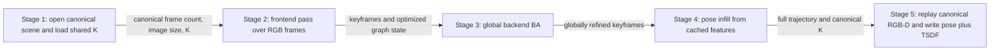
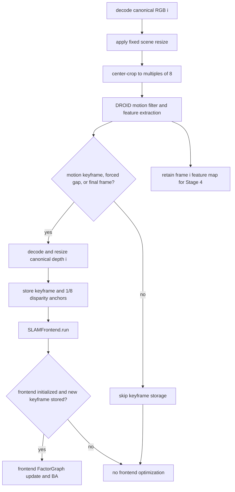
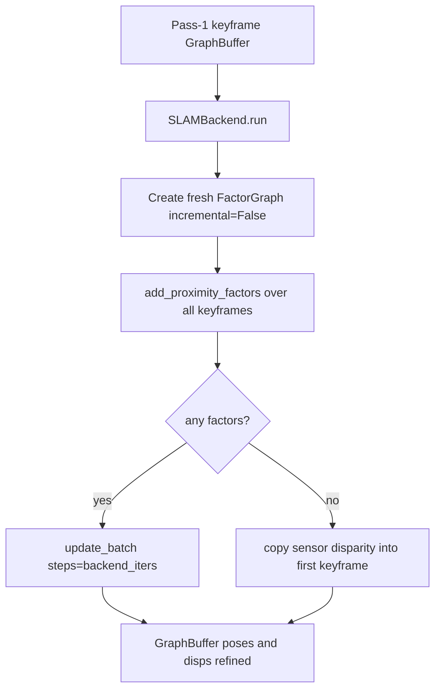
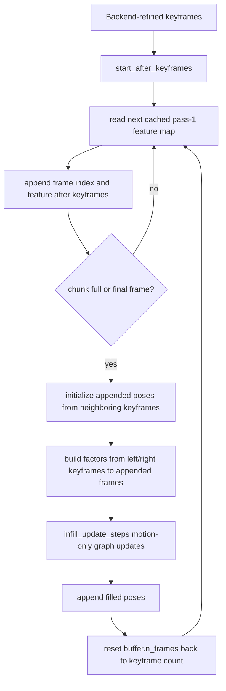
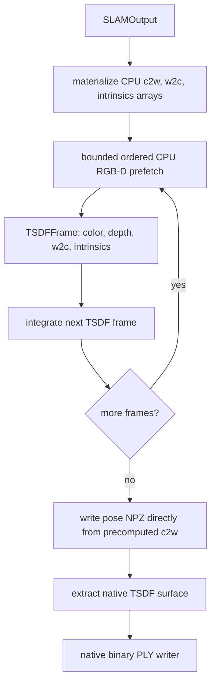

# Full Computation Walkthrough For The Current ViPE Run

This document follows the computation executed by:

```bash
python3 run.py --input-dir data/scannet/scene0000_00 --output-dir outputs/scene00
```

`run.py` starts from an already prepared canonical RGB-D scene, estimates a camera pose for every frame, and fuses the supplied depth into a colored TSDF surface point cloud.

## Offline Input Preparation

Input preparation is not a ViPE runtime stage. A converter under `scripts/data_extract/` produces this directory before `run.py` starts:

```text
<scene>/
  metadata.json
  color/000000.png
  color/000001.png
  depth/000000.png
  depth/000001.png
  intrinsic/intrinsic_color.json
  pose/000000.txt             # benchmark ground truth only
```

The runtime contract is:

| Input | Contract |
| --- | --- |
| RGB | `color/<six-digit-index>.png`, RGB8, one file per frame. |
| Depth | `depth/<six-digit-index>.png`, `uint16` millimeters, aligned pixel-for-pixel with RGB. Zero means invalid. |
| Scene metadata | `vipe_rgbd_v1`, canonical width/height/FPS, and a nonempty `frames` list whose length defines the input sequence length. |
| Intrinsics | `vipe_pinhole_intrinsics_v1`, one shared canonical-resolution `[fx,fy,cx,cy]`. |

Any source synchronization, temporal subsampling to `--vipe-fps` (`5` by default), depth-to-color alignment, lens rectification, conversion to pinhole intrinsics, and aspect-preserving resize to `--vipe-res` (`1280` by default) happens during input preparation. RGB uses area interpolation when shrinking and linear interpolation when enlarging; depth uses nearest-neighbor interpolation. Intrinsics are scaled by the exact integer output width and height. RGB, depth, and benchmark poses are all selected with the same source indices and renumbered contiguously. The runtime receives no full-rate sequence, distortion coefficients, or camera-rectification work.

## Runtime Flow

The numbered stages below are exactly the stages executed by `VipePipeline.run`. Data moves forward once between stages; there is no outer loop that returns to an earlier stage.



| Stage | Execution grain | Main output |
| --- | --- | --- |
| Stage 1 | Once per scene | Canonical scene handle, frame count, image resolution, and shared pinhole intrinsics. |
| Stage 2 | Once per canonical RGB frame | Keyframe-only `GraphBuffer` optimized incrementally by frontend BA; one cached DROID feature map per frame. |
| Stage 3 | Once per sequence | The same keyframe state refined by a fresh global backend `FactorGraph`. |
| Stage 4 | Once per cached feature map, optimized in chunks | Camera-to-world pose for every canonical frame. |
| Stage 5 | Once per canonical RGB-D frame | Pose NPZ and native colored TSDF point cloud with normals. |

## Stage 1: Open Canonical Scene And Load Intrinsics

`run.py` loads `configs/default.yaml`, applies deterministic runtime setup, creates one `FrameDir`, and passes it to `VipePipeline`:

```python
frame_stream = FrameDir(cli_args.input_dir)
pipeline.run(frame_stream)
```

`FrameDir` retains only the information needed by runtime:

```text
scene root
scene name
canonical frame count
canonical (height, width)
shared canonical-resolution [fx, fy, cx, cy]
```

Frame paths are not stored in per-frame lists. For canonical sequence position `i`, the reader computes the same six-digit stem and opens:

```text
color/<stem>.png
depth/<stem>.png
```

Construction verifies that metadata declares a positive canonical FPS and that the intrinsics resolution equals the declared scene resolution. RGB/depth paths are resolved only when a frame is consumed; each load checks successful decoding and its actual shape before data enters SLAM. There is no runtime source-index mapping or temporal branch: index `i` always means canonical frame `i` everywhere downstream.

Decoded frame contents are not cached. Stage 2 holds only one decoded canonical RGB at a time, while retaining the much smaller 1/8-resolution DROID feature map needed by Stage 4. Stage 5 later decodes the canonical RGB-D frames again for reconstruction. Caching every RGB-D frame would replace bounded disk I/O with sequence-sized host memory.

The loaded source intrinsics tensor is:

```python
K_source = torch.tensor([fx, fy, cx, cy], dtype=torch.float32, device="cuda")
```

`VipePipeline.run` performs the stage handoff directly:

```python
intrinsics = frame_stream.intrinsics()
slam_output = SLAMSystem(...).run(frame_stream, intrinsics)
save_outputs(frame_stream, slam_output)
```

RGB loading produces an `(H0,W0,3)` CUDA `float32` tensor in `[0,1]`. Keyframe depth loading produces an `(H0,W0)` CUDA `float32` tensor in meters. A mismatched depth resolution is rejected because canonical RGB and depth must already share the same pinhole image plane.

## Stage 2: SLAM Pass 1 Frontend Loop

Stage 2 is the first pass through all canonical frames. It decides which frames become keyframes and optimizes those keyframes incrementally.



Relevant files:

| File | Role |
| --- | --- |
| `vipe/stream.py` | Canonical indexed RGB-D reader and shared pinhole intrinsics loader. |
| `vipe/slam/system.py` | Two-pass orchestration, fixed frame resizing/cropping, component calls. |
| `vipe/slam/components/motion_filter.py` | DROID feature extraction and motion check for every frame; context extraction for accepted or forced keyframes. |
| `vipe/slam/components/buffer.py` | Persistent keyframe state and sensor-depth disparity anchors. |
| `vipe/slam/components/frontend.py` | Incremental frontend factor graph. |
| `vipe/slam/components/factor_graph.py` | Factor storage, learned DROID target updates, BA invocation. |
| `vipe/slam/ba/terms.py` | Dense flow term and sensor-depth disparity regularization term. |

### Fixed Working-Resolution Transform

Every frame in a canonical scene has the same input resolution and shared intrinsics, so `SLAMInputResizer` computes one scene-wide transform before the loop. For canonical size `(H0,W0)`:

```python
scale_factor = sqrt(resize_target_pixels / (H0 * W0))
H1 = int(H0 * scale_factor)
W1 = int(W0 * scale_factor)
```

Then it center-crops so both dimensions are divisible by 8:

```python
crop_h = H1 % 8
crop_w = W1 % 8
```

The crop removes `H1 % 8` rows and `W1 % 8` columns symmetrically. The working size is therefore:

```math
H = H_1-(H_1 \bmod 8),\qquad W = W_1-(W_1 \bmod 8).
```

The same fixed transform is applied as follows:

| Value | Operation |
| --- | --- |
| `rgb` | Bilinear interpolation. |
| Keyframe sensor depth | Nearest-neighbor interpolation, preserving measured depth values. |
| Shared intrinsics | Scale `fx,cx` by `W1/W0`, scale `fy,cy` by `H1/H0`, then subtract the left/top crop from `cx,cy`. |

The resulting working intrinsics are fixed constants used by all SLAM projections. They are not optimization variables.

There is no inverse image operation after SLAM: no RGB, depth, feature map, or disparity map is upsampled to canonical resolution. `SLAMOutput` simply carries the original `K_source` loaded in Stage 1. Stage 5 uses that canonical K with freshly decoded canonical-resolution RGB and depth.

### Component Construction

`SLAMSystem._build_components` creates:

```python
self.droid_net = DroidNet().to(self.device)
self.buffer = GraphBuffer(...)
self.motion_filter = MotionFilter(...)
self.frontend = SLAMFrontend(...)
self.backend = SLAMBackend(...)
self.inner_filler = InnerFiller(...)
```

The `GraphBuffer` is the persistent state table. With height `H` and width `W` after resizing/cropping, its dense-disparity grid is `(H/8, W/8)`.

Important buffer fields:

| Field | Shape | Meaning |
| --- | --- | --- |
| `frame_indices` | `(buffer,)` | Canonical stream frame index for each buffered keyframe. |
| `poses` | `(buffer,7)` | World-to-camera SE3 pose parameters. |
| `intrinsics` | `(4,)` | Shared resized/cropped `[fx,fy,cx,cy]`. |
| `disps` | `(buffer,H/8,W/8)` | Optimized dense disparity maps. |
| `disps_sens` | `(buffer,H/8,W/8)` | Sensor-depth disparity anchors. |
| `disps_sens_weight` | `(buffer,H/8,W/8)` | Validity weight for each sensor-depth anchor. |
| `fmaps` | `(buffer,128,H/8,W/8)` | DROID feature maps. |
| `nets`, `inps` | `(buffer,128,H/8,W/8)` | DROID context state. |

Initial pose is identity. Initial disparity is `pipeline.slam.init_disp`.

### Motion Filter And Keyframes

For each frame:

```python
rgb = resizer.rgb(frame_stream.rgb(frame_idx))
images = rgb.permute(2, 0, 1)[None]
motion_result = self.motion_filter.check(images)
```

If `motion_result.is_keyframe` is true, the configured maximum keyframe gap is reached, or this is the final frame, the frame is stored in the buffer:

```python
kf_idx = self.buffer.n_frames
self.buffer.frame_indices[kf_idx] = frame_idx
self.buffer.fmaps[kf_idx] = motion_result.fmap[0]
self.buffer.nets[kf_idx], self.buffer.inps[kf_idx] = motion_result.net[0], motion_result.inp[0]
self.buffer.n_frames += 1
```

The final frame is forced into the keyframe set so pose infill has a right boundary at the end of the stream.

### Sensor-Depth Anchors

When a keyframe is added, its canonical depth is decoded, nearest-resized and cropped by the fixed transform. `GraphBuffer.update_disps_sens` then samples it into the same 1/8-resolution grid used by DROID disparities:

```python
metric_depth = sensor_depth.float()
valid = torch.isfinite(metric_depth) & (metric_depth > 0.0)
metric_depth = torch.where(valid, metric_depth, torch.zeros_like(metric_depth))

disp_sens = metric_depth[3::8, 3::8]
disp_sens = torch.where(disp_sens > 0, 1.0 / disp_sens, 0.0)
self.disps_sens[kf_idx] = disp_sens
self.disps_sens_weight[kf_idx] = valid[3::8, 3::8].float()
```

So the external depth does not replace SLAM. It regularizes the optimized disparity map at valid sensor-depth samples.

### Frontend Factor Graph

`SLAMFrontend.run` maintains a persistent incremental `FactorGraph`.

Conceptually:

```text
new keyframe enters GraphBuffer
-> add neighborhood/proximity factors
-> run learned DROID update to refresh target correspondences and weights
-> run BA to mutate GraphBuffer poses/disparities
-> prune old/redundant active factors
```

Important frontend config values are in `configs/default.yaml`:

| Config | Default | Role |
| --- | ---: | --- |
| `filter_thresh` | `2.4` | Dense motion threshold for accepting keyframes. |
| `warmup` | `8` | Keyframes collected before initializing frontend graph. |
| `max_keyframe_gap` | `16` | Force storage when 16 canonical frames have elapsed since the last keyframe. |
| `keyframe_thresh` | `4.0` | Threshold for pruning redundant keyframes. |
| `frontend_thresh` | `16.0` | Proximity threshold for frontend edge creation. |
| `frontend_window` | `25` | Number of recent keyframes considered by frontend. |
| `frontend_radius` | `2` | Local forced-neighbor factor radius. |
| `frontend_nms` | `1` | Non-max suppression radius for proximity factors. |
| `frontend_max_factors` | `48` | Max active frontend factors. |
| `frontend_max_age` | `25` | Delete active factors after this many graph updates. |
| `frontend_init_updates` | `2` | Graph update calls during warmup initialization. |
| `frontend_update_iters1` | `3` | First update loop after adding a keyframe. |
| `frontend_update_iters2` | `2` | Extra update loop when candidate keyframe is retained. |
| `frontend_ba_iters` | `2` | Inner BA solver iterations per frontend graph update. |

The frontend graph is active only over keyframes. Non-keyframes do not get stored until Stage 4.

### Bundle Adjustment Objective

For one low-resolution pixel `p=(u,v)` in source keyframe `i`, with disparity `d_i(p)`, the code uses an inverse-depth homogeneous point:

```math
\Pi_K^{-1}(p,d_i)=
\begin{bmatrix}
(u-c_x)/f_x \\
(v-c_y)/f_y \\
1 \\
d_i
\end{bmatrix}.
```

This is equivalent to the Euclidean depth point with `z_i = 1/d_i` after homogeneous division, but it matches the actual `PinholeCameraModel.iproj_disp` representation.

The current projection into keyframe `j` is:

```math
\hat{p}_{ij}(p)=\Pi_K\left(P_j P_i^{-1}\Pi_K^{-1}(p,d_i)\right).
```

`P_i` and `P_j` are current world-to-camera poses. DROID supplies target coordinate `p^*_{ij}(p)` and residual weight `w_{ij}(p)`. The implementation multiplies that learned weight by the fixed visual scale `lambda_flow=0.001`, then applies a scalar Huber IRLS weight with transition at an absolute reprojection residual of `1` low-resolution pixel:

```math
h(r)=
\begin{cases}
1, & |r|\le 1,\\
1/|r|, & |r|>1.
\end{cases}
```

The dense visual term is:

```math
E_{\text{flow}}
=
\sum_{(i,j)\in\mathcal{F}}
\sum_p
\sum_{c\in\{u,v\}}
\lambda_{\text{flow}} w_{ij,c}(p) h(r_{ij,c}(p)) r_{ij,c}(p)^2,
\qquad
r_{ij}(p)=\hat{p}_{ij}(p)-p^*_{ij}(p).
```

The sensor-depth anchor term is:

```math
E_{\text{sens}}
=
\alpha
\sum_i
\sum_p
m_i(p)
\left(d_i(p)-d_{\text{sens},i}(p)\right)^2.
```

where:

| Symbol | Code |
| --- | --- |
| `alpha` | `pipeline.slam.dense_disp_alpha` |
| `d_i` | `GraphBuffer.disps` |
| `d_sens,i` | `GraphBuffer.disps_sens` |
| `m_i` | `GraphBuffer.disps_sens_weight` |

The total BA objective is:

```math
E = E_{\text{flow}} + E_{\text{sens}}.
```

For frontend/backend BA, both poses and disparities are optimized. For pose infill in Stage 4, `motion_only=True`, so dense disparities are fixed and only poses are optimized.

Exact frontend BA call path:

```text
SLAMSystem.run pass 1
-> keyframe accepted
-> GraphBuffer slot filled
-> GraphBuffer.disps_sens filled from external sensor depth
-> SLAMFrontend.run
-> frontend.graph.add_neighborhood_factors or add_proximity_factors
-> frontend.graph.update
-> GraphBuffer.bundle_adjustment
-> Solver.run_inplace
-> GraphBuffer.poses/disps mutated
```

## Stage 3: Backend Global BA

Stage 3 runs once after pass 1 finishes. It uses the same `GraphBuffer` but creates a fresh non-incremental backend `FactorGraph`.



Backend factor construction:

```python
graph = FactorGraph(
    net=droid_net,
    buffer=same_graph_buffer,
    max_factors=backend_max_factors_per_keyframe * n_keyframes,
    incremental=False,
)

graph.add_proximity_factors(
    rad=backend_radius,
    nms=backend_nms,
    thresh=backend_thresh,
    beta=beta,
)
```

`incremental=False` means the graph does not store per-edge `CorrBlock` objects. Instead, backend `update_batch` builds an `AltCorrBlock` over all keyframe feature maps and computes correlations in batches:

```python
corr_op = AltCorrBlock(buffer.fmaps[None])
for _ in range(backend_iters):
    coords1 = buffer.reproject_dense_disp(ii, jj)
    for i in range(0, jj.max() + 1, backend_batch_size):
        v = (ii >= i) & (ii < i + backend_batch_size)
        corr = corr_op(coords1[:, v], ii[v], jj[v])
        net, delta, weight, damping, _ = droid_net.update.forward(...)
    buffer.bundle_adjustment(..., n_iters=backend_ba_iters, t0=1, t1=n_keyframes)
```

The backend edge list is built once. Across each backend outer step, DROID targets/weights are refreshed, then BA runs `backend_ba_iters` inner solver iterations. Backend updates the same `GraphBuffer.poses` and `GraphBuffer.disps` that frontend produced.

If the backend graph has no factors, which can happen when there is only one keyframe, backend does not call `update_batch`. Instead it copies valid sensor-depth anchor disparities into `GraphBuffer.disps[0]` and leaves the rest of the initialized disparity values unchanged.

The backend graph is not a continuation of `frontend.graph`. It is a new temporary `FactorGraph` object that points at the same `GraphBuffer`, optimizes that shared state, then is discarded.

Backend config values:

| Config | Default | Role |
| --- | ---: | --- |
| `backend_thresh` | `22.0` | Distance threshold for global backend proximity edges. |
| `backend_radius` | `2` | Forced local edge radius. |
| `backend_nms` | `3` | Suppression radius for backend proximity edge selection. |
| `backend_iters` | `17` | Outer backend `update_batch` steps. |
| `backend_ba_iters` | `5` | Inner BA solver iterations per backend outer step. |
| `backend_max_factors_per_keyframe` | `16` | Factor budget multiplier, so max factors is `16 * n_keyframes`. |
| `backend_batch_size` | `8` | Source-keyframe-index batch size for DROID correlation/update. |
| `beta` | `0.3` | Translation/rotation blend for graph proximity scoring. |

With the default values, backend performs:

```text
17 outer update_batch steps
1 full DROID target/weight refresh over all backend edges per outer step
5 inner BA solver iterations per outer step
85 total inner BA solver iterations
```

Backend state changes by cadence:

| Cadence | State |
| --- | --- |
| Fixed for backend run | Backend `FactorGraph.ii/jj` edge list, `GraphBuffer` identity, trained DROID network parameters, shared intrinsics. |
| Once per backend outer step | `FactorGraph.target`, `FactorGraph.weight`, `FactorGraph.damping`, `FactorGraph.f_net`. |
| During inner BA solver iterations | `GraphBuffer.poses`, `GraphBuffer.disps`. |
| Not changed by backend | `GraphBuffer.n_frames`, `fmaps`, `nets`, `inps`, `disps_sens`, `disps_sens_weight`, backend edge set. |

Exact backend BA call path:

```text
SLAMSystem.run after pass 1
-> SLAMBackend.run
-> local FactorGraph created
-> local graph.add_proximity_factors
-> local graph.update_batch
-> GraphBuffer.bundle_adjustment
-> Solver.run_inplace
-> same GraphBuffer.poses/disps mutated
```

Mental model:

```text
Outer graph update step = refresh learned targets/weights using DROID, then call BA.
Inner BA solver iterations = optimize GraphBuffer.poses/disps against fixed targets/weights.
```

After pass 1, the frontend factor graph and motion-filter state have reached their final use and are released before global backend BA starts. The cached per-input-frame feature maps remain because Stage 4 still needs them. The backend graph itself is local to `SLAMBackend.run`, so its factors and correlation state are released when Stage 3 returns.

## Stage 4: Pose Infill

Pass 1 already retained one DROID feature map for every canonical RGB frame. Stage 4 consumes those cached feature maps; it does not decode or resize the images again. Backend keyframes remain fixed reference nodes. Stage 4 appends a new pose slot for every canonical-sequence position, including positions that were keyframes, then optimizes those appended full-trajectory slots in chunks against the fixed references.



Relevant file:

| File | Role |
| --- | --- |
| `vipe/slam/components/inner_filler.py` | Appends full-trajectory pose slots and optimizes them against fixed backend keyframes. |

There are no physical timestamps in runtime SLAM. `GraphBuffer.frame_indices` contains dense canonical positions `0,1,...,M-1`; source timestamps retained as extractor provenance are not read by `FrameDir`. For each appended runtime index, `InnerFiller.fill_pending_chunk` finds adjacent fixed keyframes by canonical position:

```python
pending_frame_indices = buffer.frame_indices[start_idx:total_frames]
keyframe_indices = buffer.frame_indices[:start_idx]
t0 = searchsorted(keyframe_indices, pending_frame_indices, right=True) - 1
t1 = min(t0 + 1, last_keyframe)
```

It initializes pose by constant-step interpolation in SE3. The denominator is a count of frame intervals, not elapsed seconds:

```python
d_pose = key_pose[t1] * key_pose[t0].inv()
frame_gap = keyframe_indices[t1] - keyframe_indices[t0] + 1e-3
pose_step = d_pose.log() / frame_gap
w = pose_step * (pending_frame_indices - keyframe_indices[t0])
pending_pose = SE3.exp(w) * key_pose[t0]
```

Then it builds a small incremental `FactorGraph`:

```python
graph.add_factors(t0, pending_indices)
graph.add_factors(t1, pending_indices)

for _ in range(config.infill_update_steps):
    graph.update(start_idx, total_frames, motion_only=True)
```

The defaults run `4` graph updates with `2` inner BA solver iterations each, for `8` solver iterations per chunk.

Because `motion_only=True`, the BA call fixes dense disparities:

```python
solver.set_fixed("dense_disp")
```

and optimizes only pending-frame poses.

After all chunks are filled:

```python
trajectory = infill_result.poses.inv()
keyframe_indices = buffer.frame_indices[:buffer.n_frames].cpu().tolist()
```

`infill_result.poses` stores world-to-camera poses, so `.inv()` produces the camera-to-world trajectory exported by ViPE. The shared output intrinsics are the unchanged canonical-resolution tensor loaded in Stage 1, not an upsampled or optimized estimate.

`SLAMOutput` contains:

```python
SLAMOutput(
    trajectory=<camera-to-world SE3 for every canonical frame>,
    intrinsics=<canonical-resolution pinhole [fx,fy,cx,cy]>,
    keyframe_indices=<canonical positions of optimized SLAM keyframes>,
)
```

After a cached feature is copied into the current infill slot, its entry in the pass-1 cache is cleared immediately. Each chunk-local infill factor graph is released when that chunk returns. After `SLAMSystem.run` returns, the DROID network, graph buffer, backend, and infiller all leave scope before Stage 5; only the compact `SLAMOutput` handoff remains live.

Final reconstruction depth does not come from optimized `GraphBuffer.disps`. Stage 5 uses the original sensor depth for every frame together with the completed trajectory.

## Stage 5: Replay Sensor Depth And Save Outputs

Stage 5 always runs in the current `run.py` and benchmark path.



`VipePipeline._save_outputs` materializes the compact trajectory arrays once and builds a CPU TSDF-frame loader:

```python
intrinsics = slam_output.intrinsics[:4].cpu().numpy().astype("float32")
pose_mats = slam_output.trajectory.matrix().cpu().numpy().astype("float32")
w2c_mats = slam_output.trajectory.inv().matrix().cpu().numpy().astype("float32")

def load_frame(frame_idx):
    color, depth = frame_stream.artifact_arrays(frame_idx)
    return TSDFFrame(color, depth, w2c_mats[frame_idx], intrinsics)
```

`FrameDir.artifact_arrays` decodes RGB and depth on CPU. Depth is converted from millimeters to meters and nonpositive values are set to zero. The TSDF PCD uses that sensor depth directly; native integration rejects nonfinite, nonpositive, and out-of-range samples. ViPE estimates the camera trajectory, but this fork does not export an independently predicted dense depth map.

These are the canonical-resolution files, not resized SLAM tensors. TSDF therefore receives canonical RGB, canonical sensor depth, shared intrinsics, and the corresponding final poses. Every canonical frame enters TSDF integration exactly once. The working-resolution DROID disparities never enter reconstruction.

### Saved Artifacts

`vipe/utils/io.py::save_artifacts` consumes TSDF frames in one streaming pass with bounded thread prefetch. Prefetch overlaps CPU PNG decode with TSDF integration, but frames are still yielded and integrated in canonical frame order. The pose NPZ is written directly from `pose_mats`; poses are not duplicated in the prefetch records or accumulated again per frame.

| Artifact | Path | Contents |
| --- | --- | --- |
| Pose NPZ | `pose/<artifact_name>.npz` | `data`: camera-to-world matrices, `inds`: contiguous canonical frame indices. |
| TSDF PLY | `pcd/<artifact_name>_tsdf.ply` | Colored points with `nx/ny/nz` normals and `normals_red/green/blue` normal colors sampled from the native TSDF zero-crossing surface. |

`artifact_name` is `frame_stream.name`, the input scene directory name.

`pose/<artifact_name>.npz` arrays:

| Array | Shape | Meaning |
| --- | --- | --- |
| `data` | `(M,4,4)` | Camera-to-world pose matrix for each canonical frame. |
| `inds` | `(M,)` | Contiguous canonical index `[0,1,...,M-1]`. |

### TSDF PCD

For TSDF output, each final frame is integrated into the native `vipe_ext.tsdf_ext.TSDFVolume` through `vipe.utils.tsdf.TSDFVolume`:

```python
volume = TSDFVolume(
    voxel_edge_m=pcd_tsdf_voxel_edge_m,
    sdf_trunc_m=pcd_tsdf_sdf_trunc_m,
    num_voxels_per_block_edge=pcd_tsdf_num_voxels_per_block_edge,
    depth_sampling_stride=pcd_tsdf_depth_sampling_stride,
)
```

The volume is a sparse hash map of fixed-size voxel blocks. A voxel stores:

```text
tsdf   : float32 signed distance, normalized to [-1, 1]
weight : float32 number/effective number of RGB-D observations fused into that voxel
rgb    : float32 running average color in 0..255 space
```

Per frame, the artifact writer prepares the exact arrays that the native extension receives:

```python
depth = artifact_depth_m_float32
color = rgb_uint8
intrinsics = np.array([fx, fy, cx, cy], dtype=np.float32)
w2c = slam_output.trajectory[frame_idx].inv().matrix()
volume.integrate(
    depth,
    color,
    intrinsics,
    w2c,
    pcd_tsdf_depth_trunc_m,
)
```

Inside native integration, the first pass determines which voxel blocks are touched by the current depth image. It lifts every `pcd_tsdf_depth_sampling_stride` depth pixel with valid depth `d <= pcd_tsdf_depth_trunc_m` into world coordinates, and opens every voxel block intersecting that point's `pcd_tsdf_sdf_trunc_m` neighborhood.

Then each touched voxel center `P_w = [X_w,Y_w,Z_w,1]^T` is projected into the current camera:

```math
P_c = T_{cw} P_w = [X_c,Y_c,Z_c,1]^T
```

```math
u = \frac{f_x X_c}{Z_c} + c_x + 0.5,\qquad
v = \frac{f_y Y_c}{Z_c} + c_y + 0.5.
```

If `(u,v)` is outside the image, `Z_c <= 0`, or the sampled depth is invalid, the voxel is not updated from this frame. Otherwise the signed distance is:

```math
s =
(d(u,v) - Z_c)
\sqrt{
\left(\frac{u-c_x}{f_x}\right)^2
+
\left(\frac{v-c_y}{f_y}\right)^2
+
1
}.
```

The square-root term converts optical-axis depth difference into approximate Euclidean ray distance. If `s <= -pcd_tsdf_sdf_trunc_m`, the voxel is behind the observed surface by more than the truncation band and is skipped. Otherwise:

```math
\operatorname{tsdf}_{new}
=
\min\left(1,\frac{s}{\text{sdf\_trunc}}\right).
```

RGB is bilinearly sampled at the projected floating-point pixel coordinate; only image-border samples that cannot form a 2x2 neighborhood fall back to nearest-pixel RGB. The voxel stores a running weighted average:

```math
\operatorname{tsdf}
\leftarrow
\frac{w\operatorname{tsdf}+\operatorname{tsdf}_{new}}{w+1},
\qquad
C
\leftarrow
\frac{wC+C_{rgb}(u,v)}{w+1},
\qquad
w \leftarrow w+1.
```

After all frames, the extension extracts the zero-crossing surface directly as a compact point cloud. It scans neighboring voxel samples, keeps each native TSDF cell whose eight corners are observed and contain both negative and nonnegative TSDF values, decomposes that cell into tetrahedra, and linearly interpolates its local zero-crossing triangles. It then retains the actual point on those triangles nearest the cell center. Thus every sign-changing 2 cm TSDF cell contributes exactly one point; the point count follows reconstructed surface extent rather than an arbitrary output budget.

Normals are computed from the fused implicit surface, not from per-frame depth maps. At each voxel corner, the extension estimates the TSDF gradient with central differences when both neighbors exist and one-sided differences near sparse-volume boundaries. A zero-crossing vertex interpolates endpoint gradients along the crossing edge and normalizes the result. The retained point interpolates its triangle vertex normals barycentrically and normalizes again. This writes smooth surface normals tied to the fused TSDF geometry.

```python
surface_points, surface_normals = volume.write_point_cloud(pcd_path)
```

The native extension writes these compact vertices to PLY and returns the same point/normal tensors to Python. Instance and semantic distillation therefore operate on exactly the saved reconstruction domain. There is no dense intermediate point cloud, global point cap, PLY reread, or second spatial reduction.

The saved reconstruction artifact is this compact colored zero-surface point cloud plus per-point normals, extracted from the final native sparse TSDF volume. The binary PLY vertex schema is `x y z nx ny nz red green blue normals_red normals_green normals_blue`.

The `red/green/blue` properties store the fused RGB color. The `normals_red/normals_green/normals_blue` properties store the normal vector mapped from `[-1,1]` to `[0,255]`, so `quick-tools ply-viewer` can visualize normals as a selectable RGB color set while preserving the actual metric normal vector in `nx/ny/nz`.

Important output knobs in `configs/default.yaml`:

| Config | Meaning |
| --- | --- |
| `pipeline.output.pcd_tsdf_voxel_edge_m` | TSDF voxel edge length in meters. |
| `pipeline.output.pcd_tsdf_sdf_trunc_m` | Signed-distance truncation band in meters. |
| `pipeline.output.pcd_tsdf_depth_trunc_m` | Ignore depth samples beyond this many meters. |
| `pipeline.output.pcd_tsdf_num_voxels_per_block_edge` | Number of voxels along each sparse TSDF block edge; current default is `8`. |
| `pipeline.output.pcd_tsdf_depth_sampling_stride` | Sample every Nth depth pixel when opening TSDF blocks; current default is `8`. |

## Optional Stages 6-11: Instance Distillation

When `run.py` receives `--instance-config`, Stage 5 first completes the normal pose and TSDF artifacts. The pipeline then converts no additional SLAM state: it releases the finished graph/output and CUDA cache, retains only the CPU camera-to-world poses and shared intrinsics, and synchronously runs instance and semantic-feature distillation before `VipePipeline.run()` returns.

Stage 6 receives the same compact native TSDF point/normal pairs written by Stage 5 and chooses motion-spaced views. Stage 7 builds normal-aware surface atoms. Stage 8 generates and propagates SAM masks, projects the compact surface into each retained frame, directly accumulates sparse atom-mask and atom-frame count tables plus fixed-size adjacency affinity statistics, and discards each normalized frame signature. Stages 9-11 build the hierarchy, form evidence candidates, and select the final overlapping `K=5` hypotheses. Stage 12 reuses the selected views to fuse and persist one dense open-vocabulary descriptor `A` per TSDF surface point; hypothesis descriptors `B` and overlap descriptors `C` are derived from `A` only when consumed. Their full computation and artifacts are specified in [`ALGORITHM.md`](ALGORITHM.md). Ground-truth labels, class names, and dataset-specific exclusions are benchmark-only and never enter these runtime stages.

## ScanNet Benchmark Adapter

The benchmark uses the same `VipePipeline` and `FrameDir` construction as `run.py`. It adds ScanNet GT pose/mesh loading, manifest writing, metric evaluation, and optional multi-GPU worker splitting.

Command:

```bash
python3 scripts/scannet_vipe_bench_evaluator.py --scenes scene0000_00 scene0011_00 scene0378_00 --work-dir ./workspace/evaluation_scannet_default --input-root data/scannet --raw-root /robodata/smodak/datasets/scannet_v2/scans --do-final-eval
```

Benchmark data loading is canonical-only:

| Source | Meaning |
| --- | --- |
| `--input-root/<scene>` | Canonical ViPE scene. |
| `--raw-root/<scene>` | Raw ScanNet scene folder used only for GT mesh lookup. |
| `configs/default.yaml` | Fixed ViPE runtime config for SLAM and TSDF output knobs. |
| `configs/eval_scannet_config.yaml` | Metric thresholds, render settings, cache filenames, GT mesh suffixes. |

Scene data comes from `--input-root/<scene>`. Benchmark-only GT mesh data comes from `--raw-root/<scene>`.

Before launching workers, the adapter applies its built-in GT-pose quality checks. Rejected scenes are not built or evaluated, and their reports are written to `metric_results/skipped_gt_pose_scenes.json`.

For every retained scene, the adapter:

1. Reads the canonical frame count and loads indexed GT poses from `pose/<six-digit-index>.txt`.
2. Reuses existing artifacts only when their manifest still matches the canonical frame count and contract-file modification times; otherwise it runs `VipePipeline` on `--input-root/<scene>` in a scene subprocess.
3. Writes `vipe_manifest.json` under the benchmark workspace.
4. Writes `gt_meta.npz` containing GT metadata for the complete canonical sequence.
5. Runs pose and reconstruction metrics when `--do-final-eval` is supplied. Without that flag, it stops after exports and incremental pose metric JSONs.

ViPE artifacts for benchmark runs are written under:

```text
<work-dir>/vipe_outputs/<scene>
```

The local benchmark manifest is written under:

```text
<work-dir>/model_results/scannet/<scene>/recon/exports/vipe_manifest.json
```

Manifest contents include:

| Key | Meaning |
| --- | --- |
| `format` | `vipe_artifacts_v1`. |
| `scene` | ScanNet scene id. |
| `artifact_name` | Canonical scene directory name. |
| `vipe_output_dir` | Absolute path to ViPE output directory. |
| `pose_path` | Absolute path to ViPE pose NPZ. |
| `tsdf_pcd_path` | Absolute path to ViPE TSDF PLY. |
| `output` | TSDF output parameters used for this run. |
| `frame_count` | Number of contiguous canonical frames represented by the pose artifact. |

### Pose Metric

The pose metric uses the matched canonical frames:

1. Load predicted ViPE poses in contiguous canonical order and verify their NPZ indices are `[0,1,...,M-1]`.
2. Load ScanNet GT camera-to-world poses from canonical `pose/*.txt`.
3. Convert predicted and GT camera-to-world poses to world-to-camera extrinsics.
4. Align both trajectories to their first camera.
5. Compute relative-pair rotation/translation angular errors.
6. Report AUC at configured degree thresholds.

The metric is relative after first-frame normalization. It does not apply per-frame alignment.

### Reconstruction Metric

The reconstruction metric consumes the TSDF PLY written by Stage 5:

```text
pcd/<artifact_name>_tsdf.ply
```

For reconstruction metrics, the evaluator:

1. Loads ViPE TSDF PLY.
2. Computes one rigid SE3 transform mapping the first predicted camera pose to the first ScanNet GT camera pose.
3. Applies that single SE3 to the whole predicted point cloud.
4. Caches the aligned PLY under the benchmark eval cache.
5. Samples/caches the ScanNet GT mesh point cloud.
6. Crops predicted points to the padded GT AABB.
7. Computes nearest-neighbor L2 geometry metrics.
8. Renders the aligned predicted cloud into sampled GT cameras for PSNR/SSIM.

The reported `scale_diagnostic` is not applied to the evaluated PLY. It is a diagnostic scalar fitted after first-camera SE3 alignment to expose scale drift:

```text
scale = sum(pred_delta * gt_delta) / sum(pred_delta * pred_delta)
```

The printed summary reports mean scale and individual scene scales in parentheses, so per-scene scale spread stays visible.

### Benchmark Parallelism

If `CUDA_VISIBLE_DEVICES` contains multiple GPUs and the process is not already a worker, the benchmark script spawns one worker process per visible GPU. Build workers dynamically claim the next unprocessed scene from a shared locked queue, then launch that scene in an isolated subprocess. A worker that finishes early immediately receives another scene:

```python
while scene := claim_next_scene(queue_path):
    build_scene(scene)
```

Each build worker writes timing JSON under:

```text
<work-dir>/metric_results/timing_workers/
```

The parent process merges build timing. If `--do-final-eval` is present and multiple GPUs are visible, it then spawns final-eval workers with one visible GPU each, each worker evaluates its scene shard without writing aggregate metric JSONs, and the parent merges worker payloads into `scannet_pose.json`, `scannet_recon.json`, and `scannet_timing.json`. If a scene build failed or is incomplete, the final eval restricts itself to completed scenes and records failed scenes under `metric_results/failed_scenes/`.

## Runtime Config Boundaries

Configuration is split by responsibility:

| Location | Belongs there |
| --- | --- |
| CLI | Dataset/session paths, output/workspace paths, scene list. |
| `configs/default.yaml` | Solver, keyframe, BA, and TSDF output knobs. |
| `configs/eval_scannet_config.yaml` | ScanNet metric thresholds, render settings, cache names, GT mesh suffixes. |

Paths and scene selection are CLI inputs. Numerical runtime and metric settings remain in YAML.

Important runtime config values:

| Config | Role |
| --- | --- |
| `seed` | Seeds Python/NumPy/Torch/Open3D RNGs. |
| `temporary_determinism` | Enables deterministic ordering/kernels so repeated runs on the same machine are reproducible. |
| `pipeline.slam.buffer` | Max number of keyframes kept in the graph buffer. |
| `pipeline.slam.resize_target_pixels` | SLAM working image area before the 8px-aligned resize/crop. |
| `pipeline.slam.filter_thresh` | Motion threshold for keyframe creation. |
| `pipeline.slam.dense_disp_alpha` | Weight for external sensor-depth disparity regularization. |
| `pipeline.slam.infill_chunk_size` | Non-keyframe pose infill chunk size. |
| `pipeline.slam.infill_update_steps` | Outer graph update calls per full-trajectory infill chunk. |
| `pipeline.slam.infill_ba_iters` | Inner BA solver iterations per infill graph update. |
| `pipeline.output.*` | TSDF point-cloud output controls. |

## Object Glossary

| Object | Meaning |
| --- | --- |
| `metadata.json` | Canonical scene format, image dimensions, FPS, and frame count. |
| `FrameDir` | Canonical scene reader that derives contiguous RGB-D paths and loads shared pinhole intrinsics. |
| `TSDFFrame` | CPU reconstruction record containing RGB, sensor depth, inverse pose, and intrinsics for one frame. |
| `SLAMInputResizer` | One fixed source-to-working-resolution resize/crop/intrinsics transform for the scene. |
| `GraphBuffer` | Persistent SLAM state table: keyframe poses, disparities, sensor-depth anchors, DROID features. |
| `FactorGraph` | Edge/factor manager that refreshes learned DROID targets and invokes BA. |
| `frontend.graph` | Persistent incremental factor graph used during pass 1. |
| Backend graph | Fresh non-incremental factor graph created once in Stage 3. |
| `InnerFiller` | Motion-only chunk optimizer that produces the final full-frame trajectory from fixed backend keyframe references. |
| `SLAMOutput` | Final handoff object containing full trajectory, original-resolution intrinsics, and keyframe indices. |
| `ArtifactPath` | Output naming wrapper for `pose/<scene>.npz` and `pcd/<scene>_tsdf.ply`. |
