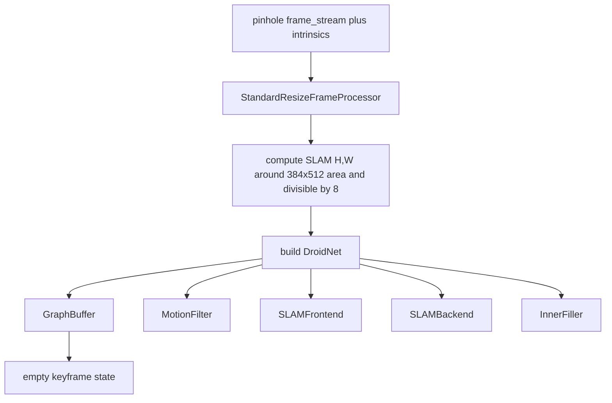
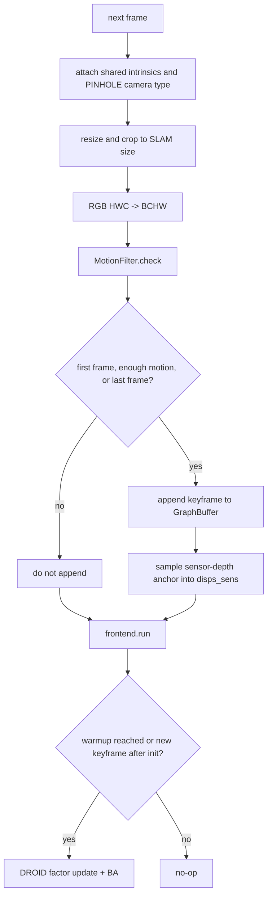
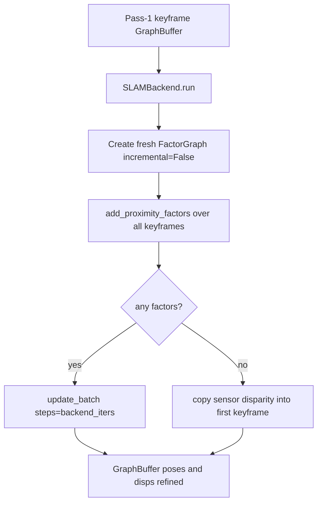
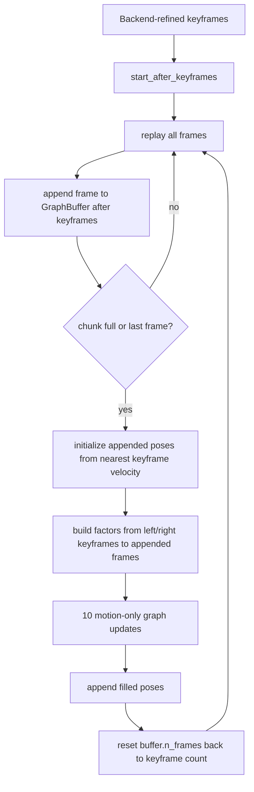
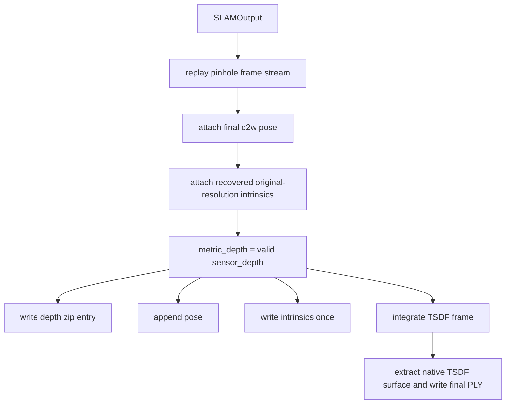

# Full Computation Walkthrough For The Current ViPE Run

This document describes the supported ViPE runtime path:

```text
one RGB frame directory
+ sibling external sensor depth directory
+ sibling external RGB/color intrinsics file
-> ViPE SLAM poses
-> sensor-depth artifacts and point clouds
```

Intrinsics and depth are input data.

Example standalone command:

```bash
export NUMEXPR_MAX_THREADS=16
export OMP_NUM_THREADS=16
export MKL_NUM_THREADS=16
export CUDA_VISIBLE_DEVICES='2'

python run.py \
  streams.base_path=/robodata/smodak/repos/ovo/data/input/ScanNet/scene0000_00/color \
  streams.fps=30 \
  pipeline.output.path=/robodata/smodak/repos/vipe/outputs/scene00 \
  pipeline.output.save_artifacts=true
```

The required input layout is:

```text
<scene>/color/<frame_id>.jpg|png
<scene>/depth/<frame_id>.png
<scene>/intrinsic/intrinsic_color.json  # preferred
<scene>/intrinsic/intrinsic_color.txt   # fallback
```

Depth PNG values are interpreted as millimeters and converted to meters.

## High-Level Flow

The runtime is easiest to understand as five one-time handoff stages. A later stage does not loop back and update an earlier stage.

```mermaid
flowchart LR
    S1[Stage 1: frame stream, external camera, sensor depth] -->|pinhole frame stream plus shared intrinsics| S2[Stage 2: SLAM pass 1 frontend loop]
    S2 -->|GraphBuffer with keyframe poses, features, disparities, sensor-depth anchors| S3[Stage 3: backend global BA over keyframes]
    S3 -->|refined keyframe state in same GraphBuffer| S4[Stage 4: SLAM pass 2 pose infill]
    S4 -->|SLAMOutput: full trajectory, recovered intrinsics, keyframe indices| S5[Stage 5: replay sensor depth and save outputs]
```



| Stage | Loop grain | Main output |
| --- | --- | --- |
| Stage 1 | Mostly once, frames are still lazy | `FrameStream` that yields RGB plus sensor depth, and one shared pinhole intrinsics tensor. |
| Stage 2 | Once over all frames | Keyframe-only `GraphBuffer`, incrementally optimized by frontend BA. |
| Stage 3 | Once over all keyframes | Same `GraphBuffer`, refined by a fresh global backend `FactorGraph`. |
| Stage 4 | Once over all frames | One pose for every selected RGB frame. |
| Stage 5 | Once over all frames | Native artifacts: pose, depth zip, intrinsics JSON, TSDF PCD. |

## Stage 1: Frame Stream, Camera, And Depth Inputs

### Construction

Source files:

| File | Role |
| --- | --- |
| `run.py` | Hydra entrypoint, logging setup, `FrameDir` construction, pipeline launch. |
| `configs/default.yaml` | The remaining runtime config. |
| `vipe/streams/base.py` | `FrameDir`, `SensorCamera`, `FrameData`, `FrameStream`. |
| `vipe/pipeline.py` | External-camera initialization and optional OpenCV undistortion wrapper. |

`run.py` composes `configs/default.yaml`, applies CLI overrides, and constructs:

```python
pipeline = VipePipeline(
    slam=args.pipeline.slam,
    output=args.pipeline.output,
)

frame_stream = FrameDir(
    path=args.streams.base_path,
    fps=args.streams.fps,
)

pipeline.run(frame_stream)
```

`FrameDir` always reads the full sorted frame directory from the first frame through the last frame.

The shell variables influence external libraries but do not change ViPE control flow:

| Variable | Practical effect |
| --- | --- |
| `CUDA_VISIBLE_DEVICES` | Selects which physical GPU appears as CUDA device 0. |
| `NUMEXPR_MAX_THREADS` | Caps NumExpr if imported by dependencies. |
| `OMP_NUM_THREADS` | Caps OpenMP threads in libraries that obey it. |
| `MKL_NUM_THREADS` | Caps MKL threads in libraries that obey it. |

### Frame Ordering And Lazy Loading

`FrameDir.__init__` first collects images from `streams.base_path` with these extensions:

```python
[".jpg", ".jpeg", ".png", ".bmp", ".tiff", ".tif"]
```

and uppercase variants.

Ordering is:

```python
def sort_image_sequence(paths):
    paths = list(paths)
    if paths and all(Path(path).stem.isdigit() for path in paths):
        return sorted(paths, key=lambda path: (int(Path(path).stem), str(path)))
    return sorted(paths, key=str)
```

So:

| Names | Order |
| --- | --- |
| `0.png`, `1.png`, `2.png`, `10.png` | Numeric: `0, 1, 2, 10`. |
| `frame1.png`, `frame10.png`, `frame2.png` | Lexicographic: `frame1, frame10, frame2`. |
| Mixed numeric and nonnumeric stems | Lexicographic. |

`FrameDir` does not cache all RGB/depth tensors. It stores file paths and re-reads frames lazily in every pass:

```python
frame_idx = self.start + index * self.step
frame_path = self.frame_files[frame_idx]
```

`FrameData.raw_frame_idx` is this index into the full sorted file list.

### Required Sensor Depth

For every selected color frame, `FrameDir.__init__` checks that the sibling depth PNG exists:

```text
<scene>/depth/<frame_path.stem>.png
```

`FrameDir.__getitem__` reads RGB and depth:

```python
frame = cv2.imread(str(frame_path))              # BGR uint8
frame = cv2.cvtColor(frame, cv2.COLOR_BGR2RGB)   # RGB uint8
frame_rgb = torch.as_tensor(frame).float().cuda() / 255.0

raw_depth = cv2.imread(str(depth_path), cv2.IMREAD_UNCHANGED)
if raw_depth.shape[:2] != frame.shape[:2]:
    raw_depth = cv2.resize(raw_depth, (frame.shape[1], frame.shape[0]), interpolation=cv2.INTER_NEAREST)

sensor = raw_depth.astype(np.float32) / 1000.0
sensor[~np.isfinite(sensor)] = 0.0
sensor[sensor <= 0.0] = 0.0
sensor_depth = torch.as_tensor(sensor).float().cuda()
```

Initial frame object:

```python
FrameData(
    raw_frame_idx=<sorted-file index>,
    rgb=<H x W x 3 CUDA float32 in 0..1>,
    sensor_depth=<H x W CUDA float32 in meters>,
    image_valid_mask=None,
    pose=None,
    intrinsics=None,
    metric_depth=None,
)
```

`sensor_depth` is input data. `metric_depth` is filled later in Stage 5 when the final output frame is assembled.

### Required External Intrinsics

`FrameDir` always loads RGB/color intrinsics from:

```text
<scene>/intrinsic/intrinsic_color.json
<scene>/intrinsic/intrinsic_color.txt
```

JSON is preferred if present.

The TXT path is ScanNet-style:

```python
matrix = np.loadtxt(path, dtype=np.float32)
K = matrix[:3, :3]
```

The JSON path accepts these common forms:

| JSON key | Meaning |
| --- | --- |
| `camera_matrix` | Raw input camera matrix, 3x3. |
| `scannet_intrinsic_matrix` | ScanNet 4x4 matrix; `[:3,:3]` is used. |
| `intrinsics` | Dict containing `fx`, `fy`, `cx`, `cy`. |
| `projection_matrix` | Output pinhole matrix when distortion metadata exists. |
| `distortion_model` | Supported: `plumb_bob`, `rational_polynomial`. |
| `distortion_coefficients` | OpenCV distortion vector. |
| `width`, `height` | Must match RGB image size if present. |

The loaded metadata is stored as:

```python
SensorCamera(
    input_k=<raw input K>,
    output_k=<downstream pinhole K>,
    width=<RGB width>,
    height=<RGB height>,
    distortion_model=<optional string>,
    distortion_coefficients=<optional vector>,
)
```

The downstream intrinsics tensor is always:

```python
intrinsics = torch.as_tensor([fx, fy, cx, cy], dtype=torch.float32).cuda()
```

where `fx,fy,cx,cy` come from `SensorCamera.output_k`.

### Camera Normalization

`VipePipeline.run` starts with:

```python
frame_stream, intrinsics = self._initialize(frame_stream)
```

If the loaded camera has no nonzero distortion coefficients, `_initialize` returns the original `FrameDir` plus the pinhole intrinsics tensor.

If the loaded camera has nonzero OpenCV distortion coefficients, `_initialize` wraps the stream in `OpenCVPinholeNormalizedFrameStream`. The wrapper builds one fixed undistortion map:

```python
mapx, mapy = cv2.initUndistortRectifyMap(
    camera.input_k,
    camera.distortion_coefficients,
    np.eye(3, dtype=np.float32),
    camera.output_k,
    (camera.width, camera.height),
    cv2.CV_32FC1,
)
```

The map is converted to a CUDA `grid_sample` grid:

```python
grid = 2.0 * stack(mapx, mapy) / [width - 1, height - 1] - 1.0
```

For each frame, the wrapper applies:

| Field | Remap |
| --- | --- |
| `rgb` | Bilinear `grid_sample`. |
| `sensor_depth` | Nearest-neighbor `grid_sample`. |
| `image_valid_mask` | `grid` in `[-1,1]` and optional incoming mask. |

Pixels that map outside the original RGB/depth support are marked invalid and zeroed:

```python
image_valid_mask = isfinite(grid) & -1 <= grid_x <= 1 & -1 <= grid_y <= 1
rgb = torch.where(image_valid_mask[..., None], rgb, 0)
sensor_depth = torch.where(sensor_depth > 0 and image_valid_mask, sensor_depth, 0)
```

After Stage 1, every later stage sees a pinhole stream. The input may have started as OpenCV-distorted RGB/depth, but the stream yields pinhole-normalized RGB/depth plus one shared `[fx, fy, cx, cy]` tensor.

## Stage 2: SLAM Pass 1 Frontend Loop

Stage 2 estimates keyframe poses and keyframe inverse-depth maps incrementally.

Source files:

| File | Role |
| --- | --- |
| `vipe/slam/system.py` | `SLAMSystem.run`, resizing, pass loops, component construction. |
| `vipe/slam/components/motion_filter.py` | DROID feature extraction and keyframe decision. |
| `vipe/slam/components/buffer.py` | `GraphBuffer`, sensor-depth anchors, bundle adjustment call. |
| `vipe/slam/components/frontend.py` | Incremental frontend factor graph logic. |
| `vipe/slam/components/factor_graph.py` | Factor edge management, DROID update, BA driver. |
| `vipe/slam/ba/*` | Solver terms and sparse solver. |

### Setup



`StandardResizeFrameProcessor` chooses a SLAM working resolution:

```python
scale_factor = sqrt((384 * 512) / (h0 * w0))
h1 = int(h0 * scale_factor)
w1 = int(w0 * scale_factor)
crop_h = h1 % 8
crop_w = w1 % 8
```

Each frame is resized to `(h1,w1)`, then center-cropped so both dimensions are divisible by 8. RGB uses bilinear interpolation; sensor depth and image-valid masks use nearest-neighbor interpolation. Intrinsics are scaled and cropped consistently:

```python
fx *= w1 / w0
cx *= w1 / w0
fy *= h1 / h0
cy *= h1 / h0
cx -= crop_left
cy -= crop_top
```

`GraphBuffer` allocates fixed-size tensors:

| Field | Shape | Meaning |
| --- | --- | --- |
| `n_frames` | int | Number of active buffer slots. |
| `tstamp` | `(buffer,)` | Original selected-frame index for each keyframe slot. |
| `images` | `(buffer,3,H,W)` float16 | Resized keyframe RGB. |
| `poses` | `(buffer,7)` float32 | World-to-camera SE3 state. |
| `intrinsics` | `(4,)` float32 | Shared resized pinhole intrinsics. |
| `disps` | `(buffer,H/8,W/8)` float32 | Optimized inverse depth. |
| `disps_sens` | `(buffer,H/8,W/8)` float32 | External sensor-depth anchor converted to inverse depth. |
| `disps_sens_weight` | `(buffer,H/8,W/8)` float32 | 1 for valid anchor pixels, 0 for invalid pixels. |
| `fmaps` | `(buffer,128,H/8,W/8)` float16 | DROID feature maps. |
| `nets` | `(buffer,128,H/8,W/8)` float16 | DROID recurrent hidden state. |
| `inps` | `(buffer,128,H/8,W/8)` float16 | DROID context input. |

Initial poses are identity world-to-camera transforms. Initial disparities are `pipeline.slam.init_disp`, default `1.0`.

### Per-Frame Pass-1 Loop



Every selected frame goes through:

```python
frame_data.intrinsics = intrinsics
frame_data.camera_type = CameraType.PINHOLE
frame_data = resizer(frame_data)
images = frame_data.rgb.permute(2, 0, 1)[None]
motion_result = motion_filter.check(images)
```

`images` has shape `(1,3,H,W)`.

### Motion Filter

`MotionFilter.check(images)` always computes the current DROID feature map:

```python
gmap = self.net.encode_features(images)  # (1,128,H/8,W/8)
```

For the first frame, it also computes DROID context:

```python
net, inp = self.net.encode_context(images)
return MotionFilterResult(True, gmap, net, inp)
```

For later frames, it compares the current feature map against the last accepted keyframe feature map:

```python
coords0 = coords_grid(H/8, W/8)[None, None]
corr = CorrBlock(last_keyframe_fmap[None], current_fmap[None])(coords0)
_, delta, weight = self.net.update.forward(last_keyframe_net[None], last_keyframe_inp[None], corr)
dense_motion_score = delta.norm(dim=-1)[0].mean([1, 2]).item()
```

A frame becomes a keyframe if:

```python
dense_motion_score > pipeline.slam.filter_thresh
```

The final selected frame is also forced into the keyframe set so pose infill has a right boundary.

### Keyframe Storage And Sensor-Depth Anchors

When a keyframe is accepted:

```python
kf_idx = buffer.n_frames
buffer.tstamp[kf_idx] = frame_idx
buffer.images[kf_idx] = images[0]
buffer.fmaps[kf_idx] = motion_result.fmap[0]
buffer.nets[kf_idx], buffer.inps[kf_idx] = context_tensors
buffer.n_frames += 1
```

The first keyframe stores the shared resized intrinsics:

```python
buffer.intrinsics = frame_data.intrinsics
```

Then `GraphBuffer.update_disps_sens(kf_idx, frame_data)` uses external sensor depth directly:

```python
metric_depth = frame_data.sensor_depth.float()
valid = torch.isfinite(metric_depth) & (metric_depth > 0.0)
if frame_data.image_valid_mask is not None:
    valid &= frame_data.image_valid_mask
metric_depth = torch.where(valid, metric_depth, 0)

disp_sens = metric_depth[3::8, 3::8]
disp_sens = torch.where(disp_sens > 0, disp_sens.reciprocal(), disp_sens)

buffer.disps_sens[kf_idx] = disp_sens
buffer.disps_sens_weight[kf_idx] = valid[3::8, 3::8].float()
```

The `3::8` sampling picks one depth sample near the center of each 8x8 image block, matching the DROID low-resolution disparity grid.

If a sampled sensor depth is invalid, the anchor disparity is `0` and the matching weight is `0`, so it contributes nothing to the depth-anchor BA term.

### Frontend Factor Graph

`frontend.graph` is a persistent incremental `FactorGraph`.

A factor is an edge `(i,j)` saying: source keyframe `i`, with its current pose and dense disparity, should reproject into target keyframe `j` at learned DROID target coordinates.

Toy one-pixel factor:

```text
source keyframe i = 4
target keyframe j = 6
low-res source pixel p = [10, 5]
current projection into j = [12.4, 5.7]
DROID learned target = [13.0, 5.5]
residual = [-0.6, 0.2]
```

BA updates poses and disparities to reduce many such residuals over all active factors and all low-res pixels.

Frontend warmup starts once `buffer.n_frames == pipeline.slam.warmup`:

```python
frontend.graph.add_neighborhood_factors(0, warmup, r=1)
for _ in range(frontend_init_updates):
    frontend.graph.update(t0=1, itrs=frontend_ba_iters)
```

After warmup, whenever a new keyframe arrives:

```python
frontend.graph.rm_factors(frontend.graph.age > frontend_max_age)
frontend.graph.add_proximity_factors(...)

for _ in range(frontend_update_iters1):
    frontend.graph.update(itrs=frontend_ba_iters)

if second_newest_keyframe_is_too_close:
    frontend.graph.rm_second_newest_keyframe(...)
else:
    for _ in range(frontend_update_iters2):
        frontend.graph.update(itrs=frontend_ba_iters)
```

Frontend config values are all visible in `configs/default.yaml`:

| Config | Role |
| --- | --- |
| `warmup` | Number of keyframes before frontend initialization. |
| `frontend_window` | Recent keyframe window considered for proximity factors. |
| `frontend_radius` | Forced local edge radius. |
| `frontend_nms` | Suppression radius for proximity edge selection. |
| `frontend_thresh` | Distance threshold for proximity edges. |
| `frontend_max_factors` | Factor budget for the incremental frontend graph. |
| `frontend_max_age` | Active factors older than this many updates are removed. |
| `frontend_init_updates` | Outer `graph.update` calls during warmup. |
| `frontend_update_iters1` | Outer updates after adding a keyframe before pruning. |
| `frontend_update_iters2` | Extra outer updates if the candidate keyframe is kept. |
| `frontend_ba_iters` | Inner BA solver iterations per outer graph update. |

### One FactorGraph Update

`FactorGraph.update` performs one learned target refresh followed by BA:

```python
coords1, _ = buffer.reproject_dense_disp(ii, jj)
motn = cat([coords1 - coords0, target - coords1])
corr = corr_block(coords1)
f_net, delta, weight, damping, _ = droid_net.update.forward(...)
target = coords1 + delta
weight = weight
damping[unique_source_frames] = damping
buffer.bundle_adjustment(..., n_iters=frontend_ba_iters)
age += 1
```

The edge list `(ii,jj)` is fixed during this `graph.update` call. `target`, `weight`, `damping`, and `f_net` are refreshed once before the inner BA iterations. During the inner BA iterations, the solver updates `GraphBuffer.poses` and `GraphBuffer.disps`.

### Bundle Adjustment Objective

For one low-resolution pixel `p=(u,v)` in source keyframe `i`, with disparity `d_i(p)`, depth is:

```math
z_i(p)=\frac{1}{d_i(p)}.
```

Inverse projection with low-resolution intrinsics `K=(fx,fy,cx,cy)` is:

```math
\Pi_K^{-1}(p,d_i)=
\begin{bmatrix}
(u-c_x)z_i/f_x \\
(v-c_y)z_i/f_y \\
z_i \\
1
\end{bmatrix}.
```

The current projection into keyframe `j` is:

```math
\hat{p}_{ij}(p)=\Pi_K\left(P_j P_i^{-1}\Pi_K^{-1}(p,d_i)\right).
```

`P_i` and `P_j` are current world-to-camera poses. DROID supplies target coordinate `p^*_{ij}(p)` and residual weight `w_{ij}(p)`.

The dense visual term is:

```math
E_{\text{flow}}
=
\sum_{(i,j)\in\mathcal{F}}
\sum_{p}
w_{ij}(p)
\left\|
\hat{p}_{ij}(p)-p^*_{ij}(p)
\right\|^2.
```

The sensor-depth anchor term is:

```math
E_{\text{sens}}
=
\alpha
\sum_i
\sum_p
m_i(p)
\left(d_i(p)-d_{\text{sens},i}(p)\right)^2.
```

where:

| Symbol | Code |
| --- | --- |
| `alpha` | `pipeline.slam.ba.dense_disp_alpha` |
| `d_i` | `GraphBuffer.disps` |
| `d_sens,i` | `GraphBuffer.disps_sens` |
| `m_i` | `GraphBuffer.disps_sens_weight` |

The total BA objective is:

```math
E = E_{\text{flow}} + E_{\text{sens}}.
```

For frontend/backend BA, both poses and disparities are optimized. For pose infill in Stage 4, `motion_only=True`, so dense disparities are fixed and only poses are optimized.

## Stage 3: Backend Global BA

Stage 3 runs once after pass 1 finishes. It uses the same `GraphBuffer` but creates a fresh non-incremental backend `FactorGraph`.



Backend factor construction:

```python
graph = FactorGraph(
    net=droid_net,
    buffer=same_graph_buffer,
    max_factors=backend_max_factors_per_keyframe * n_keyframes,
    incremental=False,
)

graph.add_proximity_factors(
    rad=backend_radius,
    nms=backend_nms,
    thresh=backend_thresh,
    beta=beta,
)
```

`incremental=False` means the graph does not store per-edge `CorrBlock` objects. Instead, backend `update_batch` builds an `AltCorrBlock` over all keyframe feature maps and computes correlations in batches:

```python
corr_op = AltCorrBlock(buffer.fmaps[None])
for _ in range(backend_iters):
    coords1 = buffer.reproject_dense_disp(ii, jj)
    for i in range(0, jj.max() + 1, backend_batch_size):
        v = (ii >= i) & (ii < i + backend_batch_size)
        corr = corr_op(coords1[:, v], ii[v], jj[v])
        net, delta, weight, damping, _ = droid_net.update.forward(...)
    buffer.bundle_adjustment(..., n_iters=backend_ba_iters, t0=1, t1=n_keyframes)
```

The backend edge list is built once. Across each backend outer step, DROID targets/weights are refreshed, then BA runs `backend_ba_iters` inner solver iterations. Backend updates the same `GraphBuffer.poses` and `GraphBuffer.disps` that frontend produced.

## Stage 4: Pose Infill

Pass 1 and backend optimize only keyframes. Stage 4 produces one pose for every selected RGB frame.



For each pending non-keyframe frame at timestamp `t`, `InnerFiller.fill_pending_chunk` finds adjacent keyframe timestamps `t0` and `t1`:

```python
t0 = searchsorted(keyframe_timestamps, pending_timestamps, right=True) - 1
t1 = min(t0 + 1, last_keyframe)
```

It initializes pose by constant velocity interpolation in SE3:

```python
d_pose = key_pose[t1] * key_pose[t0].inv()
vel = d_pose.log() / (timestamp[t1] - timestamp[t0] + 1e-3)
w = vel * (pending_timestamp - timestamp[t0])
pending_pose = SE3.exp(w) * key_pose[t0]
```

Then it builds a small incremental `FactorGraph`:

```python
graph.add_factors(t0, pending_indices)
graph.add_factors(t1, pending_indices)

for _ in range(10):
    graph.update(start_idx, total_frames, motion_only=True)
```

Because `motion_only=True`, the BA call fixes dense disparities:

```python
solver.set_fixed("dense_disp")
```

and optimizes only pending-frame poses.

After all chunks are filled:

```python
trajectory = infill_result.poses.inv()
original_intrinsics = resizer.recover_intrinsics(buffer.intrinsics)
keyframe_indices = buffer.tstamp[:buffer.n_frames].cpu().tolist()
```

`SLAMOutput` contains:

```python
SLAMOutput(
    trajectory=<camera-to-world SE3 for every selected frame>,
    intrinsics=<original-resolution downstream pinhole [fx,fy,cx,cy]>,
    keyframe_indices=<selected-frame indices of optimized SLAM keyframes>,
)
```

`keyframe_indices` are useful diagnostics. Final dense depth comes from replayed external sensor depth.

## Stage 5: Replay Sensor Depth And Save Outputs

Stage 5 runs only when `pipeline.output.save_artifacts=true`.



`VipePipeline._final_frames` re-reads frames lazily:

```python
for frame_idx in range(len(frame_stream)):
    frame = frame_stream[frame_idx]
    frame.pose = slam_output.trajectory[frame_idx]
    frame.intrinsics = slam_output.intrinsics
    frame.camera_type = CameraType.PINHOLE

    sensor_depth = frame.sensor_depth.float()
    valid = isfinite(sensor_depth) & (sensor_depth > 0)
    if frame.image_valid_mask is not None:
        valid &= frame.image_valid_mask
    frame.metric_depth = where(valid, sensor_depth, 0)
    yield frame
```

This means final depth artifacts and PCDs are built from the provided sensor depth, after any OpenCV camera normalization and invalid-mask application.

### Saved Artifacts

`vipe/utils/io.py::save_artifacts` consumes final frames in one streaming pass.

| Artifact | Path | Contents |
| --- | --- | --- |
| Pose NPZ | `pose/<artifact_name>.npz` | `data`: camera-to-world matrices, `inds`: selected frame indices. |
| Depth ZIP | `depth/<artifact_name>.zip` | One float16 NumPy `.npy` depth per selected frame. |
| Intrinsics JSON | `intrinsics/<artifact_name>.json` | Shared downstream pinhole intrinsics at output depth/RGB resolution. |
| TSDF PLY | `pcd/<artifact_name>_tsdf.ply` | Colored points sampled from the native TSDF zero-crossing surface. |

`artifact_name` is the frame directory name, for example `color`.

### TSDF PCD

For TSDF output, each final frame is integrated into the native `vipe_ext.tsdf_ext.TSDFVolume` through the small Python wrapper `vipe.utils.tsdf.TSDFVolume`:

```python
volume = TSDFVolume(
    voxel_edge_m=pcd_tsdf_voxel_edge_m,
    sdf_trunc_m=pcd_tsdf_sdf_trunc_m,
    num_voxels_per_block_edge=pcd_tsdf_num_voxels_per_block_edge,
    depth_sampling_stride=pcd_tsdf_depth_sampling_stride,
)
```

The volume is a sparse hash map of fixed-size voxel blocks. A voxel stores:

```text
tsdf   : float32 signed distance, normalized to [-1, 1]
weight : float32 number/effective number of RGB-D observations fused into that voxel
rgb    : float32 running average color in 0..255 space
```

Per frame, the artifact writer prepares the exact arrays that the native extension receives:

```python
depth = metric_depth.astype(np.float32)
depth[invalid_or_masked] = 0
color = rgb_uint8
intrinsics = np.array([fx, fy, cx, cy], dtype=np.float32)
w2c = frame.pose.inv().matrix()
volume.integrate(depth, color, intrinsics, w2c, pcd_tsdf_depth_trunc_m)
```

Inside native integration, the first pass determines which voxel blocks are touched by the current depth image. It lifts every `pcd_tsdf_depth_sampling_stride` depth pixel with valid depth `d <= pcd_tsdf_depth_trunc_m` into world coordinates, and opens every voxel block intersecting that point's `pcd_tsdf_sdf_trunc_m` neighborhood.

Then each touched voxel center `P_w = [X_w,Y_w,Z_w,1]^T` is projected into the current camera:

```math
P_c = T_{cw} P_w = [X_c,Y_c,Z_c,1]^T
```

```math
u = \frac{f_x X_c}{Z_c} + c_x + 0.5,\qquad
v = \frac{f_y Y_c}{Z_c} + c_y + 0.5.
```

If `(u,v)` is outside the image, `Z_c <= 0`, or the sampled depth is invalid, the voxel is not updated from this frame. Otherwise the signed distance is:

```math
s =
(d(u,v) - Z_c)
\sqrt{
\left(\frac{u-c_x}{f_x}\right)^2
+
\left(\frac{v-c_y}{f_y}\right)^2
+
1
}.
```

The square-root term converts optical-axis depth difference into approximate Euclidean ray distance. If `s <= -pcd_tsdf_sdf_trunc_m`, the voxel is behind the observed surface by more than the truncation band and is skipped. Otherwise:

```math
\operatorname{tsdf}_{new}
=
\min\left(1,\frac{s}{\text{sdf\_trunc}}\right).
```

The voxel stores a running weighted average:

```math
\operatorname{tsdf}
\leftarrow
\frac{w\operatorname{tsdf}+\operatorname{tsdf}_{new}}{w+1},
\qquad
C
\leftarrow
\frac{wC+C_{rgb}(u,v)}{w+1},
\qquad
w \leftarrow w+1.
```

After all frames, the extension extracts the zero-crossing surface directly as a point cloud. It scans neighboring voxel samples, keeps cubes whose eight corners are observed and contain both negative and nonnegative TSDF values, decomposes each cube into tetrahedra, linearly interpolates zero-crossing vertices and colors, builds surface triangles, and deterministically samples the resulting triangles by area:

```python
points, colors = volume.extract_point_cloud(pcd_max_points)
write_binary_ply(...)
```

So the saved reconstruction artifact is the sampled colored point cloud extracted from the final native sparse TSDF volume.

### Benchmark Adapter

`scripts/scannet_vipe_bench_evaluator.py` uses the same `VipePipeline` and `FrameDir` construction as `run.py`. It forces:

```python
pipeline.output.save_artifacts=true
```

for each scene, then writes a local benchmark manifest pointing at the native ViPE artifacts:

```text
exports/vipe_manifest.json
```

The local ScanNet evaluator in `vipe/bench/scannet.py` consumes pose and GT metadata through that manifest for pose metrics. For reconstruction, there is one mode named `recon`: the evaluator uses the TSDF point cloud written by ViPE:

```text
pcd/<artifact_name>_tsdf.ply
```

For reconstruction metrics, the evaluator computes a RANSAC Umeyama Sim3 from ViPE camera centers to the matched ScanNet GT camera centers, applies that transform to the TSDF PLY, caches the aligned PLY under the benchmark `eval_cache`, then computes geometry and render metrics in the ScanNet GT coordinate frame.

## Object Glossary

| Object | Meaning |
| --- | --- |
| `FrameDir` | Lazy reader for one RGB directory, its sibling depth directory, and its sibling intrinsic file. |
| `SensorCamera` | External RGB/color calibration metadata loaded from JSON/TXT. |
| `OpenCVPinholeNormalizedFrameStream` | Lazy wrapper that undistorts RGB/depth into the loaded output pinhole camera. |
| `FrameData.sensor_depth` | External input depth in meters, already resized/undistorted if a wrapper is active. |
| `FrameData.metric_depth` | Final output depth, assigned from valid `sensor_depth` in Stage 5. |
| `GraphBuffer` | Persistent SLAM state table: keyframe poses, disparities, sensor-depth anchors, DROID features. |
| `FactorGraph` | Edge/factor manager that refreshes learned DROID targets and invokes BA. |
| `frontend.graph` | Persistent incremental factor graph used during pass 1. |
| backend graph | Fresh non-incremental factor graph created once in Stage 3. |
| `SLAMOutput` | Final handoff object containing full trajectory and recovered original-resolution intrinsics. |
