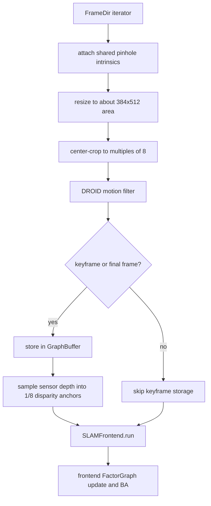
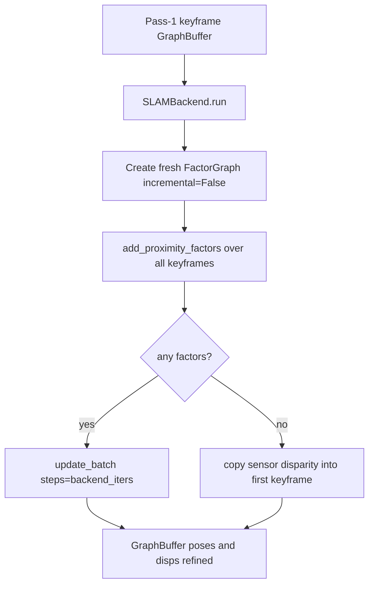
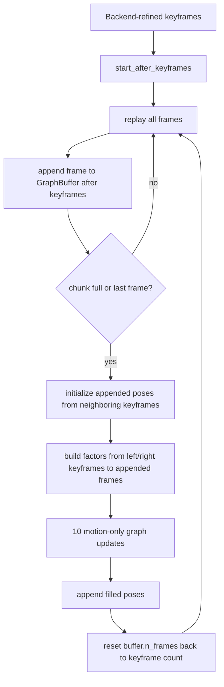
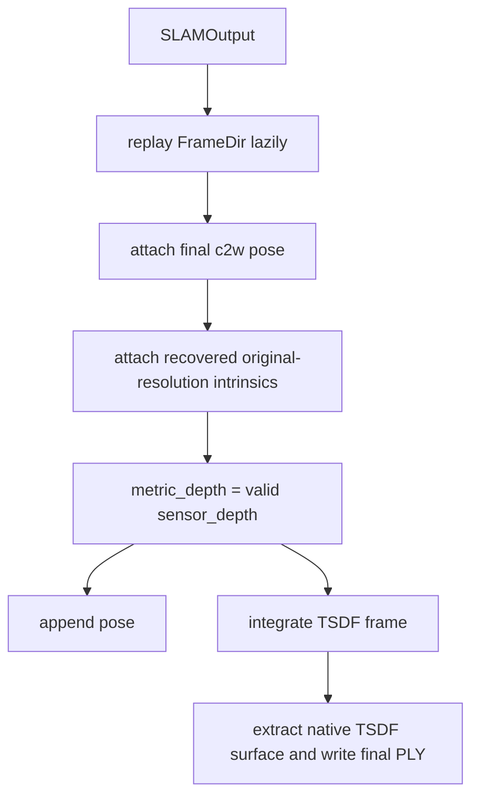

# Full Computation Walkthrough For The Current ViPE Run

This document describes the current supported ViPE pipeline after the canonical RGB-D refactor:

```text
raw dataset export
-> canonical ViPE RGB-D scene
-> lazy FrameDir stream
-> DROID/ViPE SLAM with external sensor-depth anchors
-> full camera trajectory
-> pose NPZ and native TSDF point cloud
-> optional ScanNet benchmark metrics
```

The important design rule is now simple: dataset-specific mess is handled before `run.py`. The runtime does not inspect raw ScanNet folders, raw rosbags, loose JPG sequences, TXT intrinsics, Hydra stream overrides, or distorted camera models. If data reaches `run.py` or the benchmark, it must already be in the canonical ViPE scene format.

Example standalone command:

```bash
python3 run.py --input-dir data/scannet/scene0000_00 --output-dir outputs/scene00
```

The required input layout is:

```text
<scene>/
  metadata.json
  color/
    000000.png
    000001.png
  depth/
    000000.png
    000001.png
  intrinsic/
    intrinsic_color.json
  pose/                    # required only for ScanNet benchmark GT
    000000.txt
    000001.txt
```

Depth PNG values are `uint16` millimeters on disk and are converted to float meters in memory. Intrinsics are undistorted pinhole RGB/color intrinsics.

## High-Level Flow

The runtime is easiest to understand as one extraction contract followed by five one-way computation stages. A later stage does not loop back and mutate an earlier stage.

```mermaid
flowchart LR
    S0[Stage 0: extract raw source into canonical scene] --> S1[Stage 1: FrameDir stream, camera, sensor depth]
    S1 -->|pinhole frame stream plus shared intrinsics| S2[Stage 2: SLAM pass 1 frontend loop]
    S2 -->|GraphBuffer with keyframes, poses, features, disparities, sensor-depth anchors| S3[Stage 3: backend global BA over keyframes]
    S3 -->|refined keyframe state in same GraphBuffer| S4[Stage 4: SLAM pass 2 pose infill]
    S4 -->|SLAMOutput: full trajectory, recovered intrinsics, keyframe indices| S5[Stage 5: replay sensor depth and save outputs]
```



| Stage | Loop grain | Main output |
| --- | --- | --- |
| Stage 0 | Once per raw dataset/session | Canonical scene directory with metadata, color, depth, intrinsics, and optional GT poses. |
| Stage 1 | Mostly once; frames remain lazy | `FrameStream` that yields RGB plus sensor depth, and one shared pinhole intrinsics tensor. |
| Stage 2 | Once over all frames | Keyframe-only `GraphBuffer`, incrementally optimized by frontend BA. |
| Stage 3 | Once over all keyframes | Same `GraphBuffer`, refined by a fresh global backend `FactorGraph`. |
| Stage 4 | Once over all frames | One pose for every canonical frame. |
| Stage 5 | Once over all frames | Native artifacts: pose NPZ and TSDF PCD. |

## Stage 0: Canonical Scene Extraction

Runtime accepts exactly one input representation. Raw datasets are converted into this representation by scripts in `scripts/data_extract/`.

### Canonical Metadata

`metadata.json` is the source of truth for frame order. Runtime does not glob and sort files to infer order, so names like `1.png` versus `10.png` are no longer a runtime risk.

Minimal metadata shape:

```json
{
  "format": "vipe_rgbd_v1",
  "name": "scene0000_00",
  "fps": 30.0,
  "width": 1296,
  "height": 968,
  "color": {"dir": "color", "encoding": "rgb8_png"},
  "depth": {"dir": "depth", "encoding": "uint16_png", "unit": "millimeter"},
  "intrinsics": "intrinsic/intrinsic_color.json",
  "frames": [
    {
      "seq": 0,
      "stem": "000000",
      "color_file": "color/000000.png",
      "depth_file": "depth/000000.png",
      "pose_file": "pose/000000.txt"
    }
  ]
}
```

Runtime-required fields:

| Field | Requirement |
| --- | --- |
| `format` | Must be `vipe_rgbd_v1`. |
| `fps` | Scene FPS. There is no `streams.fps` runtime override. |
| `width`, `height` | Must match the decoded RGB frame size. |
| `frames[*].color_file` | Relative path to an RGB/color PNG frame. |
| `frames[*].depth_file` | Relative path to a same-resolution `uint16` depth PNG. |
| `intrinsic/intrinsic_color.json` | Undistorted pinhole RGB intrinsics. |

ScanNet benchmark additionally requires:

| Field | Requirement |
| --- | --- |
| `frames[*].pose_file` | Relative path to a 4x4 camera-to-world GT pose text file. |
| `--raw-root/<scene>/<scene>_vh_clean_2.ply` | Preferred GT mesh; `<scene>_vh_clean.ply` is fallback. |

### Intrinsics Contract

`intrinsic/intrinsic_color.json` has format `vipe_pinhole_intrinsics_v1`:

```json
{
  "format": "vipe_pinhole_intrinsics_v1",
  "camera_model": "pinhole",
  "width": 1296,
  "height": 968,
  "fx": 1170.18798828125,
  "fy": 1170.18798828125,
  "cx": 647.75,
  "cy": 483.75
}
```

The runtime tensor is always:

```python
intrinsics = torch.tensor([fx, fy, cx, cy], dtype=torch.float32, device="cuda")
```

There is no runtime OpenCV undistortion wrapper anymore. If the source camera is distorted, the extractor must rectify RGB/depth and write the rectified pinhole intrinsics.

### ScanNet Extraction

Command:

```bash
python3 scripts/data_extract/scannet_to_vipe.py --scans-root /robodata/smodak/datasets/scannet_v2/scans --output-root data/scannet --scenes scene0000_00 scene0011_00 scene0378_00 --frame-skip 1
```

The extractor reads exactly one `.sens` file from each raw ScanNet scene. It loads the `.sens` header, checks that `depth_shift == 1000.0`, decodes selected frames, and writes a canonical scene under `--output-root/<scene>`.

| Artifact | Details |
| --- | --- |
| `color/*.png` | Decoded `.sens` color frames, standard PNG, color resolution. |
| `depth/*.png` | Decoded `.sens` `uint16` depth, millimeters, nearest-resized to color size if needed. |
| `pose/*.txt` | 4x4 camera-to-world matrix from the `.sens` frame. |
| `intrinsic/intrinsic_color.json` | Pinhole color intrinsics from `.sens` `intrinsic_color[:3,:3]`. |
| `metadata.json` | `fps = source_fps / frame_skip`, frame records, source frame ids, timestamps, source provenance. |

`frame_skip` changes what frames are exported and lowers metadata FPS accordingly. For example, `--fps 30 --frame-skip 4` writes every fourth frame and records `7.5` FPS.

### Kinect Rosbag MCAP Extraction

Command:

```bash
python3 scripts/data_extract/rosbag_to_vipe.py data/kinect_rosbags/raw/distilled_bag2/distilled_bag2_0.mcap --output-dir data/kinect_rosbags/processed/distilled_bag2
```

Default topics:

| Topic | Meaning |
| --- | --- |
| `/rgb/image_raw` | RGB/color image. |
| `/depth_to_rgb/image_raw` | Depth already projected into RGB frame. |
| `/rgb/camera_info` | RGB camera calibration. |

The extractor always overwrites the output directory, exports raw audit data, syncs RGB/depth, and writes canonical runtime data.

| Artifact | Details |
| --- | --- |
| `raw/color/*.png`, `raw/depth/*.png` | Raw topic dumps for audit/debug. |
| `raw/color/meta.json`, `raw/depth/meta.json` | Raw timestamps, encodings, dimensions, count, rounded FPS. |
| `color/*.png`, `depth/*.png` | Synced canonical RGB-D stream. |
| `sync_meta.json` | Color/depth pairing, max sync delta, synced FPS. |
| `intrinsic/intrinsic_color.json` | Pinhole RGB intrinsics from `CameraInfo`; rectified if needed. |
| `metadata.json` | Canonical runtime metadata. |

Depth ROS topics are expected to be `uint16` millimeters. Float depth topics are converted to millimeters before writing. If `CameraInfo` contains nonzero distortion coefficients, RGB and depth are rectified at extraction time and the output pinhole projection matrix is written.

### DepthCaptureLab MCAP Extraction

Command:

```bash
TMPDIR=data/depthcapture_rosbags/processed python3 scripts/data_extract/depthcapture_to_vipe.py data/depthcapture_rosbags/raw/Balanced.zip --output-dir data/depthcapture_rosbags/processed/Balanced
```

The extractor accepts a DepthCaptureLab `.zip`, a session directory, or a direct `recording.mcap`. For zip input it extracts into a Python temporary directory and deletes those temporary files before exiting.

Default topics:

| Topic | Meaning |
| --- | --- |
| `/camera/color/image/compressed` | JPEG `sensor_msgs/msg/CompressedImage`. |
| `/camera/depth/image_rect` | `32FC1` depth image in meters. |
| `/camera/color/camera_info` | Rectified pinhole color camera info. |
| `/camera/depth/camera_info` | Rectified pinhole depth camera info. |

DepthCaptureLab writes depth in meters, not millimeters. The extractor decodes the float depth, maps it from the depth intrinsic grid into the color intrinsic grid assuming identity extrinsics, then writes canonical `uint16` millimeter PNG depth:

```python
aligned_m = cv2.remap(depth_m, map_x, map_y, interpolation=cv2.INTER_NEAREST)
depth_mm = round(aligned_m * 1000).clip(0, 65535).astype(uint16)
```

It also computes synchronized frame FPS from color timestamps and stores that rounded FPS in `metadata.json`.

## Stage 1: Frame Stream, Camera, And Depth Inputs

### Runtime Construction

Source files:

| File | Role |
| --- | --- |
| `run.py` | Argparse CLI, fixed config loading, logging setup, `FrameDir` construction, pipeline launch. |
| `configs/default.yaml` | Runtime SLAM and output config. |
| `vipe/utils/data_format.py` | Canonical metadata and intrinsics readers/writers. |
| `vipe/streams/base.py` | `FrameDir`, `SensorCamera`, `FrameData`, `FrameStream`. |
| `vipe/pipeline.py` | External-camera initialization, SLAM call, artifact replay/save. |

`run.py` has two required CLI flags:

```bash
python3 run.py --input-dir <canonical-scene-dir> --output-dir <artifact-output-dir>
```

It always loads the fixed runtime config:

```python
DEFAULT_CONFIG_PATH = get_config_path() / "default.yaml"
cfg = load_yaml_config(DEFAULT_CONFIG_PATH)
```

and constructs:

```python
pipeline = VipePipeline(
    slam=cfg.pipeline.slam,
    output=cfg.pipeline.output,
    output_dir=cli_args.output_dir,
)

frame_stream = FrameDir(path=cli_args.input_dir)
pipeline.run(frame_stream)
```

There are no Hydra overrides and no runtime config-path flags. Dataset roots and output roots are explicit CLI paths. Low-level solver and TSDF knobs stay in YAML.

The shell variables influence external libraries but do not change ViPE control flow:

| Variable | Practical effect |
| --- | --- |
| `CUDA_VISIBLE_DEVICES` | Selects which physical GPU appears as CUDA device 0. |
| `NUMEXPR_MAX_THREADS` | Caps NumExpr if imported by dependencies. |
| `OMP_NUM_THREADS` | Caps OpenMP threads in libraries that obey it. |
| `MKL_NUM_THREADS` | Caps MKL threads in libraries that obey it. |

### Frame Ordering And Lazy Loading

`FrameDir.__init__` reads `metadata.json` and then reads `metadata["frames"]` in list order:

```python
self.metadata = read_scene_metadata(path)
self.frames = read_scene_frames(path)
self.frame_files = [path / frame["color_file"] for frame in self.frames]
self.depth_files = [path / frame["depth_file"] for frame in self.frames]
```

It does not list the `color/` directory, does not glob image extensions, and does not sort filenames. The extractor-generated metadata is therefore the ordering authority.

`FrameDir` does not cache all RGB/depth tensors. It stores file paths and re-reads frames lazily in every pass. This matters because the SLAM system iterates the stream twice and the artifact writer replays it one more time.

### Required Sensor Depth

For every frame record, `FrameDir.__init__` checks that both files exist:

```text
<scene>/<frame.color_file>
<scene>/<frame.depth_file>
```

`FrameDir.__getitem__` reads RGB and depth:

```python
frame = cv2.imread(str(frame_path))              # BGR uint8
frame = cv2.cvtColor(frame, cv2.COLOR_BGR2RGB)   # RGB uint8
frame_rgb = torch.as_tensor(frame).float().cuda() / 255.0

raw_depth = cv2.imread(str(depth_path), cv2.IMREAD_UNCHANGED)
if raw_depth.shape[:2] != frame.shape[:2]:
    raise ValueError(...)

sensor = raw_depth.astype(np.float32) / 1000.0
sensor[~np.isfinite(sensor)] = 0.0
sensor[sensor <= 0.0] = 0.0
sensor_depth = torch.as_tensor(sensor).float().cuda()
```

Current runtime refuses mismatched RGB/depth dimensions. Resizing or reprojection must happen in Stage 0 extraction.

Initial frame object:

```python
FrameData(
    raw_frame_idx=<metadata frame seq or list index>,
    rgb=<H x W x 3 CUDA float32 in 0..1>,
    sensor_depth=<H x W CUDA float32 in meters>,
    image_valid_mask=None,
    pose=None,
    intrinsics=None,
    metric_depth=None,
)
```

`sensor_depth` is input data. `metric_depth` is filled later in Stage 5 when the final output frame is assembled.

### Required External Intrinsics

`FrameDir` always loads RGB/color intrinsics from:

```text
<scene>/intrinsic/intrinsic_color.json
```

The JSON must have `format == "vipe_pinhole_intrinsics_v1"`. TXT intrinsics and multiple JSON variants are intentionally gone.

The loaded metadata is stored as:

```python
SensorCamera(
    source_path=<intrinsic json path>,
    k=<3x3 pinhole K>,
    width=<RGB width>,
    height=<RGB height>,
)
```

The downstream intrinsics tensor is always:

```python
torch.as_tensor([fx, fy, cx, cy], dtype=torch.float32).cuda()
```

### Pipeline Initialization

`VipePipeline.run` starts with:

```python
frame_stream, intrinsics = self._initialize(frame_stream)
artifact_path = ArtifactPath(self.out_path, frame_stream.name())
slam_output = self._run_slam(frame_stream, intrinsics)
self._save_outputs(artifact_path, frame_stream, slam_output)
```

`_initialize` enforces external intrinsics:

```python
camera = frame_stream.sensor_camera()
if camera is None:
    raise ValueError("Input stream must provide external RGB/color intrinsics")
intrinsics = camera.pinhole_intrinsics()
```

The only camera type passed into SLAM is:

```python
CameraType.PINHOLE
```

There is no camera-normalization stream wrapper at runtime. If a source camera is distorted or if depth is not in the RGB frame, Stage 0 must solve that and write a canonical pinhole RGB-D scene.

## Stage 2: SLAM Pass 1 Frontend Loop

Stage 2 is the first pass through all frames. It decides which frames become keyframes and optimizes those keyframes incrementally.



Relevant files:

| File | Role |
| --- | --- |
| `vipe/slam/system.py` | Two-pass orchestration, frame resizing/cropping, component calls. |
| `vipe/slam/components/motion_filter.py` | DROID motion check and cached feature/context tensors for accepted keyframes. |
| `vipe/slam/components/buffer.py` | Persistent keyframe state and sensor-depth disparity anchors. |
| `vipe/slam/components/frontend.py` | Incremental frontend factor graph. |
| `vipe/slam/components/factor_graph.py` | Factor storage, learned DROID target updates, BA invocation. |
| `vipe/slam/ba/terms.py` | Dense flow term and sensor-depth disparity regularization term. |

### Standard Resize And Crop

The SLAM network runs at a normalized resolution. For original size `(H0,W0)`, `StandardResizeFrameProcessor` computes:

```python
scale_factor = sqrt((384 * 512) / (H0 * W0))
H1 = int(H0 * scale_factor)
W1 = int(W0 * scale_factor)
```

Then it center-crops so both dimensions are divisible by 8:

```python
crop_h = H1 % 8
crop_w = W1 % 8
```

`FrameData.resize` applies:

| Field | Operation |
| --- | --- |
| `rgb` | Bilinear interpolation. |
| `sensor_depth` | Nearest-neighbor interpolation. |
| `image_valid_mask` | Nearest-neighbor interpolation if present. |
| `intrinsics` | `fx,cx` scaled by `W1/W0`; `fy,cy` scaled by `H1/H0`. |

`FrameData.crop` then applies:

| Field | Operation |
| --- | --- |
| `rgb` | Tensor crop. |
| `sensor_depth` | Tensor crop. |
| `image_valid_mask` | Tensor crop if present. |
| `intrinsics` | `cx -= left`, `cy -= top`. |

The resized/cropped intrinsics are the intrinsics optimized inside the SLAM graph. Original-resolution intrinsics are recovered in Stage 4.

### Component Construction

`SLAMSystem._build_components` creates:

```python
self.droid_net = DroidNet().to(self.device)
self.buffer = GraphBuffer(...)
self.motion_filter = MotionFilter(...)
self.frontend = SLAMFrontend(...)
self.backend = SLAMBackend(...)
self.inner_filler = InnerFiller(...)
```

The `GraphBuffer` is the persistent state table. With height `H` and width `W` after resizing/cropping, its dense-disparity grid is `(H/8, W/8)`.

Important buffer fields:

| Field | Shape | Meaning |
| --- | --- | --- |
| `tstamp` | `(buffer,)` | Canonical stream frame index for each buffered keyframe. |
| `images` | `(buffer,3,H,W)` | Resized/cropped RGB keyframes, float16. |
| `poses` | `(buffer,7)` | World-to-camera SE3 pose parameters. |
| `intrinsics` | `(4,)` | Shared resized/cropped `[fx,fy,cx,cy]`. |
| `disps` | `(buffer,H/8,W/8)` | Optimized dense disparity maps. |
| `disps_sens` | `(buffer,H/8,W/8)` | Sensor-depth disparity anchors. |
| `disps_sens_weight` | `(buffer,H/8,W/8)` | Validity weight for each sensor-depth anchor. |
| `fmaps` | `(buffer,128,H/8,W/8)` | DROID feature maps. |
| `nets`, `inps` | `(buffer,128,H/8,W/8)` | DROID context state. |

Initial pose is identity. Initial disparity is `pipeline.slam.init_disp`.

### Motion Filter And Keyframes

For each frame:

```python
frame_data = attach_intrinsics(frame_data, intrinsics, CameraType.PINHOLE)
frame_data = resizer(frame_data)
images = frame_data.rgb.permute(2, 0, 1)[None]
motion_result = self.motion_filter.check(images)
```

If `motion_result.is_keyframe` is true, or if this is the final frame, the frame is stored in the buffer:

```python
kf_idx = self.buffer.n_frames
self.buffer.tstamp[kf_idx] = frame_idx
self.buffer.images[kf_idx] = images[0]
self.buffer.fmaps[kf_idx] = motion_result.fmap[0]
self.buffer.nets[kf_idx], self.buffer.inps[kf_idx] = motion_result.net[0], motion_result.inp[0]
self.buffer.n_frames += 1
```

The final frame is forced into the keyframe set so pose infill has a right boundary at the end of the stream.

### Sensor-Depth Anchors

When a keyframe is added, `GraphBuffer.update_disps_sens` samples the external depth into the same 1/8-resolution grid used by DROID disparities:

```python
metric_depth = frame_data.sensor_depth.float()
valid = torch.isfinite(metric_depth) & (metric_depth > 0.0)
if frame_data.image_valid_mask is not None:
    valid &= frame_data.image_valid_mask.to(valid.device)
metric_depth = torch.where(valid, metric_depth, torch.zeros_like(metric_depth))

disp_sens = metric_depth[3::8, 3::8]
disp_sens = torch.where(disp_sens > 0, 1.0 / disp_sens, 0.0)
self.disps_sens[kf_idx] = disp_sens
self.disps_sens_weight[kf_idx] = valid[3::8, 3::8].float()
```

So the external depth does not replace SLAM. It regularizes the optimized disparity map at valid sensor-depth samples.

### Frontend Factor Graph

`SLAMFrontend.run` maintains a persistent incremental `FactorGraph`.

Conceptually:

```text
new keyframe enters GraphBuffer
-> add neighborhood/proximity factors
-> run learned DROID update to refresh target correspondences and weights
-> run BA to mutate GraphBuffer poses/disparities
-> prune old/redundant active factors
```

Important frontend config values are in `configs/default.yaml`:

| Config | Default | Role |
| --- | ---: | --- |
| `filter_thresh` | `2.4` | Dense motion threshold for accepting keyframes. |
| `warmup` | `8` | Keyframes collected before initializing frontend graph. |
| `keyframe_thresh` | `4.0` | Threshold for pruning redundant keyframes. |
| `frontend_thresh` | `16.0` | Proximity threshold for frontend edge creation. |
| `frontend_window` | `25` | Number of recent keyframes considered by frontend. |
| `frontend_radius` | `2` | Local forced-neighbor factor radius. |
| `frontend_nms` | `1` | Non-max suppression radius for proximity factors. |
| `frontend_max_factors` | `48` | Max active frontend factors. |
| `frontend_max_age` | `25` | Delete active factors after this many graph updates. |
| `frontend_init_updates` | `8` | Graph update calls during warmup initialization. |
| `frontend_update_iters1` | `4` | First update loop after adding a keyframe. |
| `frontend_update_iters2` | `2` | Extra update loop when candidate keyframe is retained. |
| `frontend_ba_iters` | `3` | Inner BA solver iterations per frontend graph update. |

The frontend graph is active only over keyframes. Non-keyframes do not get stored until Stage 4.

### Bundle Adjustment Objective

For one low-resolution pixel `p=(u,v)` in source keyframe `i`, with disparity `d_i(p)`, the code uses an inverse-depth homogeneous point:

```math
\Pi_K^{-1}(p,d_i)=
\begin{bmatrix}
(u-c_x)/f_x \\
(v-c_y)/f_y \\
1 \\
d_i
\end{bmatrix}.
```

This is equivalent to the Euclidean depth point with `z_i = 1/d_i` after homogeneous division, but it matches the actual `PinholeCameraModel.iproj_disp` representation.

The current projection into keyframe `j` is:

```math
\hat{p}_{ij}(p)=\Pi_K\left(P_j P_i^{-1}\Pi_K^{-1}(p,d_i)\right).
```

`P_i` and `P_j` are current world-to-camera poses. DROID supplies target coordinate `p^*_{ij}(p)` and residual weight `w_{ij}(p)`.

The dense visual term is:

```math
E_{\text{flow}}
=
\sum_{(i,j)\in\mathcal{F}}
\sum_p
w_{ij}(p)
\left\|
\hat{p}_{ij}(p)-p^*_{ij}(p)
\right\|^2.
```

The sensor-depth anchor term is:

```math
E_{\text{sens}}
=
\alpha
\sum_i
\sum_p
m_i(p)
\left(d_i(p)-d_{\text{sens},i}(p)\right)^2.
```

where:

| Symbol | Code |
| --- | --- |
| `alpha` | `pipeline.slam.ba.dense_disp_alpha` |
| `d_i` | `GraphBuffer.disps` |
| `d_sens,i` | `GraphBuffer.disps_sens` |
| `m_i` | `GraphBuffer.disps_sens_weight` |

The total BA objective is:

```math
E = E_{\text{flow}} + E_{\text{sens}}.
```

For frontend/backend BA, both poses and disparities are optimized. For pose infill in Stage 4, `motion_only=True`, so dense disparities are fixed and only poses are optimized.

Exact frontend BA call path:

```text
SLAMSystem.run pass 1
-> keyframe accepted
-> GraphBuffer slot filled
-> GraphBuffer.disps_sens filled from external sensor depth
-> SLAMFrontend.run
-> frontend.graph.add_neighborhood_factors or add_proximity_factors
-> frontend.graph.update
-> GraphBuffer.bundle_adjustment
-> Solver.run_inplace
-> GraphBuffer.poses/disps mutated
```

## Stage 3: Backend Global BA

Stage 3 runs once after pass 1 finishes. It uses the same `GraphBuffer` but creates a fresh non-incremental backend `FactorGraph`.



Backend factor construction:

```python
graph = FactorGraph(
    net=droid_net,
    buffer=same_graph_buffer,
    max_factors=backend_max_factors_per_keyframe * n_keyframes,
    incremental=False,
)

graph.add_proximity_factors(
    rad=backend_radius,
    nms=backend_nms,
    thresh=backend_thresh,
    beta=beta,
)
```

`incremental=False` means the graph does not store per-edge `CorrBlock` objects. Instead, backend `update_batch` builds an `AltCorrBlock` over all keyframe feature maps and computes correlations in batches:

```python
corr_op = AltCorrBlock(buffer.fmaps[None])
for _ in range(backend_iters):
    coords1 = buffer.reproject_dense_disp(ii, jj)
    for i in range(0, jj.max() + 1, backend_batch_size):
        v = (ii >= i) & (ii < i + backend_batch_size)
        corr = corr_op(coords1[:, v], ii[v], jj[v])
        net, delta, weight, damping, _ = droid_net.update.forward(...)
    buffer.bundle_adjustment(..., n_iters=backend_ba_iters, t0=1, t1=n_keyframes)
```

The backend edge list is built once. Across each backend outer step, DROID targets/weights are refreshed, then BA runs `backend_ba_iters` inner solver iterations. Backend updates the same `GraphBuffer.poses` and `GraphBuffer.disps` that frontend produced.

If the backend graph has no factors, which can happen when there is only one keyframe, backend does not call `update_batch`. Instead it copies valid sensor-depth anchor disparities into `GraphBuffer.disps[0]` and leaves the rest of the initialized disparity values unchanged.

The backend graph is not a continuation of `frontend.graph`. It is a new temporary `FactorGraph` object that points at the same `GraphBuffer`, optimizes that shared state, then is discarded.

Backend config values:

| Config | Default | Role |
| --- | ---: | --- |
| `backend_thresh` | `22.0` | Distance threshold for global backend proximity edges. |
| `backend_radius` | `2` | Forced local edge radius. |
| `backend_nms` | `3` | Suppression radius for backend proximity edge selection. |
| `backend_iters` | `31` | Outer backend `update_batch` steps. |
| `backend_ba_iters` | `8` | Inner BA solver iterations per backend outer step. |
| `backend_max_factors_per_keyframe` | `16` | Factor budget multiplier, so max factors is `16 * n_keyframes`. |
| `backend_batch_size` | `8` | Source-keyframe-index batch size for DROID correlation/update. |
| `beta` | `0.3` | Translation/rotation blend for graph proximity scoring. |

With the default values, backend performs:

```text
31 outer update_batch steps
1 full DROID target/weight refresh over all backend edges per outer step
8 inner BA solver iterations per outer step
248 total inner BA solver iterations
```

Backend state changes by cadence:

| Cadence | State |
| --- | --- |
| Fixed for backend run | Backend `FactorGraph.ii/jj` edge list, `GraphBuffer` identity, DROID weights, shared intrinsics. |
| Once per backend outer step | `FactorGraph.target`, `FactorGraph.weight`, `FactorGraph.damping`, `FactorGraph.f_net`. |
| During inner BA solver iterations | `GraphBuffer.poses`, `GraphBuffer.disps`. |
| Not changed by backend | `GraphBuffer.n_frames`, `images`, `fmaps`, `nets`, `inps`, `disps_sens`, `disps_sens_weight`, backend edge set. |

Exact backend BA call path:

```text
SLAMSystem.run after pass 1
-> SLAMBackend.run
-> local FactorGraph created
-> local graph.add_proximity_factors
-> local graph.update_batch
-> GraphBuffer.bundle_adjustment
-> Solver.run_inplace
-> same GraphBuffer.poses/disps mutated
```

Mental model:

```text
Outer graph update step = refresh learned targets/weights using DROID, then call BA.
Inner BA solver iterations = optimize GraphBuffer.poses/disps against fixed targets/weights.
```

## Stage 4: Pose Infill

Pass 1 and backend optimize only keyframes. Stage 4 produces one pose for every canonical RGB-D frame.



Relevant file:

| File | Role |
| --- | --- |
| `vipe/slam/components/inner_filler.py` | Appends pending non-keyframes and optimizes their poses against fixed keyframes. |

For each pending non-keyframe frame at timestamp `t`, `InnerFiller.fill_pending_chunk` finds adjacent keyframe timestamps `t0` and `t1`:

```python
t0 = searchsorted(keyframe_timestamps, pending_timestamps, right=True) - 1
t1 = min(t0 + 1, last_keyframe)
```

It initializes pose by constant-velocity interpolation in SE3:

```python
d_pose = key_pose[t1] * key_pose[t0].inv()
vel = d_pose.log() / (timestamp[t1] - timestamp[t0] + 1e-3)
w = vel * (pending_timestamp - timestamp[t0])
pending_pose = SE3.exp(w) * key_pose[t0]
```

Then it builds a small incremental `FactorGraph`:

```python
graph.add_factors(t0, pending_indices)
graph.add_factors(t1, pending_indices)

for _ in range(10):
    graph.update(start_idx, total_frames, motion_only=True)
```

Because `motion_only=True`, the BA call fixes dense disparities:

```python
solver.set_fixed("dense_disp")
```

and optimizes only pending-frame poses.

After all chunks are filled:

```python
trajectory = infill_result.poses.inv()
original_intrinsics = resizer.recover_intrinsics(buffer.intrinsics)
keyframe_indices = buffer.tstamp[:buffer.n_frames].cpu().tolist()
```

`SLAMOutput` contains:

```python
SLAMOutput(
    trajectory=<camera-to-world SE3 for every canonical frame>,
    intrinsics=<original-resolution pinhole [fx,fy,cx,cy]>,
    keyframe_indices=<canonical frame indices of optimized SLAM keyframes>,
)
```

`keyframe_indices` are diagnostics. Final dense depth comes from replayed external sensor depth in Stage 5.

## Stage 5: Replay Sensor Depth And Save Outputs

Stage 5 always runs in the current `run.py` and benchmark path.



`VipePipeline._final_frames` re-reads frames lazily:

```python
for frame_idx in range(len(frame_stream)):
    frame = frame_stream[frame_idx]
    frame.pose = slam_output.trajectory[frame_idx]
    frame.intrinsics = slam_output.intrinsics
    frame.camera_type = CameraType.PINHOLE

    sensor_depth = frame.sensor_depth.float()
    valid = isfinite(sensor_depth) & (sensor_depth > 0)
    if frame.image_valid_mask is not None:
        valid &= frame.image_valid_mask
    frame.metric_depth = where(valid, sensor_depth, 0)
    yield frame
```

This means the TSDF PCD is built from the provided sensor depth. ViPE estimates the camera trajectory, but this fork does not export an independently predicted dense depth map.

### Saved Artifacts

`vipe/utils/io.py::save_artifacts` consumes final frames in one streaming pass.

| Artifact | Path | Contents |
| --- | --- | --- |
| Pose NPZ | `pose/<artifact_name>.npz` | `data`: camera-to-world matrices, `inds`: sequential canonical frame indices. |
| TSDF PLY | `pcd/<artifact_name>_tsdf.ply` | Colored points sampled from the native TSDF zero-crossing surface. |

`artifact_name` is `frame_stream.name()`, which is the input scene directory name unless explicitly overridden.

`pose/<artifact_name>.npz` arrays:

| Array | Shape | Meaning |
| --- | --- | --- |
| `data` | `(N,4,4)` | Camera-to-world pose matrix for each saved frame. |
| `inds` | `(N,)` | Sequential canonical frame index used by the artifact writer. |

### TSDF PCD

For TSDF output, each final frame is integrated into the native `vipe_ext.tsdf_ext.TSDFVolume` through `vipe.utils.tsdf.TSDFVolume`:

```python
volume = TSDFVolume(
    voxel_edge_m=pcd_tsdf_voxel_edge_m,
    sdf_trunc_m=pcd_tsdf_sdf_trunc_m,
    num_voxels_per_block_edge=pcd_tsdf_num_voxels_per_block_edge,
    depth_sampling_stride=pcd_tsdf_depth_sampling_stride,
)
```

The volume is a sparse hash map of fixed-size voxel blocks. A voxel stores:

```text
tsdf   : float32 signed distance, normalized to [-1, 1]
weight : float32 number/effective number of RGB-D observations fused into that voxel
rgb    : float32 running average color in 0..255 space
```

Per frame, the artifact writer prepares the exact arrays that the native extension receives:

```python
depth = metric_depth.astype(np.float32)
depth[invalid_or_masked] = 0
color = rgb_uint8
intrinsics = np.array([fx, fy, cx, cy], dtype=np.float32)
w2c = frame.pose.inv().matrix()
volume.integrate(depth, color, intrinsics, w2c, pcd_tsdf_depth_trunc_m)
```

Inside native integration, the first pass determines which voxel blocks are touched by the current depth image. It lifts every `pcd_tsdf_depth_sampling_stride` depth pixel with valid depth `d <= pcd_tsdf_depth_trunc_m` into world coordinates, and opens every voxel block intersecting that point's `pcd_tsdf_sdf_trunc_m` neighborhood.

Then each touched voxel center `P_w = [X_w,Y_w,Z_w,1]^T` is projected into the current camera:

```math
P_c = T_{cw} P_w = [X_c,Y_c,Z_c,1]^T
```

```math
u = \frac{f_x X_c}{Z_c} + c_x + 0.5,\qquad
v = \frac{f_y Y_c}{Z_c} + c_y + 0.5.
```

If `(u,v)` is outside the image, `Z_c <= 0`, or the sampled depth is invalid, the voxel is not updated from this frame. Otherwise the signed distance is:

```math
s =
(d(u,v) - Z_c)
\sqrt{
\left(\frac{u-c_x}{f_x}\right)^2
+
\left(\frac{v-c_y}{f_y}\right)^2
+
1
}.
```

The square-root term converts optical-axis depth difference into approximate Euclidean ray distance. If `s <= -pcd_tsdf_sdf_trunc_m`, the voxel is behind the observed surface by more than the truncation band and is skipped. Otherwise:

```math
\operatorname{tsdf}_{new}
=
\min\left(1,\frac{s}{\text{sdf\_trunc}}\right).
```

The voxel stores a running weighted average:

```math
\operatorname{tsdf}
\leftarrow
\frac{w\operatorname{tsdf}+\operatorname{tsdf}_{new}}{w+1},
\qquad
C
\leftarrow
\frac{wC+C_{rgb}(u,v)}{w+1},
\qquad
w \leftarrow w+1.
```

After all frames, the extension extracts the zero-crossing surface directly as a point cloud. It scans neighboring voxel samples, keeps cubes whose eight corners are observed and contain both negative and nonnegative TSDF values, decomposes each cube into tetrahedra, linearly interpolates zero-crossing vertices and colors, builds surface triangles, and deterministically samples the resulting triangles by area:

```python
points, colors = volume.extract_point_cloud(pcd_max_points)
write_binary_ply(...)
```

So the saved reconstruction artifact is the sampled colored point cloud extracted from the final native sparse TSDF volume.

Important output knobs in `configs/default.yaml`:

| Config | Meaning |
| --- | --- |
| `pipeline.output.pcd_max_points` | Maximum sampled TSDF point-cloud points. |
| `pipeline.output.pcd_tsdf_voxel_edge_m` | TSDF voxel edge length in meters. |
| `pipeline.output.pcd_tsdf_sdf_trunc_m` | Signed-distance truncation band in meters. |
| `pipeline.output.pcd_tsdf_depth_trunc_m` | Ignore depth samples beyond this many meters. |
| `pipeline.output.pcd_tsdf_num_voxels_per_block_edge` | Number of voxels along each sparse TSDF block edge. |
| `pipeline.output.pcd_tsdf_depth_sampling_stride` | Sample every Nth depth pixel when opening TSDF blocks. |

## ScanNet Benchmark Adapter

The benchmark uses the same `VipePipeline` and `FrameDir` construction as `run.py`. It adds ScanNet GT pose/mesh loading, manifest writing, metric evaluation, and optional multi-GPU worker splitting.

Command:

```bash
python3 scripts/scannet_vipe_bench_evaluator.py --scenes scene0000_00 scene0011_00 scene0378_00 --work-dir ./workspace/evaluation_scannet_default --input-root data/scannet --raw-root /robodata/smodak/datasets/scannet_v2/scans
```

Benchmark data loading is canonical-only:

| Source | Meaning |
| --- | --- |
| `--input-root/<scene>` | Canonical ViPE scene. |
| `--raw-root/<scene>` | Raw ScanNet scene folder used only for GT mesh lookup. |
| `configs/default.yaml` | Fixed ViPE runtime config for SLAM and TSDF output knobs. |
| `configs/eval_scannet_config.yaml` | Metric thresholds, render settings, cache filenames, GT mesh suffixes. |

The benchmark does not accept runtime path overrides. Scene data comes only from `--input-root/<scene>`, which avoids the previous ambiguous branch where a benchmark could evaluate one scene while running ViPE on a separately formatted path.

For every scene, the adapter:

1. Loads canonical frame records and GT poses from `metadata.json` and `pose/*.txt`.
2. Runs `VipePipeline` on `--input-root/<scene>`.
3. Writes `vipe_manifest.json` under the benchmark workspace.
4. Writes `gt_meta.npz` containing the exact evaluated GT frame subset.
5. Runs pose and reconstruction metrics.

ViPE artifacts for benchmark runs are written under:

```text
<work-dir>/vipe_outputs/<scene>
```

The local benchmark manifest is written under:

```text
<work-dir>/model_results/scannet/<scene>/recon/exports/vipe_manifest.json
```

Manifest contents include:

| Key | Meaning |
| --- | --- |
| `format` | `vipe_artifacts_v1`. |
| `scene` | ScanNet scene id. |
| `artifact_name` | Canonical scene directory name. |
| `vipe_output_dir` | Absolute path to ViPE output directory. |
| `pose_path` | Absolute path to ViPE pose NPZ. |
| `tsdf_pcd_path` | Absolute path to ViPE TSDF PLY. |
| `output` | TSDF output parameters used for this run. |
| `frame_indices` | Sequential canonical frame indices. |

### Pose Metric

The pose metric uses the matched canonical frames:

1. Load predicted ViPE poses by `frame_indices`.
2. Load ScanNet GT camera-to-world poses from canonical `pose/*.txt`.
3. Convert predicted and GT camera-to-world poses to world-to-camera extrinsics.
4. Align both trajectories to their first camera.
5. Compute relative-pair rotation/translation angular errors.
6. Report AUC at configured degree thresholds.

The metric is relative after first-frame normalization. It does not apply per-frame alignment.

### Reconstruction Metric

The reconstruction metric consumes the TSDF PLY written by Stage 5:

```text
pcd/<artifact_name>_tsdf.ply
```

For reconstruction metrics, the evaluator:

1. Loads ViPE TSDF PLY.
2. Computes one rigid SE3 transform mapping the first predicted camera pose to the first ScanNet GT camera pose.
3. Applies that single SE3 to the whole predicted point cloud.
4. Caches the aligned PLY under the benchmark eval cache.
5. Samples/caches the ScanNet GT mesh point cloud.
6. Crops predicted points to the padded GT AABB.
7. Computes nearest-neighbor L2 geometry metrics.
8. Renders the aligned predicted cloud into sampled GT cameras for PSNR/SSIM.

The reported `scale_diagnostic` is not applied to the evaluated PLY. It is a diagnostic scalar fitted after first-camera SE3 alignment to expose scale drift:

```text
scale = sum(pred_delta * gt_delta) / sum(pred_delta * pred_delta)
```

The printed summary reports mean scale and individual scene scales in parentheses, so per-scene scale spread stays visible.

### Benchmark Parallelism

If `CUDA_VISIBLE_DEVICES` contains multiple GPUs and the process is not already a worker, the benchmark script spawns one worker process per visible GPU. Scenes are partitioned by scene index modulo GPU count:

```python
scenes = [scene for idx, scene in enumerate(all_scenes) if idx % total_gpus == gpu_id]
```

Each worker writes timing JSON under:

```text
<work-dir>/metric_results/timing_workers/
```

The parent process merges build timing, runs metric evaluation, writes `scannet_timing.json`, and prints the final summary.

## Runtime Config Boundaries

The current CLI/YAML split is intentional:

| Location | Belongs there |
| --- | --- |
| CLI | Dataset/session paths, output/workspace paths, scene list. |
| `configs/default.yaml` | Solver, keyframe, BA, and TSDF output knobs. |
| `configs/eval_scannet_config.yaml` | ScanNet metric thresholds, render settings, cache names, GT mesh suffixes. |

No CLI flag and YAML key should represent the same path or stream. This removes the old conflict class where a command line could set `--input-root` but Hydra overrides could silently point `streams.base_path` somewhere else.

Important runtime config values:

| Config | Role |
| --- | --- |
| `seed` | Seeds Python/NumPy/Torch/Open3D RNGs without forcing slower deterministic kernels. |
| `pipeline.slam.buffer` | Max number of keyframes kept in the graph buffer. |
| `pipeline.slam.filter_thresh` | Motion threshold for keyframe creation. |
| `pipeline.slam.ba.dense_disp_alpha` | Weight for external sensor-depth disparity regularization. |
| `pipeline.slam.infill_chunk_size` | Non-keyframe pose infill chunk size. |
| `pipeline.output.*` | TSDF point-cloud output controls. |

## What Is Intentionally Gone

The current codebase intentionally does not support these runtime branches:

| Removed branch | Replacement |
| --- | --- |
| Image directory without metadata | Extract or convert to canonical `metadata.json` first. |
| `streams.base_path` | `run.py --input-dir`. |
| `streams.fps` | `metadata.json["fps"]`. |
| JPG/BMP/TIFF runtime discovery | Canonical `metadata.json["frames"]` paths. |
| Filename sort heuristics | Metadata frame order. |
| ScanNet TXT intrinsic fallback | `intrinsic/intrinsic_color.json`. |
| Multiple intrinsic JSON schemas | `vipe_pinhole_intrinsics_v1`. |
| Runtime OpenCV distortion wrapper | Rectify in extractor, write pinhole intrinsics. |
| Runtime depth resizing | Extractor must write RGB-sized depth. |
| Benchmark stream overrides | `--input-root/<scene>` only. |
| `pipeline.output.save_artifacts` | Artifacts are always saved. |

This is the key invariant: if a path reaches `run.py` or the ScanNet benchmark, it must already be canonical.

## Object Glossary

| Object | Meaning |
| --- | --- |
| `metadata.json` | Canonical scene manifest and frame-order authority. |
| `FrameDir` | Lazy canonical scene reader for RGB, depth, metadata, and pinhole intrinsics. |
| `SensorCamera` | Loaded undistorted pinhole RGB/color calibration metadata. |
| `FrameData.sensor_depth` | External input depth in meters, already aligned to RGB frame by extraction. |
| `FrameData.metric_depth` | Final output depth, assigned from valid `sensor_depth` in Stage 5. |
| `StandardResizeFrameProcessor` | Resize/crop logic used before DROID/SLAM, plus inverse intrinsics recovery. |
| `GraphBuffer` | Persistent SLAM state table: keyframe poses, disparities, sensor-depth anchors, DROID features. |
| `FactorGraph` | Edge/factor manager that refreshes learned DROID targets and invokes BA. |
| `frontend.graph` | Persistent incremental factor graph used during pass 1. |
| Backend graph | Fresh non-incremental factor graph created once in Stage 3. |
| `InnerFiller` | Motion-only pose optimizer for non-keyframe frames. |
| `SLAMOutput` | Final handoff object containing full trajectory, original-resolution intrinsics, and keyframe indices. |
| `ArtifactPath` | Output naming wrapper for `pose/<scene>.npz` and `pcd/<scene>_tsdf.ply`. |
