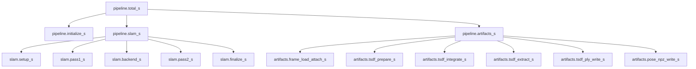
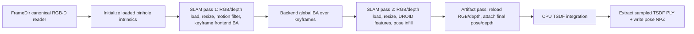

# ViPE Speedify Plan

This is the working plan for the speed experiment loop. The priority order is:

1. Speed up the actual ViPE build run: `run.py` / `VipePipeline.run()` / SLAM / artifact + TSDF export.
2. Speed up benchmark plumbing: scene scheduling, manifest/eval wrappers, dashboard/reporting, resume behavior.

The experiment target is full-build speed, not pose-only speed. A valid run must still output final poses and the TSDF point cloud, with deterministic behavior preserved.

## Retained Speedified State

The current default config/code keeps the full-build speedups that survived full benchmark checks:

- SLAM works at `pipeline.slam.resize_target_pixels=196608` by default.
- SLAM pass 1 reads RGB only for motion filtering and loads/resizes sensor depth only for accepted keyframes.
- SLAM pass 2 reuses pass-1 DROID feature maps for infill instead of re-decoding and re-encoding every frame.
- Artifact export uses a CPU RGB-D loader with bounded prefetch, then feeds native CPU TSDF integration directly.
- TSDF PLY writing is handled by the native extension to avoid slow Python structured-array packing.
- TSDF defaults are speedified to `pcd_tsdf_num_voxels_per_block_edge=8` and `pcd_tsdf_depth_sampling_stride=128`; the original pre-speedify values were `16` and `4`.
- Benchmark timing JSONs now include nested stage timings, and ScanNet/Replica final eval can split across visible GPUs.

## Hard Invariants

- Keep determinism enabled unless explicitly testing deployment-only speed. The current correctness baseline assumes `temporary_determinism=true`.
- Do not cheat by skipping artifact saving, skipping TSDF, lowering `pcd_max_points`, or changing benchmark semantics.
- Preserve output requirements: pose NPZ, timing JSON, TSDF PLY, benchmark manifest, and incremental pose metrics.
- Treat per-scene AUC30 shifts below roughly `0.01` as noise unless the direction is systematic.
- Reject speedups that materially change metrics unless the change is an explicitly approved algorithmic tradeoff.

## Baseline Scene Set

The retained 4-scene control minibench is:

```text
scene0009_01
scene0013_00
scene0047_00
scene0060_00
```

Reference full8 values from the previous full benchmark:

| Scene | Full8 Build FPS | Pose AUC30 |
|---|---:|---:|
| `scene0009_01` | 3.173629 | 0.879801848260 |
| `scene0013_00` | 3.385657 | 0.843588863463 |
| `scene0047_00` | 3.205602 | 0.720697239965 |
| `scene0060_00` | 2.539910 | 0.775683829835 |

The minibench baseline must be regenerated with full-build execution. The old pose-only baseline was useful for isolating SLAM but is not valid for this speed loop.

## Timing Schema

Every run should record both total timing and nested stage timing:



Important interpretation:

- `pipeline.total_s` is measured inside `VipePipeline.run()`.
- Benchmark `build.seconds` is measured around the subprocess/pipeline call, so it includes process and wrapper overhead.
- Nested stage timings are written to `vipe_outputs/<scene>/timing/<scene>.json`.
- `scannet_timing.json` stores per-scene timing entries and aggregate stage summaries for keys ending in `_s`.

## 1. Actual ViPE Build Run Speed

This is the main target. The current build flow is:



### Build Opportunity A: Avoid Depth Work When SLAM Only Needs RGB

Current `FrameDir.__getitem__()` always decodes RGB and depth, creates CUDA tensors for both, and `FrameData.resize()` always resizes both RGB and depth.

But:

- Motion filtering only needs RGB.
- DROID feature/context encoders only need RGB.
- Pass 2 infill currently only needs RGB features for target frames.
- Sensor depth is needed for keyframe disparity regularization in pass 1, and later for final artifact/TSDF export.

Expected fix:

- Add an RGB-only read path for SLAM frames.
- Load/resize sensor depth lazily only when a frame is accepted as a keyframe.
- In pass 2, avoid loading/resizing depth entirely.
- Keep the artifact pass as the canonical full-resolution RGB-D source for TSDF.

Expected speed:

- Potentially large, especially on long RGB-D scenes where depth PNG decode and nearest resize are repeated thousands of times.

Correctness:

- Should be exact if keyframe depth loading uses the same decoded depth and same resize/crop path as before.

Risk:

- Must preserve invalid masks and depth units exactly when the keyframe depth is lazily loaded.

### Build Opportunity B: CPU-Only Artifact/TSDF Input Path

The pre-speedify artifact path effectively did:

```text
cv2 decode on CPU
-> torch CUDA tensors in FrameDir
-> attach final metric_depth on CUDA
-> copy depth/color/intrinsics/pose back to CPU NumPy
-> TSDF extension converts to CPU torch
-> CPU TSDF integrate
```

The TSDF extension is CPU-side, so moving artifact frames to CUDA is wasted work.

Retained fix:

- Add an artifact reader path that keeps RGB/depth/masks on CPU.
- Apply the same valid-depth rules on CPU.
- Feed CPU tensors/arrays directly to `TSDFVolume.integrate`.

Expected speed:

- Moderate full-build win.

Correctness:

- Should be exact or extremely close if RGB order, depth units, mask semantics, pose convention, and frame order are unchanged.

### Build Opportunity C: Pass 2 Feature-Only Infill Append

Current pass 2 calls `_add_infill_frame()`, which calls `_store_buffer_frame()` and computes/stores:

```text
image
feature map
context net
context input
```

For infill factors, the source side is a keyframe and the target side is the non-keyframe. The graph needs the non-keyframe target feature map for correlation, but it does not need target context `net/inp`.

Expected fix:

- Add a dedicated infill-frame append path.
- Store timestamp, initialized pose/disp, and target feature map.
- Do not compute/store `net/inp` for non-keyframe infill targets.
- Avoid storing resized images for infill frames unless a live code path uses them.

Expected speed:

- Potentially large because pass 2 currently runs the context encoder for every frame.

Correctness:

- Should be exact if only unused context/image storage is removed.

### Build Opportunity D: Reuse Pass-1 Feature Maps In Pass 2

`MotionFilter.check()` computes a DROID feature map for every pass-1 frame. Pass 2 later decodes the same frame and recomputes a feature map for infill.

Expected fix:

- Cache pass-1 feature maps for non-keyframes, ideally CPU `float16`.
- Reuse them in pass 2 instead of decoding/re-encoding RGB.
- Keep a memory cap or a config-only diagnostic fallback if needed.

Expected speed:

- Potentially very large if pass 2 is dominated by image decode + DROID feature encoding.

Correctness:

- If caching preserves exact dtype/layout, pose should be identical.
- `float16` cache may introduce tiny numeric differences; validate before keeping.

Risk:

- Memory can be several GB on 5k-frame scenes.

### Build Opportunity E: Infill Algorithm Budget

Current default:

```yaml
infill_chunk_size: 16
infill_update_steps: 10
```

The infill pass starts from SE(3) interpolation between neighboring keyframes and then runs motion-only graph updates. If interpolation is already strong, fewer update calls may keep AUC stable.

Experiments:

- `infill_update_steps=8`
- `infill_update_steps=5`
- `infill_update_steps=2`
- `infill_update_steps=0`
- Larger `infill_chunk_size`

Expected speed:

- Potentially large if pass 2 is a major stage.

Correctness:

- Algorithmic tradeoff, not exact-preserving. Validate per-scene AUC30.

### Build Opportunity F: Backend Batch And Iteration Budget

Current defaults:

```yaml
backend_iters: 31
backend_ba_iters: 8
backend_batch_size: 8
backend_max_factors_per_keyframe: 16
```

Experiments:

- `backend_batch_size=16`
- `backend_batch_size=32` if VRAM permits
- `backend_iters=24`
- `backend_ba_iters=6`

Expected speed:

- Batch size may improve throughput with little metric change.
- Iteration reduction can be faster but is algorithmic.

Correctness:

- Batch-size changes should be close if ordering remains deterministic.
- Iter-count changes need strict metric checks.

### Build Opportunity G: BA Solver And Sparse Assembly

The BA solver assembles sparse systems on CUDA but falls back to CPU SciPy solve for some pose systems. Sparse block matching also has Python/CPU work.

Potential fixes:

- Add lower-level solver timing if stage timing shows BA dominates.
- Cache sparse index-pair mappings when the graph structure is fixed.
- Prototype backend-only dense CUDA pose solve for moderate keyframe counts.
- Move repeated sparse bookkeeping into C++/torch deterministic kernels.

Expected speed:

- Potentially large if backend or frontend BA dominates.

Correctness:

- Not necessarily byte-identical. Needs pose delta and AUC validation.

### Build Opportunity H: TSDF Native CPU Optimizations

Current native TSDF does sparse block opening/touching, CPU integration, extraction, deterministic sampling, and binary PLY write.

Potential fixes:

- Avoid wrapper-level CPU array/tensor copies.
- Optimize touched-block discovery with vector sort/unique instead of repeated hash inserts.
- Tune C++ parallel loop grain sizes and thread settings.
- Only consider CUDA TSDF if timing proves CPU TSDF dominates and minor numeric differences are acceptable.

Expected speed:

- Moderate for copy/touched-block optimizations.
- Large but higher-risk for CUDA TSDF.

Correctness:

- CPU copy/path cleanup can be exact.
- CUDA TSDF likely changes accumulation order and must be metric-validated.

### Build Opportunity I: Overlap CPU TSDF With GPU Pass 2

Pass 2 is GPU-heavy; TSDF is CPU-heavy. Once final poses are available for a chunk, TSDF could integrate completed frames while later chunks are still being processed.

Expected fix:

- Emit completed frame poses from infill in original frame order.
- Run a deterministic CPU TSDF worker that integrates frames strictly in index order.
- Wait at the end before extraction/write.

Expected speed:

- Potentially large if artifact/TSDF and pass2 are both significant.

Risk:

- More invasive lifecycle/error handling.
- Do only after simpler exact wins are measured.

## 2. Benchmark Plumbing Speed

This is secondary. It matters for rapid experiments but should not distract from actual build-run speed.

### Plumbing Opportunity A: Stage Timing And Summaries

Status: implemented in this working state.

Outputs:

- Per-scene pipeline timing JSON under `vipe_outputs/<scene>/timing/<scene>.json`.
- Per-scene nested timing copied into `metric_results/scannet_timing.json`.
- Aggregate stage summaries under `scannet_timing.json["build"]["stage_summary"]`.

Why it matters:

- Lets us distinguish real build wins from benchmark/eval overhead.
- Lets the dashboard show build FPS while deeper JSON explains which stage moved.

### Plumbing Opportunity B: Full-Build Minibench Harness

The temp minibench runner should call the real pipeline path and produce:

- pose NPZ
- TSDF PLY
- timing JSON
- ViPE manifest
- incremental pose metrics
- per-scene result JSON
- summary JSON with build FPS

This avoids optimizing a pose-only diagnostic path by accident.

### Plumbing Opportunity C: Smarter Resume

Current benchmark already reuses complete artifacts. For speed experiments:

- Preserve per-scene timing when timing JSON exists.
- Keep failed scenes explicit.
- Avoid rerunning completed scene builds unless `--force` or a clean output dir is used.

### Plumbing Opportunity D: Dashboard And Experiment Log UX

Dashboard should prioritize:

- run status
- AUC03/AUC30
- build FPS and FPS ratio vs baseline
- concise experiment description
- done-scene-only means

This is not a build speedup, but it reduces human wait/blindness during adaptive experiments.

### Plumbing Opportunity E: Final Recon Eval Control

Most speed experiments need pose metrics and artifact existence, not full reconstruction metrics. Keep final recon off unless a candidate changes TSDF or needs recon validation.

## Experiment Loop

Run adaptively, not as a fixed matrix.

### Wave 0: Measurement

1. Regenerate the 4-scene full-build baseline with stage timing.
2. Confirm pose metrics match full8 within noise and build FPS is in the same ballpark.
3. Inspect stage timings to pick the highest-payoff exact-preserving branch.

### Wave 1: Exact-Preserving Build Optimizations

4. RGB-only/lazy-depth SLAM read path.
5. CPU-only artifact/TSDF path.
6. Pass-2 feature-only infill append.
7. Pass-1 feature-map reuse in pass 2.
8. Combine exact wins that pass metrics.

### Wave 2: Algorithmic Budget Sweeps

9. Infill update budget.
10. Backend batch size.
11. Backend iteration count.
12. Frontend update budget only if timing proves pass1 dominates.

### Wave 3: Engineering Prototypes

13. Solver sparse mapping cache.
14. Backend dense CUDA solve prototype.
15. TSDF C++ touched-block optimization.
16. Best combined candidate, then repeat for reproducibility.

## Correctness Gates

### Exact-Preserving Gate

- Pose metrics should match exactly or within formatting noise.
- Keyframe count should match.
- TSDF PLY point count should match.
- Stage timing should improve in the expected bucket.

### Algorithmic-Speed Gate

- Per-scene AUC30 target: no systematic degradation, and ideally `abs(delta) <= 0.01`.
- Mean AUC30 target: near zero degradation.
- Build FPS must not fall below `0.5x` baseline.
- TSDF PLY must exist and use the expected point count.
